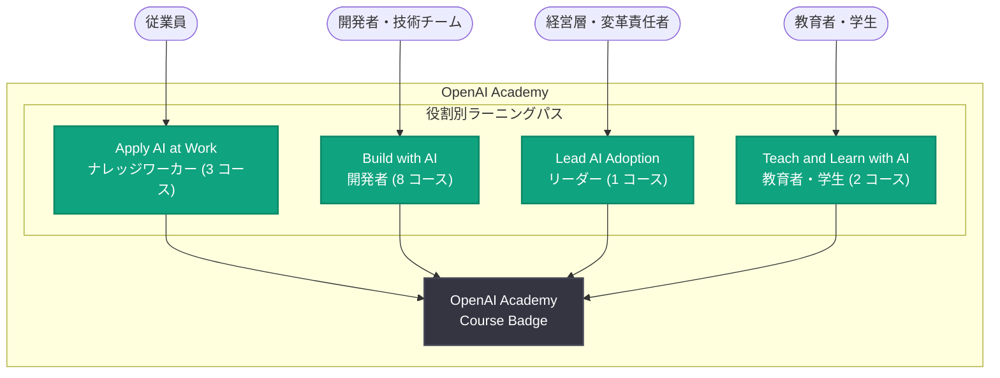

# OpenAI Academy が新しいラーニングパスで拡張、役割別の AI 学習を提供

## メタデータ

| 項目 | 内容 |
|------|------|
| 発表日 | 2026-09-21 |
| ソース | OpenAI News |
| カテゴリ | Company (企業発表) |
| 公式リンク | https://openai.com/index/expanding-openai-academy-with-new-learning-paths/ |

## 概要

OpenAI は 2026 年 9 月 21 日、AI 学習プラットフォーム「OpenAI Academy」を拡張し、開発者、リーダー、教育者、大学生向けの新コースを追加したことを発表した。既存の「Apply AI at Work」に加え、役割別に設計された合計 4 つのラーニングパスが提供され、従業員、開発者、リーダー、教育者、学生がそれぞれの立場で実践的な AI スキルを習得し、学んだことを実証できるようになる。

Academy の基本理念は「AI を学ぶために AI を使うべき (you should use AI to learn AI)」であり、座学だけでなく実際のタスクを通じて練習する設計になっている点が特徴である。コース評価に合格すると「OpenAI Academy course badge」(コースバッジ) を取得でき、スキルの証明として活用できる。

## 主な内容

### 4 つのラーニングパス

今回の拡張により、OpenAI Academy は以下の 4 つの役割別ラーニングパスで構成される。

| ラーニングパス | 対象者 | コース数 |
|---------------|--------|----------|
| Apply AI at Work | ナレッジワーカー | 3 コース |
| Build with AI | 開発者・技術チーム | 8 コース |
| Lead AI Adoption | リーダー | 1 コース |
| Teach and Learn with AI | 教育者・学生 | 2 コース |

### Apply AI at Work (ナレッジワーカー向け)

日常業務で AI を活用したいナレッジワーカー向けのパス。以下の内容を段階的に学習する。

- **基礎スキル**: 明確な指示の出し方、文脈 (コンテキスト) の追加、応答のレビュー
- **ワークフロー化**: 成功したアプローチを再利用可能なワークフローとして定着させる
- **エージェント活用**: エージェントに委任すべきタスクの判断、チェックポイントと人間によるレビューの設定

### Build with AI (開発者・技術チーム向け)

Codex ユーザーや OpenAI API で製品を構築するチーム向けのパスで、最多の 8 コースを提供する。

- **ソフトウェア開発**: ソフトウェア開発ライフサイクル全体における変更の計画と実装
- **API 開発**: ソリューション設計、評価 (evals)、エージェント、情報検索 (retrieval)、本番環境での AI システム運用

### Lead AI Adoption (リーダー向け)

戦略・導入・変革管理の責任者を対象とした「AI Leadership」コースを含むパス。

- AI 活用をビジネス優先事項と接続する方法
- オーナーシップとガバナンスの定義
- AI 戦略とロードマップの策定

### Teach and Learn with AI (教育者・学生向け)

教育分野向けに 2 つのコースが提供される。

- **AI for Educators**: 授業計画の作成、課題・評価の作成、コミュニケーションの調整を支援する。教育者が最終的な判断を持つ設計になっている
- **AI for College Students**: 学習計画の作成、グループプロジェクトの役割分担、課題要件に対する下書きレビュー、就職活動や面接準備をカバーする

## ラーニングパスの全体像

## 組織向けの導入モデル

OpenAI は組織全体での導入を想定した組み合わせ例を提示している。

- **企業**: オンボーディングに Apply AI at Work、技術チームに Build with AI、幹部・Champion・変革プログラムに AI Leadership を割り当てる
- **教育機関**: 「AI Foundations」と AI for Educators / AI for College Students を組み合わせて展開する

また、「OpenAI Academy Deployment Guide」(導入ガイド) が提供され、コースの紹介方法、リーダーやマネージャーの巻き込み方、参加促進、進捗管理に関する推奨事項がまとめられている。

## 認定とバッジ

各コースの評価 (assessment) に合格すると、OpenAI Academy course badge を取得できる。これにより学習者は習得したスキルを対外的に実証でき、組織は従業員のスキル習得状況を可視化できる。

## 開発者への影響

- **体系的な学習リソース**: Codex や OpenAI API を使った開発について、ソリューション設計から evals、エージェント、retrieval、本番運用までを体系的に学べる公式コースが 8 つ提供される
- **チーム全体のスキル底上げ**: 開発者だけでなく、ビジネスサイドやリーダー層も同じプラットフォームで学習できるため、組織全体での AI 導入がスムーズになる
- **スキルの証明**: コースバッジにより、AI 関連スキルを客観的に示す手段が増える
- **継続的な更新**: コースは OpenAI 社内の複数チームによって作成されており、モデル・製品・ガイダンスの変化に応じて継続的に更新される予定

## 関連リンク

- [Expanding OpenAI Academy with new learning paths (公式発表)](https://openai.com/index/expanding-openai-academy-with-new-learning-paths/)
- [OpenAI Academy](https://academy.openai.com/)
- [OpenAI 公式ドキュメント](https://platform.openai.com/docs)
- [OpenAI News](https://openai.com/news)

## まとめ

OpenAI Academy の拡張により、ナレッジワーカー、開発者、リーダー、教育者・学生という 4 つの役割に対応した合計 14 コースのラーニングパスが整備された。「AI を学ぶために AI を使う」という理念のもと、実践的なタスクを通じた学習とコースバッジによるスキル証明を組み合わせている点が特徴である。特に開発者向けの Build with AI は 8 コースと最も充実しており、evals やエージェント、本番運用まで含む実務直結の内容となっている。導入ガイドの提供により、企業や教育機関が組織的に AI スキル教育を展開するための基盤が整ったといえる。
