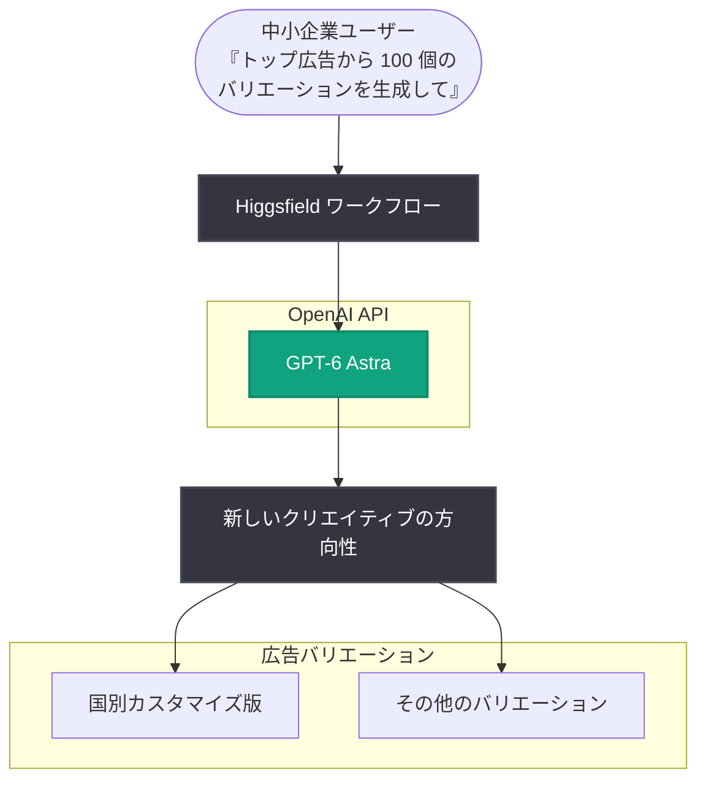

# Higgsfield AI が GPT-6 Astra で新しい動画機能を 1 日で出荷

## メタデータ

| 項目 | 内容 |
|------|------|
| 発表日 | 2026-09-21 |
| ソース | OpenAI News |
| カテゴリ | Startup (導入事例) |
| 公式リンク | https://openai.com/index/higgsfield-from-prompt-to-production-with-astra |

## 概要

動画制作ワークフローを AI でエンドツーエンドに支援するスタートアップ Higgsfield AI が、GPT-6 Astra を活用し、新機能をエンジニア 1 人・1 日で市場投入している事例が公開された。Higgsfield は「クリエイティブなストーリーテリングを世界中のプロフェッショナルにとってより身近にする」ことをミッションとし、動画広告で商品を販売する中小企業もその対象に含めている。

GPT-6 Astra はこのミッションの両面を支えている。1 つは顧客向けの広告制作体験の向上、もう 1 つは Higgsfield 社内での機能開発の高速化である。

> 「GPT-6 Astra のおかげで、新しい探索機能をわずか 1 日で提供できることに非常に興奮しています。しかも、これはエンジニア 1 人だけで実現できるようになりました」
>
> — Alex Mashrabov 氏、Co-founder and CEO、Higgsfield AI

## 導入企業プロファイル

| 項目 | 内容 |
|------|------|
| 企業名 | Higgsfield AI |
| 企業規模 | スタートアップ |
| 地域 | 北米 |
| 業界 | テクノロジー |
| 利用製品 | API |

## 主な内容

### 1 つの広告を新しい可能性に変える

Higgsfield での広告制作は、「一番成果の出ている広告をもとに、新しいバリエーションを 100 個生成して」といったシンプルなリクエストから始められる。GPT-6 を選択すると、ワークフローはそのリクエストを既存広告に対する新しいクリエイティブの方向性へと変換し、国ごとに広告をカスタマイズするといったバリエーションを生成する。

中小企業にとっては、単一のプロンプトだけで広告のさまざまなバージョンを探索しやすくなる。

> 「Higgsfield は、動画 AI で広告を生成することで、小規模なビジネスがより多くの商品を販売できるようにもしています。まさにこの領域で、GPT-6 モデルによる大きな改善が見られました」
>
> — Alex Mashrabov 氏、Co-founder and CEO、Higgsfield AI

### クリエイティブなアイデアをより速く市場へ

Higgsfield 社内では、GPT-6 Astra によってエンジニア 1 人が新機能を 1 日以内に提供できるようになった。Alex 氏はこのスピードの要因として、以下を挙げている。

- Astra の長期タスクプランニング (long-horizon task planning): 複数ステップにまたがる作業を計画する能力
- Higgsfield のクリエイティブチームとエンジニアの緊密な協働

GPT-6 Astra により、Higgsfield は新しいクリエイティブツールをより速く市場に投入し、中小企業がアイデアを商品を魅力的に見せる動画広告へと変えることを支援している。

## アーキテクチャ

記事で説明された、単一プロンプトから広告バリエーションを生成するワークフローを図示する。

## 開発者への影響

- GPT-6 Astra の長期タスクプランニングにより、複数ステップにまたがる機能開発をエンジニア 1 人・1 日というスピードで進められる可能性がある
- 単一のプロンプトを多数のクリエイティブバリエーション (例: 国別カスタマイズ) に展開するワークフローの構築事例として参考になる
- クリエイティブチームとエンジニアの緊密な協働が、AI による開発高速化の効果を引き出す要因として挙げられている

## 関連リンク

- [公式記事: Higgsfield AI ships new video features in a day with GPT-6 Astra](https://openai.com/index/higgsfield-from-prompt-to-production-with-astra)
- [OpenAI News](https://openai.com/news)
- [OpenAI 公式ドキュメント](https://platform.openai.com/docs)

## まとめ

Higgsfield AI は GPT-6 Astra を、顧客向けの動画広告制作と社内の機能開発という 2 つの側面で活用している。顧客側では単一プロンプトから広告バリエーションを大量生成して中小企業の販売を支援し、社内では長期タスクプランニングを活かしてエンジニア 1 人が新機能を 1 日で提供できる体制を実現した。AI による「プロンプトからプロダクションまで」の高速化を示すスタートアップ事例である。
