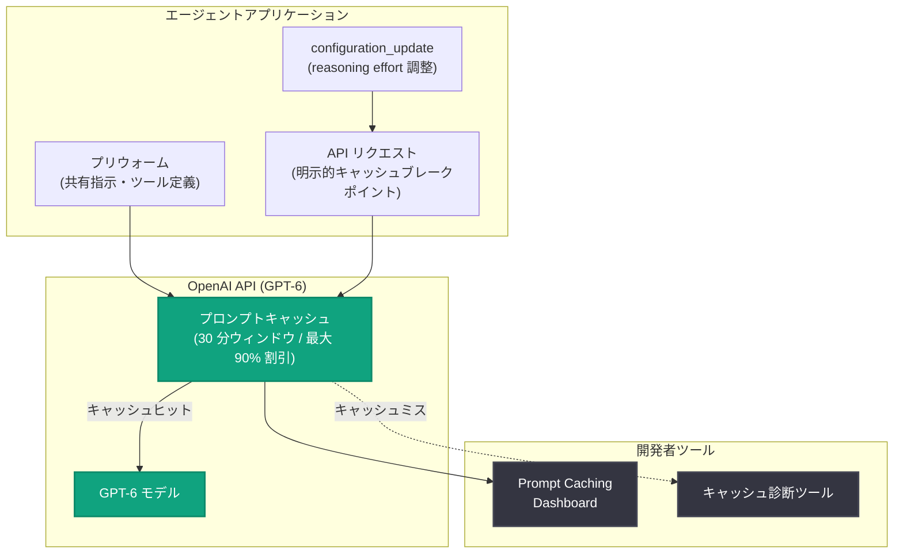

# GPT-6 のプロンプトキャッシュが強化: ヒット率向上と新しい診断・最適化ツール

## メタデータ

| 項目 | 内容 |
|------|------|
| 発表日 | 2026-09-22 |
| ソース | OpenAI News |
| カテゴリ | Product (API) |
| 公式リンク | https://openai.com/index/better-prompt-caching-for-gpt-6 |

## 概要

OpenAI は、GPT-6 ファミリー向けに改良されたプロンプトキャッシュシステムを発表した。デフォルトでより高いキャッシュヒット率を実現し、30 分間のウィンドウ内で再利用された適格な共有プレフィックスに対してキャッシュ割引が適用される。キャッシュされた入力トークンには最大 90% の割引が提供される。

さらに、開発者がキャッシュパフォーマンスを監視し、キャッシュミスを診断し、プロンプトのどの部分をキャッシュするかを選択できる新しいツール群も導入された。コードベースのリファクタリングや調査ドキュメントの作成など、数時間にわたって複雑なタスクを実行する永続的なエージェントを、より高速かつ低コストで運用できるようにすることが狙いである。

## 主な内容

### キャッシュの監視とキャッシュミスの診断

新しい **Prompt Caching Dashboard** では、アプリケーションの入力のうちどれだけがキャッシュから提供されているかを確認できる。主な機能は以下の通り。

- ヒット率の時系列トラッキング
- 入力構成チャートによるキャッシュ済みトークンと未キャッシュトークンの比較
- キャッシュヒットの低下の検出と、アプリケーション変更がキャッシュ性能に与える影響の評価

予期しないキャッシュミスが発生した場合は、**プロンプトキャッシュ診断ツール**を使って原因を特定できる。リクエストを直近のレスポンスと比較し、モデル・ツール・設定・入力のどの変更が再利用を妨げたかを識別する。影響を受けたトークンの推定数も表示されるため、影響の大きさを把握し、キャッシュヒット率を最大化するための最適化方針を判断できる。

### アプリケーションに合わせたキャッシュの最適化

記事では 4 つの最適化手法が紹介されている。

1. **キャッシュ対象の選択**: 明示的なキャッシュブレークポイント (explicit cache breakpoints) により、再利用するプロンプトプレフィックスを開発者が選択できる。更新されたプロンプトキャッシュガイドで、使用方法、キャッシュされたプレフィックスの有効期間、ツールや入力の変更が再利用に与える影響が解説されている

2. **キャッシュを壊さずに reasoning effort を調整**: GPT-6 モデルでは、`configuration_update` を末尾に追加することで、リクエストレベルの reasoning effort を変更せずにレスポンス間で推論の強度を調整できる。難しいタスクでは effort を上げ、定型的なフォローアップでは下げるといった運用が、再利用可能なコンテキストを保持したまま可能になる

3. **ツールや指示の変更時にキャッシュを保持**: ツール定義・スキーマ・順序を安定させることで、以前のコンテキストの再利用性を維持できる。定義を削除する代わりに `allowed_tools` で呼び出し可能なツールを制限するか、ツールが不要な場合は `tool_choice` を `none` に設定する。新しい指示は developer メッセージとしてコンテキストの末尾に追加し、古い指示を上書きする

4. **キャッシュのプリウォームによるレイテンシ削減**: プリウォーミング (prewarming) により、既知のコンテキストを事前に準備しておくことで、リクエスト到着時にモデルがより早く応答を開始できる。たとえば、ユーザーが最初の質問をする前に、アプリケーションの起動時に共有指示・ツール定義・参照資料をプリウォームすることで、処理をユーザーの待ち時間の外に移動できる

## 技術的な詳細

診断ツールはキャッシュミスの種別・理由・影響トークン数を構造化された形式で返す。記事に掲載されている診断結果の例は以下の通り。

```json
{
  "prompt_cache_diagnostics": {
    "type": "cache_miss",
    "reason": "tools_changed",
    "comparison_reusable_tokens": 5629,
    "cache_missed_tokens": 5629
  }
}
```

この例では、ツール定義の変更 (`tools_changed`) が原因で 5,629 トークンがキャッシュミスとなったことが示されている。

## アーキテクチャ



## 導入企業の実績

記事では複数の企業による導入効果が紹介されている。

| 企業 | 実績 |
|------|------|
| GitHub Copilot | 数十億件のリクエストにおいて、新規処理が必要なプロンプトトークンの割合を従来比 50% 以上削減 |
| Strawberry Browser | ダッシュボードと診断でヒット率を数ポイント改善し、コストを 20% 削減。会話のフォークが経済的に実現可能に |
| Manus | 明示的・自動キャッシュの併用とブレークポイント配置の改善により、1 週間未満でキャッシュヒット率が約 85% から 90% 超に向上 |
| Wordsmith | 明示的キャッシュブレークポイントへの移行により、ヒット率が 83% から 91% に向上。キャッシュ書き込みは約 3 分の 2 減、推論コストは 36% 削減 |

## 開発者への影響

- **コスト削減**: キャッシュされた入力トークンに最大 90% の割引が適用され、長時間動作するエージェントの経済性が向上する
- **可観測性の向上**: ダッシュボードと診断ツールにより、これまで把握しにくかったキャッシュミスの原因 (モデル・ツール・設定・入力の変更) を特定できる
- **設計の柔軟性**: `configuration_update` による reasoning effort の動的調整や、`allowed_tools` / `tool_choice` を使ったツール管理により、キャッシュを維持したままエージェントの挙動を変更できる
- **レイテンシ改善**: プリウォーミングにより初回応答までの時間を短縮できる

## 関連リンク

- [Better prompt caching for GPT-6 (公式発表)](https://openai.com/index/better-prompt-caching-for-gpt-6)
- [OpenAI 公式ドキュメント](https://platform.openai.com/docs)
- [OpenAI API リファレンス](https://platform.openai.com/docs/api-reference)
- [OpenAI News](https://openai.com/news)

## まとめ

GPT-6 ファミリーの改良されたプロンプトキャッシュシステムは、30 分間の再利用ウィンドウと高いデフォルトヒット率により、永続的エージェントの運用コストとレイテンシを大幅に削減する。Prompt Caching Dashboard と診断ツールによる可観測性の向上、明示的キャッシュブレークポイント・`configuration_update`・プリウォーミングといった最適化手段の追加により、開発者はワークロードに合わせてキャッシュ戦略を細かく制御できるようになった。GitHub Copilot や Manus などの導入事例が示す通り、長時間動作するエージェントの経済性を左右する重要なアップデートである。
