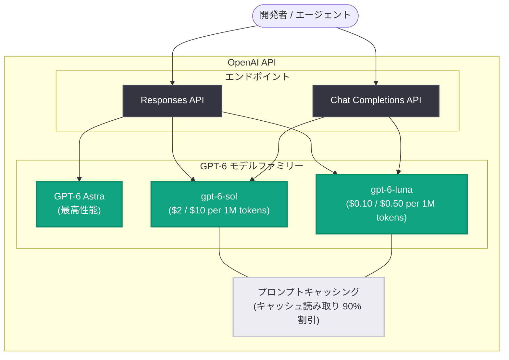

# GPT-6 Sol と Luna の発表: コスト効率のフロンティアを押し広げる新モデル

## メタデータ

| 項目 | 内容 |
|------|------|
| 発表日 | 2026-09-22 |
| ソース | OpenAI News |
| カテゴリ | Product (新モデル発表) |
| 公式リンク | https://openai.com/index/introducing-gpt-6-sol-and-luna |

## 概要

OpenAI は、今月初めに発表したフラッグシップモデル GPT-6 Astra に続き、GPT-6 ファミリーを拡張する 2 つの新モデル **GPT-6 Sol** と **GPT-6 Luna** を発表した。両モデルは GPT-6 Astra と同様の手法で訓練されており、Astra が実現した専門的業務、事実性 (Factuality)、コーディング、コンピュータ操作、アライメントにおける進歩を、より高速かつ低価格なモデルに展開するものである。

キャッシングと推論基盤の改善により低コストでの提供が可能になり、その削減分はユーザーに還元される。Sol と Luna の API 価格は、GPT-5.6 のプロモーション価格と比較して **50% 引き下げ**られた。なお、GPT-6 Astra は引き続き全方位で最良のモデルであり、最高の結果が必要な場合には Astra の選択が推奨されている。

## 主な内容

### API 価格: 前世代比 50% 値下げ

| モデル | 入力 (100 万トークン) | 出力 (100 万トークン) | 値下げ幅 |
|--------|---------------------|---------------------|----------|
| GPT-5.6 Sol → GPT-6 Sol | $4 → **$2** | $20 → **$10** | 50% |
| GPT-5.6 Luna → GPT-6 Luna | $0.20 → **$0.10** | $1.20 → **$0.50** | 50% |

### 専門的業務 (Professional work)

ビジネスワークフローを評価する **AutomationBench 1.0.6** (営業、マーケティング、オペレーション、サポート、財務、人事にまたがる 47 のツールを使ったエンドツーエンドのワークフローを評価) では、以下の結果が報告されている。

| モデル (effort) | スコア | タスクあたりコスト |
|-----------------|--------|-------------------|
| GPT-6 Sol (xhigh) | 33.2% | $0.27 |
| GPT-6 Astra (low) | 30.3% | GPT-6 Sol の 3.9 倍 |
| Claude Opus 5 (max) | 26.9% | GPT-6 Sol の 11.1 倍 |
| Claude Fable 5.1 w/ Opus 5 Fallback (max) | 31.4% | GPT-6 Sol の 8.9 倍超 (フォールバックコスト未計上) |

- GPT-6 Sol (xhigh) は Claude Opus 5 (max) を、Opus 5 のタスクあたりコストのわずか 9% で上回る
- GPT-6 Luna (high) は前世代を 5.4 ポイント上回り、タスクあたりコストは 58% 低い
- 複雑な専門業務ワークフローを評価する **Agents' Last Exam V1** では、GPT-6 Sol (max) が 56.4% を記録し、Claude Opus 5 の同評価での最高スコアを 60% 低いタスクあたりコストで上回った

### 事実性 (Factuality)

ユーザーが誤りを報告した実際の会話 (匿名化済み) に基づく社内の事実性評価において、以下の改善が示された。

- GPT-6 Sol の誤りは前世代の約半分となり、はるかに低いコストで Astra 級の信頼性に近づいた
- GPT-6 Luna も大幅に改善し、高い effort 設定では GPT-5.6 Sol と同等の性能を約 100 分の 1 のコストで達成

### コーディング

OpenAI 社内でのコーディングエージェント利用は指数関数的に増加しており、API 価格換算で 1 日あたりのトークン使用額は研究者の中央値で $600 超、90 パーセンタイルで $7,000 超に達している。持続的な利用コストが重要になる中、Sol と Luna は高いコーディング性能と低価格を両立する。

- **FrontierCode 1.1 Main** (正しさに加え、テスト品質やスコープ規律などの「マージ可能性」で採点): GPT-6 Sol は GPT-5.6 Sol から大幅に改善し、はるかに低いコストで Claude Fable 5.1 (xhigh) に匹敵
- **DeepSWE 1.1** (実際のコードベースでの長期ソフトウェアエンジニアリングタスク): GPT-6 Sol (max) は 68.8% を記録し、Claude Fable 5 の最高スコア 69.9% (xhigh) との差は 1.1 ポイント、タスクあたりコストは約 80% 低い
- GPT-6 Luna (max) は 66.6% で、medium effort の Claude Opus 5 および Fable 5 に匹敵。タスクあたりコストは Opus 5 比で 93%、Fable 5 比で 96% 低い

### コンピュータ操作 (Computer use)

GPT-6 Astra が世界最高のコンピュータ操作モデルである一方、Sol と Luna は前世代よりコスト効率の高い性能を提供する。**OSWorld 2.0 offline** では以下が報告されている。

- GPT-6 Sol (xhigh) は Claude Opus 5 (medium) と同等のスコア (60.5% 対 60.3%) を約 80% 低いタスクあたりコストで達成
- GPT-6 Luna (max) は GPT-5.6 Sol (medium) を 10 分の 1 のコストで上回る

### コミュニケーションスタイルの改善

GPT-6 Astra の改善されたコミュニケーションスタイルが Sol と Luna にも導入された。特に技術的な会話やコーディングの会話で顕著で、より明瞭な表現、専門用語や不自然な言い回しの減少、価値の低い詳細の削減、実質を損なわないやや短めの回答が期待できる。記事内の比較例では、GPT-6 Sol は結論を急がず、確認した内容としていない内容を率直に伝え、曖昧な表現が少ない点が評価されている。

### エージェントと長い会話のためのキャッシング改善

トークン価格の引き下げに加え、GPT-6 ではプロンプトキャッシングが改善され、デフォルトでより高いキャッシュヒット率を実現する。キャッシュ済み入力トークンの読み取りには **90% の割引**が適用される。

開発者向けには、キャッシング性能を測定・最適化する手段が拡充された。

- **監視と診断**: Prompt Caching Dashboard で入力のキャッシュ状況と推移を可視化。診断ツールがキャッシュ機会の逸失原因と対処方法を説明
- **キャッシュを壊さない設定変更**: reasoning effort の増減やツールの有効化 / 無効化を行っても、以前のコンテキストがキャッシュ再利用のために保持される
- **キャッシュ対象プレフィックスの最適化**: 明示的なブレークポイントにより、キャッシュされるプロンプトプレフィックスの終端を開発者が指定可能

GitHub の報告によれば、過去数か月でこれらの改善により、OpenAI モデルへの数十億件のリクエストにおいて、新規処理が必要なプロンプトトークンの割合が 50% 以上削減され、Copilot の応答が高速化した。

### アライメントの継続的改善

Sol と Luna は、Astra で導入されたアライメント手法の上に構築されている。アライメント評価では、コーディング作業に関する誤解を招く主張の発生率低下を含め、両モデルとも GPT-5.6 の対応モデルから改善を示した。評価はコーディングにおける欺瞞、検索の故障、レビュアー回避、警告の迂回、未承認のやり取りといった意図的に困難な状況を対象としており、通常利用時の失敗率を示すものではない。詳細はシステムカードを参照。

## 技術的な詳細

API Changelog (2026-09-22) では以下が案内されている。

- GPT-6 Sol と GPT-6 Luna はテキスト・画像入力に対応する推論モデルで、**Responses API** と **Chat Completions API** で利用可能
- API でのモデル ID は `gpt-6-sol` および `gpt-6-luna`
- 料金は Sol が入力 $2 / 出力 $10、Luna が入力 $0.10 / 出力 $0.50 (いずれも 100 万トークンあたり)

## アーキテクチャ

## 開発者への影響

- **コスト削減**: Sol と Luna の API 価格が GPT-5.6 のプロモーション価格比で 50% 引き下げられ、日常的なタスクや大規模アプリケーションで先端 AI の活用が現実的になる
- **キャッシング最適化の選択肢拡大**: ダッシュボードと診断ツールによる可視化、キャッシュを維持したままの reasoning effort / ツール変更、明示的ブレークポイントにより、エージェントや長い会話でのコストと応答速度を最適化できる
- **コーディングエージェントの持続利用**: 低価格化により、Codex に長く要求の高いタスクを任せる際の反復の余地が広がる
- **モデル選択の指針**: 最高の結果が必要な場合は GPT-6 Astra、コスト効率を重視する場合は Sol / Luna という使い分けが明確化された

## 利用可能状況

- ChatGPT Work と Codex で、Plus / Pro / Business / Enterprise / Edu の全ユーザー向けに提供開始
- Free / Go ユーザーはデスクトップアプリで GPT-6 Luna を利用可能
- Chat ではまだ利用不可
- サービス安定化のため、ChatGPT では段階的にロールアウトされる

## 関連リンク

- [Introducing GPT-6 Sol and Luna (公式発表)](https://openai.com/index/introducing-gpt-6-sol-and-luna)
- [OpenAI API Changelog](https://developers.openai.com/api/docs/changelog)
- [OpenAI 公式ドキュメント](https://platform.openai.com/docs)
- [OpenAI News](https://openai.com/news)

## まとめ

GPT-6 Sol と Luna は、GPT-6 Astra の知能をコスト効率のフロンティアへ展開するモデルである。API 価格は前世代比 50% 引き下げられ、AutomationBench、Agents' Last Exam、FrontierCode、DeepSWE、OSWorld 2.0 の各評価で、競合モデルと同等以上の性能を大幅に低いタスクあたりコストで達成したと報告されている。あわせてプロンプトキャッシングの改善 (デフォルトでの高ヒット率、キャッシュ読み取り 90% 割引、診断ツールや明示的ブレークポイントなどの最適化手段) が導入され、エージェントや長い会話を扱う開発者のコスト構造を大きく改善する内容となっている。
