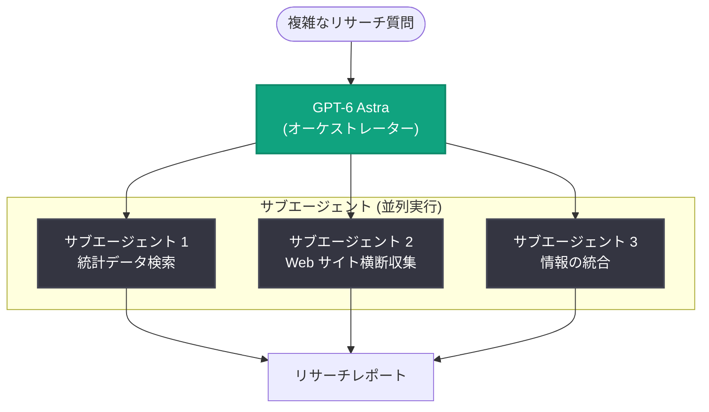

# Parallel が GPT-6 Astra でリサーチ時間とコストを半減

## メタデータ

| 項目 | 内容 |
|------|------|
| 発表日 | 2026-09-22 |
| ソース | OpenAI News |
| カテゴリ | Startup (導入事例) |
| 公式リンク | https://openai.com/index/parallel-cuts-time-and-cost-with-astra |

## 概要

AI エージェント向けの開発者インフラを提供するスタートアップ Parallel (Parallel Web Systems) が、GPT-6 Astra を活用して労働市場データのリサーチと統合にかかる時間とコストを、従来モデル比でそれぞれ約半分に削減した事例が公開された。Parallel は、音声エージェント向けの Web グラウンディングから金融機関・法務顧客向けのリサーチまで、フロンティアモデルと Web 検索を組み合わせた「Web 上でナレッジワークを行う AI エージェント」の基盤を構築している。

これまで Parallel の長時間リサーチタスクでは、高品質な回答を得るためにより大きなモデルと拡張された推論 (extended reasoning) が必要となり、時間とリソースを多く消費していた。GPT-6 Astra の導入により、同等の品質を維持しながら、より少ないリサーチ呼び出しとトークン数で結果を得られるようになったという。

## 導入企業プロファイル

| 項目 | 内容 |
|------|------|
| 企業名 | Parallel (Parallel Web Systems) |
| 企業規模 | スタートアップ |
| 地域 | 北米 |
| 業界 | テクノロジー |
| 利用製品 | API |

## 主な成果

| 指標 | 改善率 |
|------|--------|
| リサーチタスクの完了時間 | 50% 短縮 |
| コード (実行) コスト | 約 50% 削減 |

## 主な内容

### 6 か月分のデータ収集を 2 倍の速さで完了

GPT-6 Astra のテストとして、Parallel はエージェントに「4 つの州にわたる 6 種類の労働市場統計を 6 か月分リサーチする」タスクを与えた。エージェントは複数の Web サイトを横断して検索し、情報を収集した上で、単一のリサーチレポートにまとめる必要があった。

GPT-6 Astra は、従来モデルの半分の時間でこの作業を完了し、コードコストも約 50% 削減しながら、同等品質のリサーチ結果を提供した。

> 「Astra によって、より少ないリサーチ呼び出しと少ないトークンで、同じ高品質なリサーチをはるかに速く得られることを実証できました」
>
> — Devin Gupta 氏、Member of Technical Staff、Parallel Web Systems

### より少ないステップで高品質な回答に到達

Parallel は、GPT-6 Astra がより焦点を絞った検索を行い、有用な結果に到達するまでのステップ数が少ないことも確認した。

> 「Astra は、従来モデルと比較して、より的を絞った検索クエリを発行し、自身の世界知識を活用しながら最終的なタスクに集中していました」
>
> — Devin Gupta 氏、Member of Technical Staff、Parallel Web Systems

### サブエージェントによる並列リサーチ

効率の向上により、Parallel はリサーチを複数のエージェントに分割することがより現実的になった。GPT-6 Astra は特定のリサーチタスクをサブエージェントに委譲でき、作業を同時並行で進めることで、単一の検索シーケンスを順番にたどる時間を削減できる。

## アーキテクチャ

記事で説明されたサブエージェントへのタスク委譲の構成を図示する。

## 開発者への影響

- 長時間のリサーチタスクにおいて、大型モデル + 拡張推論に頼らずとも、GPT-6 Astra で同等品質の結果をより短時間・低コストで得られる可能性がある
- より的を絞った検索クエリと少ないステップ数により、エージェントのツール呼び出し回数とトークン消費を削減できる
- サブエージェントへのタスク委譲によって、リサーチ作業の並列化が実用的になり、大規模で要求の厳しいリサーチタスクへの対応余地が広がる

## 関連リンク

- [公式記事: Parallel cut research time and cost in half with GPT-6 Astra](https://openai.com/index/parallel-cuts-time-and-cost-with-astra)
- [OpenAI News](https://openai.com/news)
- [OpenAI 公式ドキュメント](https://platform.openai.com/docs)

## まとめ

Parallel は GPT-6 Astra の導入により、労働市場データのリサーチタスクを従来モデルの半分の時間・約半分のコードコストで完了し、品質は同等に維持した。的を絞った検索とステップ数の削減、サブエージェントへの委譲による並列化が効率向上の要因であり、複雑な質問から根拠あるリサーチ回答への道筋が、待ち時間の短縮と低コストで実現されている。
