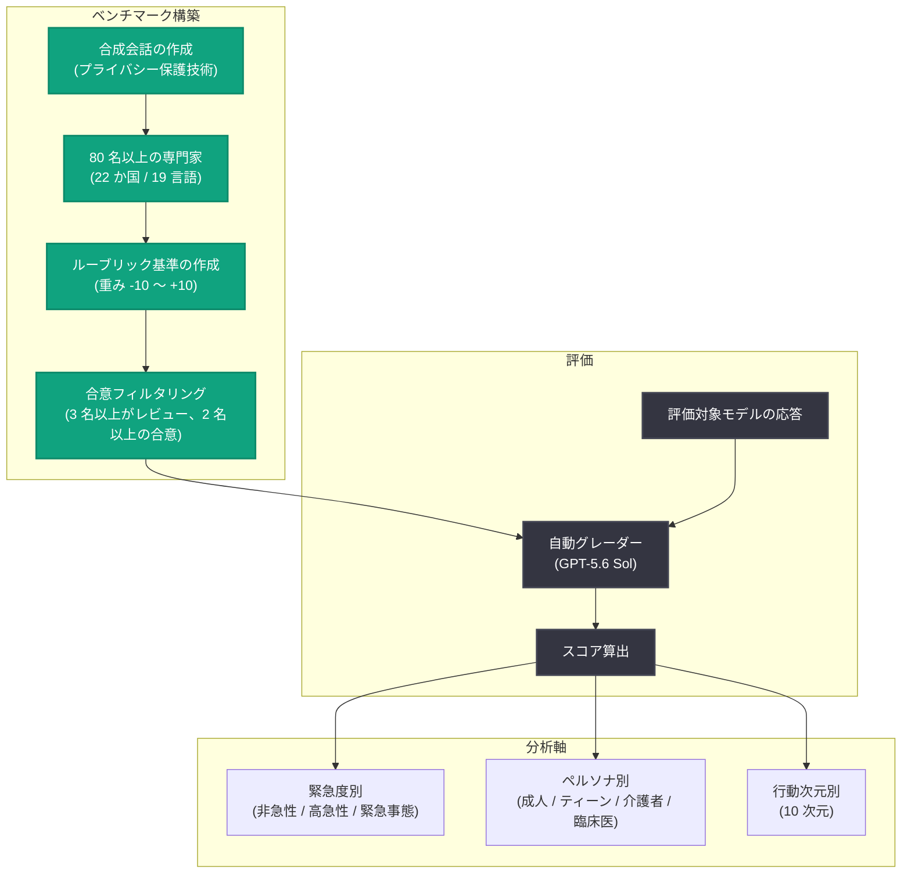

# MentalHealthBench の発表: メンタルヘルス会話における AI 応答を評価する専門家主導のオープンベンチマーク

## メタデータ

| 項目 | 内容 |
|------|------|
| 発表日 | 2026-09-23 |
| ソース | OpenAI Research |
| カテゴリ | 研究成果 (Publication) |
| 公式リンク | https://openai.com/index/introducing-mentalhealthbench |

## 概要

OpenAI は、現実的なメンタルヘルス会話において AI システムがどのように応答するかを測定する新しいオープンベンチマーク「MentalHealthBench」を発表した。このベンチマークは、22 か国のライセンスを持つ 80 名以上のメンタルヘルス専門家と共同で作成され、安全性、コンテキストの確認、ユーザーの主体性 (agency) の尊重、適切な場合の実行可能なガイダンスの提供といった主要な行動を評価する。

従来の評価は主に緊急シナリオに焦点を当て、広範な事前定義された基準で成功を測定してきたため、メンタルヘルス会話の全範囲にわたるモデルの性能や、各状況における専門家のガイダンスとの整合性についての理解にギャップがあった。週あたり 10 億人以上が ChatGPT を利用する中、MentalHealthBench はこのギャップを埋め、他の研究者が手法を検証し、独自の評価を実行し、研究を発展させられるようオープンに公開される。

## 主な内容

### あらゆるコンテキストにおけるメンタルヘルス支援

メンタルヘルスに関する会話は、トピック、緊急度、文化的コンテキストが大きく異なる。MentalHealthBench はこうした現実的なシナリオとユーザーペルソナの幅広さを捉えるよう設計されている。プライバシー保護技術を用いて、AI のメンタルヘルス用途における実際の利用パターンを正確に反映した合成会話を作成した。一部のシナリオには、合成ユーザーに関する背景情報 (例: 最近の家族との死別) が含まれており、モデルがそのコンテキストを活用して応答を適切に調整できるかを評価できる。

ベンチマークは、成人、ティーン、介護者 (caregiver)、臨床医が関わるシナリオを複数の言語と地域にわたって含み、以下の 3 段階の緊急度 (acuity) を網羅する。

- **非急性 (Non-acute)**: 感情的な要素を含みうる日常的な会話
- **高急性 (High-acuity)**: より深刻なメンタルヘルスの懸念や大きな苦痛を示すが、即時の緊急事態ではない会話
- **緊急事態 (Emergencies)**: メンタルヘルス上の緊急事態の兆候や、緊急の現実世界での支援を必要とする即時の安全上の懸念を含む会話

なお、シナリオの構成はモデルの応答をテストするために設計されたものであり、これらのトピックが ChatGPT で発生する頻度を表すものではない。

### 専門家との共同構築

MentalHealthBench は、[HealthBench](https://openai.com/index/healthbench/) および HealthBench Professional における臨床医主導の先行研究を基盤とし、メンタルヘルス専門家コホートとの緊密な協力のもとで開発された。このコホートは、22 か国、19 言語、約 20 のメンタルヘルス専門分野を代表する 80 名以上のライセンスを持つ心理士・精神科医で構成される。

専門家は各合成会話を読み、最後のユーザーメッセージに対するモデル応答を評価するための詳細なルーブリック基準リストを作成した。各基準は「適切な質問をする」「可能な限り最善のアドバイスを提供する」といったモデル応答の単一の側面を対象とし、-10 から +10 の重みを持つ。正の点数は有益な行動を報酬とし、負の点数は有害な行動を罰する。値が大きい基準ほど、その会話のコンテキストにおける臨床的重要性が高いことを示す。

各会話は少なくとも 3 名の専門家によってレビューされ、少なくとも 2 名の専門家が合意し、3 人目が矛盾しない基準のみが保持された。したがって、最終的なルーブリックは各コンテキストでモデルがどう応答すべきかについての共有された判断を反映している。各会話について、自動グレーダー (GPT-5.6 Sol) が専門家の書いた基準に照らしてモデル応答を評価する。

### モデルの性能評価

幅広いモデルが MentalHealthBench で評価された。評価では、モデルの応答が各シナリオで専門家が特定した理想的な行動をすべて示し、望ましくない行動を避けているかを測定する。結果は、メンタルヘルス状況のナビゲーションを支援する AI システムの着実な改善を示している。

ベンチマークの特徴的な分析軸は以下のとおり。

- **緊急度別の評価**: 日常的なメンタルヘルスシナリオと、現実世界での支援を必要とする緊急事態の両方でのモデル性能を把握できる
- **ユーザーペルソナ別の評価**: 成人、13-17 歳のティーン、介護者、臨床医の 4 種類のユーザーを対象とする。ティーンペルソナではシステムメッセージでユーザーが 13-17 歳であることを明示し、モデルプロバイダー横断で機能するアプローチを採用した (個々の製品に組み込まれたすべてのセーフガードを捉えられない場合がある)。ティーンペルソナが関わる会話は、青少年メンタルヘルスの専門知識を持つ臨床医によってレビューされた
- **行動次元別の分解**: 全体スコアは、メンタルヘルスに関するモデル行動の 10 次元の性能に分解できる。全体スコアが近いモデルでも、行動ごとの強みが異なりうる。例えば、コンテキストを適切に確認する能力は、より高度なモデルで向上している

### ユーザー視点の理解

MentalHealthBench と並行して、専門家のガイダンスと、人々が AI 支援において有用と感じるものを比較する別の分析も実施された。16 か国、14 言語を代表する、AI をメンタルヘルスや感情的サポートに利用した経験のある成人 44 名が参加し、合成会話へのモデル応答を評価し、有用な支援がどうあるべきかを記述する基準を作成した。参加者のレビューは、苦痛を与えうる高急性の内容への曝露を避けるため、非急性の会話に限定された。

ユーザー視点では、専門家のガイダンスであまり強調されていなかった「実践的な次のステップ」と「トーン」が重視される一方、専門家は関連コンテキストの収集と曖昧な状況の慎重な解釈をより重視していた。なお、ベンチマークの最終的なスコアリング基準は専門家の合意に基づいており、この分析によって変更されてはいない。

## 技術的な詳細

### 評価フロー

### ルーブリックの仕組み

| 要素 | 内容 |
|------|------|
| 評価対象 | 会話の最後のユーザーターンに対するモデル応答 |
| 基準の粒度 | 各基準はモデル応答の単一の側面を対象 |
| 重み | -10 から +10 (上限 10、下限 1 の絶対値)。正は有益な行動への報酬、負は有害な行動への罰則 |
| 重みの意味 | 値が大きいほど、その会話における臨床的重要性が高い |
| 合意形成 | 各会話を 3 名以上がレビューし、2 名以上が合意し 3 人目が矛盾しない基準のみ採用 |
| グレーディング | 自動グレーダー GPT-5.6 Sol が専門家作成基準に照らして評価 |

## 開発者への影響

- **オープンベンチマークの利用**: MentalHealthBench はオープンに公開されるため、研究者や開発者は手法を検証し、独自の評価を実行し、既存モデルのギャップを特定できる
- **多面的な性能測定**: 全体スコアを 10 の行動次元に分解できるため、解釈可能なモデル行動に沿って改善領域を特定できる
- **緊急度・ペルソナ別の分析**: 日常会話から緊急事態まで、また成人からティーンまで、細分化された評価が可能になり、センシティブな用途向けのモデル選定や改善に活用できる
- **関連する取り組みとの連携**: OpenAI はメンタルヘルス研究への助成、Partnership on AI との専門家会合、Transluce のメンタルヘルス評価などの補完的な独立の取り組みも支援している

## 関連リンク

- [Introducing MentalHealthBench (OpenAI 公式)](https://openai.com/index/introducing-mentalhealthbench)
- [HealthBench](https://openai.com/index/healthbench/)
- [ChatGPT のセンシティブな会話への応答強化](https://openai.com/index/strengthening-chatgpt-responses-in-sensitive-conversations/)
- [Trusted Contact の導入](https://openai.com/index/introducing-trusted-contact-in-chatgpt/)
- [ChatGPT for Teens](https://openai.com/index/chatgpt-for-teens/)
- [AI メンタルヘルス研究助成](https://openai.com/index/ai-mental-health-research-grants/)
- [ChatGPT の危機ヘルプライン支援](https://help.openai.com/en/articles/12677603-crisis-helpline-support-in-chatgpt)

## まとめ

MentalHealthBench は、22 か国 80 名以上のライセンスを持つメンタルヘルス専門家と共同開発された、現実的なメンタルヘルス会話における AI 応答評価のためのオープンベンチマークである。非急性から緊急事態までの 3 段階の緊急度、成人・ティーン・介護者・臨床医の 4 種類のペルソナ、10 の行動次元にわたる多面的な測定を可能にし、重み付きルーブリック (-10 〜 +10) と自動グレーダー GPT-5.6 Sol による評価を採用している。ChatGPT はセラピーや専門的ケアの代替ではないものの、本ベンチマークの結果はメンタルヘルス状況における AI システムの着実な改善を示しており、OpenAI はオープンな公開を通じて、AI による人々の支援の水準向上をコミュニティとともに目指している。
