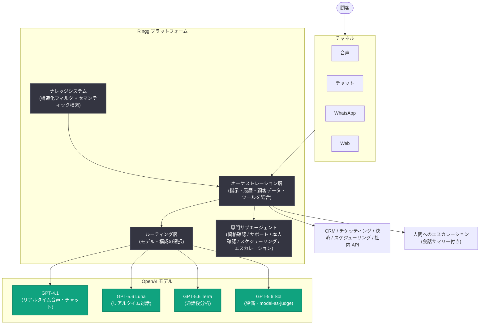

# Ringg の AI エージェント、OpenAI を活用し顧客からの電話の最大 65% を解決

## メタデータ

| 項目 | 内容 |
|------|------|
| 発表日 | 2026-09-23 |
| ソース | OpenAI News |
| カテゴリ | Startup (導入事例) |
| 公式リンク | https://openai.com/index/ringg |

## 概要

音声・チャットエージェントプラットフォームの [Ringg](https://www.ringg.ai/) は、GPT-5.6 をはじめとする高効率モデルを中核に据えたエンタープライズ向けエージェントプラットフォームを構築し、音声、チャット、WhatsApp、Web を横断する多言語エージェントを提供している。適切なリアルタイムワークロードを GPT-4.1 から GPT-5.6 に移行することで、必要な品質とレイテンシを維持しながらモデルコストを約 90% 削減した。

Ringg のエージェントは現在、月間 700 万件以上の接続コールを処理しており、顧客の平均 CSAT (顧客満足度) スコアは 4.8 に達している。定型的な顧客問い合わせの最大 65% を人間のエージェントの関与なしに解決している。

## 主な内容

### 背景: インド大手消費者向け企業の課題

コール量が増加すると、カスタマーサービスは通常人員追加でスケールするが、これは各対応のコストと複雑さを増大させる。Ringg はインドの大手消費者向け企業との協業でこの問題を目の当たりにした。これらの企業はコール対応の増加に苦しむだけでなく、保険の購入から予約の確定まで、顧客のタスク完了を支援する際に、断片化された手作業のシステムと格闘していた。

### 顧客アウトカムを中心としたエージェントプラットフォーム

エージェントが顧客のリクエストを完了するには、ポリシーの確認、アカウント記録の取得、予約のスケジューリング、CRM の更新、コンテキストを維持したままの専門担当者への引き継ぎなどが必要になる。

- **リアルタイム対話**: GPT-5.6 Luna などのモデルを使用して顧客リクエストを解釈し、ツールを選択し、複数ステップのワークフローを通じて顧客をガイド
- **オーケストレーション層**: CRM、チケッティングプラットフォーム、決済システム、スケジューリングツール、社内 API を横断してアクションを実行し、必要に応じて会話サマリー付きで人間にエスカレーション
- **ナレッジシステム**: 構造化フィルタリングとセマンティック検索を組み合わせ、データセット、PDF、CSV、ビジネス文書を横断して企業情報に基づく回答を提供
- **専門サブエージェント**: 資格確認 (qualification)、サポート、本人確認 (verification)、スケジューリング、エスカレーションに特化したサブエージェントに作業を分割し、音声、チャット、WhatsApp、Web を横断して一貫した会話を維持

### タスクごとに最適な OpenAI モデルへルーティング

Ringg は会話品質、レイテンシ、指示追従、ツール呼び出し、多言語性能、信頼性、コストの観点で OpenAI と代替を評価し、OpenAI が本番ワークロードに対して最も優れた総合バランスを提供すると判断した。

| モデル | 役割 |
|--------|------|
| GPT-4.1 | リアルタイムの音声・チャットトラフィックの大部分を処理 |
| GPT-5.6 Luna | 性能、レイテンシ、価格性能比がリクエストに適する場合に使用 (本番スタックに常駐) |
| GPT-5.6 Terra | 通話後分析 (サマリー、感情分類) を担当 |
| GPT-5.6 Sol | 評価、プロンプト改善、model-as-judge ワークフローを支援 |

顧客が音声通話で話すかチャットを送信すると、Ringg のオーケストレーションシステムがその入力をエージェントの指示、会話履歴、顧客固有データ、関連するナレッジベースのコンテキスト、利用可能なツールと組み合わせる。ルーティング層が適切なモデルと構成を選択し、モデルの出力はオーケストレーションシステムを経由して顧客が選んだチャネルに配信される。

長時間の対話では、コンテキストが約 80,000 トークンに近づくと構造化サマリーを作成し、履歴全体を繰り返し送信することなく重要な情報を保持したまま会話を継続できる。

### 本番評価 (evals) による品質とコストの改善

Ringg は本番デプロイ前に、過去の会話とシミュレートした顧客フローを使用してモデルをテストする。評価プラットフォームがその結果から弱点を特定し、プロンプト改善を推奨することで、エージェントと構成の継続的改善ループを構築している。

- **通話後分析の評価**: GPT-5.6 Terra を Gemini 2.5 Flash などの代替と比較テストした結果、Terra が最良となり、サマリーと感情分類を GPT-5.6 Terra に移行。高い精度を維持しつつユニットエコノミクスを大幅に改善
- **多言語・地域変種のテスト**: 言語間の切り替えや英語と現地語フレーズの混在など、Ringg の対象市場で一般的な会話パターンをテスト。GPT-5.6 Terra は一般的な地域言語で最大 97% の精度を達成し、Gemini 2.5 Flash を上回った
- **段階的ロールアウト**: オフラインテストに合格したモデルは、本番トラフィックの一部に導入してから展開を拡大
- **本番監視**: ルーターがリージョンをまたいでレイテンシとエンドポイントの健全性を監視し、エンドポイントが利用不可またはレイテンシしきい値を超えた場合にトラフィックを切り替え。専用ノード、アラート、バージョン管理されたデプロイで問題を隔離

このアプローチにより、特定のリアルタイムワークロードを GPT-4.1 から GPT-5.6 Luna に移行し、モデルコストを約 90% 削減した。

### 業界横断の顧客成果

| 顧客 | 成果 |
|------|------|
| Policybazaar (インド最大級のオンライン保険プラットフォーム) | 57,000 件以上の顧客リクエストを接続し、67% のコールを人間の介入なしで処理。平均応答時間は 8-12 分から 60 秒未満に短縮 (約 88% の改善) |
| Practo (グローバルヘルスケアプラットフォーム) | 初回コール解決率 85%、応答時間 3 秒未満を達成。従来の人間主導ワークフローと比較して運用コストを 70% 削減。1 日あたり 1,000 件以上の予約を完了 |
| Groww (オンライン投資プラットフォーム) | IPO、先物、オプション関連のインバウンド問い合わせの 72% を完全セルフサービスで解決。平均処理時間は 2 分 |

### ブラウザへのエージェント拡張

OpenAI の computer-use 機能を使用し、Ringg はプラットフォームオンボーディング、KYC (本人確認) プロセス、IT トラブルシューティング、オンコールインシデント対応、保険金請求処理向けのブラウザエージェントを開発中である。

また、チャネルと対話をまたいで情報を保持するコンテキスト層も開発中で、顧客が音声でリクエストを開始し、WhatsApp で継続し、ブラウザで完了するといった流れを、同じ詳細を繰り返すことなく実現することを目指している。

## アーキテクチャ

## 開発者への影響

- **タスク別モデルルーティング**: リアルタイム対話、通話後分析、評価といったタスクの特性に応じて GPT-4.1、GPT-5.6 Luna / Terra / Sol を使い分ける設計は、品質・レイテンシ・コストの最適化パターンとして参考になる
- **コンテキスト管理**: 約 80,000 トークンに達した時点で構造化サマリーを生成し会話を継続する手法は、長時間対話を扱うエージェント実装のプラクティスとなる
- **評価駆動の運用**: 過去会話とシミュレーションによるオフライン評価、少量トラフィックでの段階的ロールアウト、レイテンシ監視によるトラフィック切り替えという運用フローは、本番エージェントの信頼性向上に有効
- **コスト削減の実例**: 適切なワークロードの GPT-4.1 から GPT-5.6 Luna への移行で約 90% のモデルコスト削減を達成しており、モデル移行の投資対効果を示す事例となる

## 関連リンク

- [公式記事: Ringg's AI agents resolve up to 65% of customer calls with OpenAI](https://openai.com/index/ringg)
- [Ringg 公式サイト](https://www.ringg.ai/)
- [OpenAI News](https://openai.com/news)

## まとめ

Ringg は GPT-5.6 (Luna / Terra / Sol) と GPT-4.1 をタスクごとにルーティングするエンタープライズエージェントプラットフォームを構築し、音声、チャット、WhatsApp、Web を横断する多言語エージェントで月間 700 万件以上のコールを処理している。定型問い合わせの最大 65% を自動解決し、GPT-4.1 から GPT-5.6 への移行で約 90% のモデルコスト削減を実現。Policybazaar、Practo、Groww などの顧客で応答時間短縮や運用コスト削減の具体的成果を上げており、今後は computer-use 機能によるブラウザエージェントとチャネル横断のコンテキスト層に取り組んでいる。
