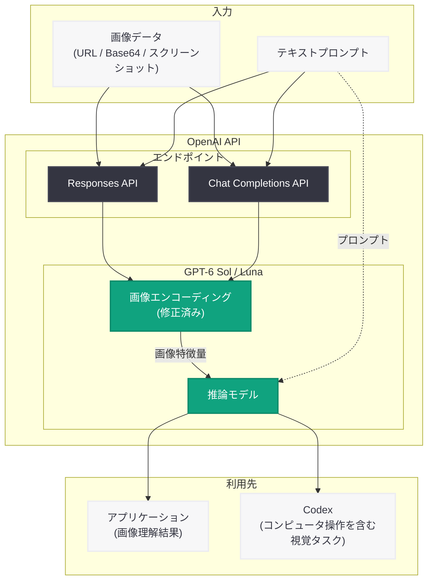

# GPT-6 Sol と GPT-6 Luna の画像エンコーディング不具合を修正: 画像理解品質が改善、eval の再実行を推奨

## メタデータ

| 項目 | 内容 |
|------|------|
| 発表日 | 2026-09-25 |
| ソース | OpenAI API Changelog |
| カテゴリ | API 変更 (Bug Fix) |
| 公式リンク | [OpenAI API Changelog](https://developers.openai.com/api/docs/changelog) |

## 概要

OpenAI は 2026 年 9 月 25 日、GPT-6 Sol (`gpt-6-sol`) と GPT-6 Luna (`gpt-6-luna`) の画像エンコーディングに存在していた不具合を修正したことを API Changelog で発表した。この不具合は両モデルの画像理解 (image understanding) の品質を低下させていたもので、修正により API および Codex における視覚タスク (コンピュータ操作を含む) の結果が改善される。

GPT-6 Sol と GPT-6 Luna は 2026 年 9 月 22 日にリリースされたばかりの推論モデルであり、リリースからわずか 3 日でのバグ修正となる。修正はサーバーサイドで適用されるため開発者側のコード変更は不要だが、OpenAI は**画像入力を使うワークロードでは評価 (eval) の再実行を推奨**している。

Changelog 原文では以下のように案内されている。

> Fixed a bug in image encoding that degraded image understanding in GPT-6 Sol and GPT-6 Luna.
>
> This update improves results on visual tasks in the API and Codex, including computer use.
>
> If your use cases involve image inputs, we recommend rerunning your evaluations

## 主な内容

### 修正対象

GPT-6 Sol と GPT-6 Luna の画像エンコーディング処理に、画像理解の品質を低下させる不具合が存在していた。

- **対象モデル:** `gpt-6-sol`、`gpt-6-luna` (2026-09-22 リリースの推論モデル)
- **対象機能:** 画像入力 (テキスト・画像入力に対応する両モデルの Vision 機能)
- **対象エンドポイント:** Responses API、Chat Completions API
- **修正タイプ:** サーバーサイド修正 (クライアント変更不要)

なお、同じ GPT-6 ファミリーのフラッグシップモデル GPT-6 Astra への言及はなく、本修正は Sol と Luna の 2 モデルに関するものである。

### 修正による改善

画像エンコーディングの修正により、API と Codex の両方で視覚タスクの結果が改善される。特に以下のユースケースで品質向上が見込まれる。

- **コンピュータ操作 (Computer use)**: スクリーンショットに基づく画面認識と操作判断
- 画像内のテキスト認識と抽出
- 文書画像・チャート・グラフの解析
- 写真やスクリーンショットの内容理解

GPT-6 Sol と Luna はリリース時、OSWorld 2.0 offline などのコンピュータ操作ベンチマークでのコスト効率の高さが訴求されていたモデルであり、画面認識に直結する本修正の影響範囲は大きい。

### 評価 (eval) の再実行を推奨

本修正はモデルの出力品質を変化させるため、OpenAI は画像入力を使うユースケースについて評価の再実行を推奨している。これは以下の理由による。

- 不具合修正前に取得した評価スコアは、修正後のモデル挙動を正しく反映していない
- 不具合期間中 (2026-09-22 〜 2026-09-25) に「品質が低い」と判断して見送ったワークフローが、修正後には実用水準に達している可能性がある
- プロンプトやパイプラインを不具合時の挙動に合わせて調整していた場合、修正後は過剰調整になっている可能性がある

## 技術的な詳細

### 影響範囲

この修正は画像エンコーディング内部の不具合に対するものであり、API のリクエスト / レスポンス形式に変更はない。既存のコードはそのまま動作し、修正の恩恵を自動的に受ける。

### コードサンプル

#### Responses API での画像入力

```python
from openai import OpenAI

client = OpenAI()

# Responses API を使用した画像理解
response = client.responses.create(
    model="gpt-6-sol",
    input=[
        {
            "role": "user",
            "content": [
                {"type": "input_text", "text": "この画像の内容を説明してください。"},
                {
                    "type": "input_image",
                    "image_url": "data:image/png;base64,...",
                    "detail": "auto",
                },
            ],
        }
    ],
)

print(response.output_text)
```

#### Chat Completions API での画像入力

```python
from openai import OpenAI

client = OpenAI()

# Chat Completions API を使用した画像理解
response = client.chat.completions.create(
    model="gpt-6-luna",
    messages=[
        {
            "role": "user",
            "content": [
                {"type": "text", "text": "この画像に含まれるテキストを抽出してください。"},
                {
                    "type": "image_url",
                    "image_url": {
                        "url": "data:image/png;base64,...",
                        "detail": "auto",
                    },
                },
            ],
        }
    ],
)

print(response.choices[0].message.content)
```

## アーキテクチャ



## 開発者への影響

### アクション不要のサーバーサイド修正

本修正はサーバーサイドで自動的に適用されるため、開発者側でのコード変更や API バージョンの更新は不要である。既存のアプリケーションは修正後の画像エンコーディングの恩恵を自動的に受ける。

### 画像入力ワークロードでの推奨アクション

- **評価 (eval) の再実行:** 画像入力を使うユースケースでは、修正後のモデル挙動を反映した評価スコアを取得するため、eval を再実行する
- **不具合期間中の結果の再検証:** リリース (2026-09-22) から修正 (2026-09-25) までの間に GPT-6 Sol / Luna の画像理解品質を評価・比較した場合、その結果は不具合の影響を受けている可能性があるため再測定する
- **モデル移行判断の見直し:** 不具合期間中の品質を理由に前世代モデルへの残留や他モデルの選択を判断した場合、修正後の品質で再判断する価値がある

### 影響を受けるユースケース

- Codex やエージェントによるコンピュータ操作 (画面認識)
- マルチモーダルチャットボット
- 文書デジタル化・OCR パイプライン
- チャート・グラフの読み取りと構造化
- スクリーンショットからの情報抽出

## 関連リンク

- [OpenAI API Changelog](https://developers.openai.com/api/docs/changelog)
- [Introducing GPT-6 Sol and Luna (公式発表)](https://openai.com/index/introducing-gpt-6-sol-and-luna)
- [OpenAI API ドキュメント](https://platform.openai.com/docs)
- [OpenAI API リファレンス](https://platform.openai.com/docs/api-reference)

## まとめ

OpenAI は、2026 年 9 月 22 日にリリースされた GPT-6 Sol と GPT-6 Luna の画像エンコーディングに存在していた、画像理解の品質を低下させる不具合を修正した。この修正により、API および Codex における視覚タスク (コンピュータ操作を含む) の結果が改善される。サーバーサイド修正のため開発者側のコード変更は不要だが、画像入力を使うワークロードでは評価 (eval) の再実行が推奨される。特に、不具合期間中に取得した評価結果やモデル選定の判断は、修正後の品質で見直す価値がある。
