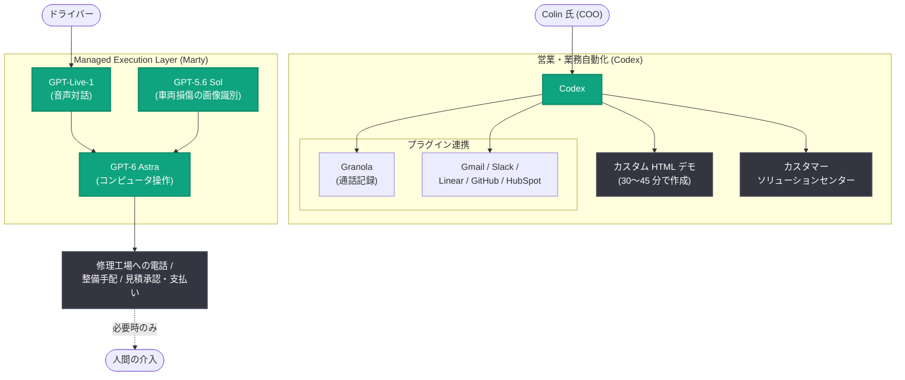

# Proaction が Codex で売上を 60% 向上させ、月 75 時間以上を削減

## メタデータ

| 項目 | 内容 |
|------|------|
| 発表日 | 2026-09-25 |
| ソース | OpenAI News |
| カテゴリ | Customer Story (導入事例) |
| 公式リンク | https://openai.com/index/proaction |

## 概要

車両フリート管理ソフトウェアを提供する Proaction が、Codex、GPT-Live-1、GPT-6 Astra を活用して、モダンなフリート管理製品の構築・運用・販売を加速している事例が公開された。非技術者である共同創業者・COO の Colin Knudsen 氏が Codex を使って顧客ごとのカスタムデモを自作できるようになった結果、初期接触から具体的な提案フェーズへの商談進展率が 50〜60% 向上し、エンジニアリング工数を月 40〜60 時間、Colin 氏個人の作業時間を月 25〜33 時間削減した。

さらに Proaction は、GPT-Live-1 と GPT-6 Astra を組み合わせた音声エージェント「Marty」を開発し、ドライバーとの対話から修理工場への電話、整備手配、見積承認・支払いまでのフリート運用業務を、必要時のみ人間が介入する形で自動化している。

## 導入企業プロファイル

| 項目 | 内容 |
|------|------|
| 企業名 | Proaction |
| 業界 | 車両フリート管理ソフトウェア |
| 主要人物 | Colin Knudsen 氏 (共同創業者・COO)、Danny O'Halloran 氏 (プロダクト責任者) |
| 利用製品 | Codex、GPT-5.6 Sol、GPT-Live-1、GPT-6 Astra |
| Codex プラグイン連携 | Granola、Gmail、Slack、Linear、GitHub、HubSpot |

## 主な成果

| 指標 | 数値 |
|------|------|
| 売上 (商談進展率) の向上 | 50〜60% 増 |
| エンジニアリング工数削減 | 月 40〜60 時間 |
| Colin 氏個人の時間削減 | 月 25〜33 時間 |
| カスタムデモ作成数 | 月 4〜6 件 |
| デモ 1 件の作成時間 | 30〜45 分 (エンジニアが実装すると約 10 時間) |
| Codex で処理する日々のタスク数 | 15〜20 件 |

## 主な内容

### カスタムデモによる営業強化

従来、非技術者の Colin 氏はデモを自ら作ることができず、商談は会話やスライドに依存していた。現在は商談後に Codex へ Granola の録音、メール、スプレッドシートを読み込ませ、顧客の車両やワークフローを反映した HTML デモ環境を 30〜45 分で自作している。同等のデモをエンジニアが実装すると約 10 時間かかる作業である。

顧客は自社データが入ったデモを見て具体的な要望を出せるため、初期接触から具体的な提案フェーズへの移行率が 50〜60% 向上した。カスタムデモは月 4〜6 件のペースで作成されている。

### エンジニアリング工数の節約

Codex で作成したデモは、そのまま開発時の視覚的な仕様書として機能し、仕様確認のやり取りを削減する。これにより、エンジニアリング工数を月 40〜60 時間節約している。また、顧客がログインして自社のワークフローを確認できる「カスタマーソリューションセンター」も Codex で構築した。

### Codex での業務一元化

Colin 氏は営業・カスタマーサポート・プロダクト管理の作業を Codex 内で完結させており、日々 15〜20 件のタスクを処理している。Granola、Gmail、Slack、Linear、GitHub、HubSpot とのプラグイン連携により、以下を実現している。

- 通話記録の取得とフォローアップ準備
- Linear への課題作成
- HubSpot の案件更新
- 営業レポートの定期自動化

これらにより、Colin 氏個人の作業時間は月 25〜33 時間削減された。

> 「Codex なしでスタートアップの創業者をやることは、もはや想像できません」
>
> — Colin Knudsen 氏、共同創業者・COO、Proaction

### 音声エージェント「Managed Execution Layer」

Proaction は GPT-Live-1 と GPT-6 Astra を活用し、フリート運用業務を代行するエージェント基盤「Managed Execution Layer」を開発した。エージェント「Marty」は、ドライバーとの対話から修理工場への電話、整備の手配、見積承認・支払いまでを一貫して担当し、必要な場合のみ人間が介入する。

なお、車両損傷の画像識別には GPT-5.6 Sol を利用している。プロダクト責任者の Danny O'Halloran 氏によると、GPT-6 Astra のコンピュータ操作は GPT-5.6 Sol より実行が簡潔で、開発の高速化につながっているという。

## アーキテクチャ

記事で説明された Codex による業務一元化と、Marty エージェントの構成を図示する。

## 開発者・企業への影響

- 非技術者の創業者や営業担当者でも、Codex を使って顧客データを反映した動くデモを短時間 (30〜45 分) で作成でき、商談進展率の大幅な向上 (50〜60%) につなげられる
- デモが視覚的な仕様書として機能することで、営業とエンジニアリングの間の仕様確認コストを削減し、月 40〜60 時間規模の工数節約が可能になる
- Codex のプラグイン連携 (Granola、Gmail、Slack、Linear、GitHub、HubSpot) により、営業・サポート・プロダクト管理の業務を単一のインターフェースに集約できる
- GPT-Live-1 (音声) と GPT-6 Astra (コンピュータ操作) の組み合わせは、電話対応や手配業務を含むエンドツーエンドの業務代行エージェントの実装パターンとして参考になる

## 関連リンク

- [公式記事: Proaction boosts sales 60% and saves 75+ hours with Codex](https://openai.com/index/proaction)
- [OpenAI News](https://openai.com/news)
- [OpenAI 公式ドキュメント](https://platform.openai.com/docs)

## まとめ

Proaction は Codex を営業・サポート・プロダクト管理のハブとして活用し、商談進展率を 50〜60% 向上させるとともに、エンジニアリング工数を月 40〜60 時間、COO 個人の時間を月 25〜33 時間 (合計で月 75 時間以上) 削減した。さらに GPT-Live-1 と GPT-6 Astra による音声エージェント「Marty」で、フリート運用業務そのものの自動化にも踏み出しており、コーディングエージェントが開発だけでなく営業・運用を含む企業活動全体を変革する事例となっている。
