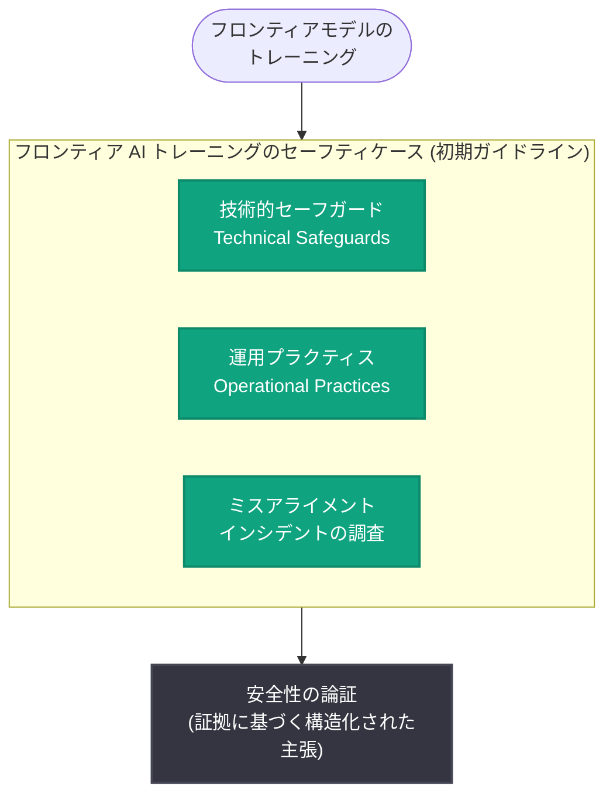

# フロンティア AI トレーニングにおけるセーフティケースに向けて

## メタデータ

| 項目 | 内容 |
|------|------|
| 発表日 | 2026-09-28 |
| ソース | OpenAI News (Safety) |
| カテゴリ | 研究成果 / 安全性 |
| 公式リンク | https://openai.com/index/towards-safety-cases-for-frontier-ai-training |

> **注記**: 本レポート作成時点で、詳細ページの取得を試行しましたが、openai.com が自動アクセスに対して 403 (Cloudflare チャレンジ) を返したため、記事全文は取得できませんでした。本レポートは公式の発表タイトルおよび概要 (「フロンティア AI トレーニングにおけるセーフティケースの初期ガイドラインとして、技術的セーフガード、運用プラクティス、ミスアライメントインシデントの調査をカバーする」) に基づいて作成しています。概要に含まれない技術詳細は「未確認」と明記しています。

## 概要

OpenAI は 2026 年 9 月 28 日、フロンティア AI モデルの「トレーニング段階」を対象としたセーフティケース (safety case) の初期ガイドラインを発表しました。セーフティケースとは、システムが特定の文脈において十分に安全であることを、証拠に基づく構造化された議論として示す手法であり、航空・原子力などの高信頼性産業で長く用いられてきた概念です。

今回の発表は、デプロイ (提供) 段階だけでなく、モデルをトレーニングする段階そのものの安全性を体系的に論証しようとする点が特徴です。ガイドラインは (1) 技術的セーフガード、(2) 運用プラクティス、(3) ミスアライメントインシデントの調査、という 3 つの領域をカバーするとされています。

## 主な内容

公式概要によると、初期ガイドラインは以下の 3 領域で構成されます。各領域の具体的な内容は記事全文が取得できていないため「未確認」ですが、概要から読み取れる範囲を整理します。

### 1. 技術的セーフガード (Technical Safeguards)

トレーニング中のフロンティアモデルに対する技術的な安全対策を扱う領域です。具体的にどのような対策 (例: トレーニング中の評価、能力の監視、アクセス制御など) が含まれるかは未確認です。

### 2. 運用プラクティス (Operational Practices)

トレーニングを実施する組織・プロセス面での安全確保を扱う領域です。運用体制、意思決定プロセス、エスカレーション手順などが含まれる可能性がありますが、詳細は未確認です。

### 3. ミスアライメントインシデントの調査 (Investigating Misalignment Incidents)

トレーニング中または評価中に観測されたミスアライメント (モデルの挙動が意図から逸脱する事象) のインシデントをどのように調査するかを扱う領域です。調査の具体的な手法・基準・報告プロセスは未確認です。

## 背景: セーフティケースとは

セーフティケースは「システムが特定の運用環境で許容可能な程度に安全であることを示す、構造化された証拠に基づく主張」です。AI 安全性の分野では、フロンティアモデルの能力が高まるにつれ、評価結果の羅列ではなく、明示的な主張 (claim)・議論 (argument)・証拠 (evidence) の連鎖として安全性を論証するアプローチとして注目されています。

OpenAI は 2026 年 9 月 22 日にも「Priorities and principles for third-party assessments」(第三者評価の優先事項と原則) を公表しており、今回の発表は安全性ガバナンスの枠組み整備を継続的に進める流れの一環と位置付けられます (両発表の直接的な関係性は未確認)。

## ガイドラインの構造 (概要ベース)

※ 上図は公式概要に記載された 3 領域を図示したものであり、各領域間の関係や内部構造は未確認です。

## 開発者・コミュニティへの影響

- **トレーニング段階の安全性への注目**: デプロイ前評価 (Preparedness Framework など) に加え、トレーニングプロセス自体を安全性論証の対象とする動きが明確になり、フロンティアモデル開発の透明性向上につながる可能性があります
- **業界標準化への布石**: 「初期ガイドライン (early guidelines)」という位置付けから、今後の改訂や業界全体での議論の出発点となることが期待されます
- **ミスアライメント調査の体系化**: インシデント調査がガイドラインの柱の 1 つとされたことで、ミスアライメント事象の報告・分析プラクティスが整備されていく可能性があります

※ API や製品への直接的な変更を伴う発表ではないため、開発者が即座に対応すべき事項は確認されていません。

## 関連リンク

- [Towards safety cases for frontier AI training (公式記事)](https://openai.com/index/towards-safety-cases-for-frontier-ai-training)
- [OpenAI Safety](https://openai.com/safety)
- [OpenAI News](https://openai.com/news)
- [OpenAI Preparedness Framework](https://openai.com/preparedness)

## まとめ

OpenAI は、フロンティア AI の「トレーニング段階」の安全性を体系的に論証するためのセーフティケース初期ガイドラインを発表しました。ガイドラインは技術的セーフガード、運用プラクティス、ミスアライメントインシデントの調査という 3 領域をカバーします。記事全文が取得できなかったため各領域の具体的内容は未確認ですが、デプロイ前評価にとどまらずトレーニングプロセス自体を安全性ガバナンスの対象とする点で、フロンティア AI 開発の安全性議論における重要な一歩と言えます。
