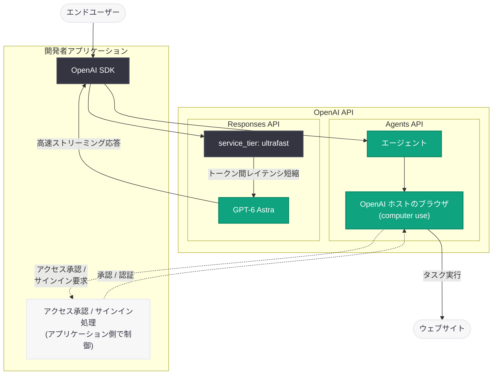

# API 更新: Agents API にコンピュータ操作機能を追加、GPT-6 Astra に Ultrafast モードが登場

## メタデータ

| 項目 | 内容 |
|------|------|
| 発表日 | 2026-09-29 |
| ソース | OpenAI API Changelog |
| カテゴリ | API 更新 |
| 公式リンク | [OpenAI API Changelog](https://developers.openai.com/api/docs/changelog) |

## 概要

OpenAI は 2026 年 9 月 29 日、API Changelog で 2 つの機能追加を発表した。1 つ目は **Agents API へのコンピュータ操作 (computer use) 機能の追加**で、エージェントが OpenAI ホストのブラウザ内でタスクを完了できるようになった。ウェブサイトへのアクセス承認とサインインは開発者のアプリケーション側で処理する設計となっており、ブラウザ環境の構築・運用を OpenAI 側に任せられる点が特徴である。

2 つ目は **GPT-6 Astra (`gpt-6-astra`) への Ultrafast モードの追加**である。Responses API で `service_tier: "ultrafast"` を指定することで、生成される出力トークン間の待ち時間 (トークン間レイテンシ) を短縮できる。音声対話やリアルタイム UI など、体感速度が重要なユースケースに向けた新しいサービスティアとなる。

なお、同日の Changelog では GPT-6.1 Sol (`gpt-6.1-sol`) のリリースも発表されているが、こちらは別レポート ([Introducing GPT-6.1 Sol](2026-09-29-introducing-gpt-6-1-sol.md)) で詳しく扱う。

## 主な内容

### Agents API のコンピュータ操作 (computer use) 機能

Agents API を利用するエージェントが、OpenAI がホストするブラウザ内でウェブタスクを実行できるようになった。Changelog 原文では以下のように案内されている。

> Agents can complete tasks in an OpenAI-hosted browser, with website access approvals and sign-in handled by your application.

ポイントは以下のとおり。

- **OpenAI ホストのブラウザ**: 開発者が自前でブラウザ環境 (仮想マシン、Playwright / Selenium 環境など) を構築・運用する必要がなく、OpenAI 側がホストするブラウザでエージェントがタスクを実行する
- **アクセス承認はアプリケーション側で制御**: エージェントがどのウェブサイトにアクセスできるかの承認 (approval) は、開発者のアプリケーション側でハンドリングする。これにより、意図しないサイトへのアクセスを防ぐガードレールを設けられる
- **サインインもアプリケーション側で処理**: 認証が必要なサイトへのサインインもアプリケーション側で扱う設計で、認証情報をエージェントのプロンプトに直接渡す必要がない

これまでコンピュータ操作をエージェントに組み込むには、スクリーンショットの取得・アクションの実行・環境の維持といった実行ループを開発者側で実装する必要があった。Agents API のコンピュータ操作機能により、ブラウザ操作を伴うエージェントの構築・運用コストが大きく下がることになる。

### GPT-6 Astra の Ultrafast モード

GPT-6 Astra を Responses API で使用する際、新しいサービスティア `ultrafast` を指定できるようになった。

- **指定方法**: Responses API のリクエストで `model: "gpt-6-astra"` と `service_tier: "ultrafast"` を組み合わせる
- **効果**: 生成される出力トークン間の時間 (inter-token latency) を短縮する。最初のトークンが返るまでの時間だけでなく、ストリーミング中のトークン供給速度が向上するため、長い応答でも体感速度が改善する
- **提供条件**: レート制限の対象となる。グローバル処理 (global processing) と米国データレジデンシー (US data residency) に対応する一方、**EU などその他の地域推論レジデンシーはサポートされない**
- **料金**: Ultrafast ティア専用の料金が適用される。具体的な金額は [Ultrafast の料金ページ](https://developers.openai.com/api/docs/pricing?latest-pricing=ultrafast) を参照

Changelog 原文の注意書きは以下のとおり。

> EU and other regional inference residency aren't supported.

### 同日リリースの GPT-6.1 Sol (別レポート参照)

同じ 2026 年 9 月 29 日の Changelog では、複雑なコーディングとプロフェッショナルワーク向けの新モデル GPT-6.1 Sol (`gpt-6.1-sol`) のリリースも発表された。GPT-6 Astra より低コストで、ベータ版のマルチエージェント機能 (Responses API リクエスト内でのサブエージェントへの委任) を備える。詳細は別レポートを参照のこと。

## 技術的な詳細

### service_tier パラメータ

`service_tier` は Responses API のリクエストパラメータで、リクエストの処理優先度・レイテンシ特性を制御する。今回のアップデートで、GPT-6 Astra に対して `"ultrafast"` が指定可能になった。

| 項目 | 内容 |
|------|------|
| パラメータ | `service_tier` |
| 新しい値 | `"ultrafast"` |
| 対象モデル | `gpt-6-astra` |
| 対象エンドポイント | Responses API (`v1/responses`) |
| 効果 | 出力トークン間レイテンシの短縮 |
| データレジデンシー | グローバル処理と米国のみ (EU などの地域推論レジデンシーは非対応) |
| 料金 | Ultrafast 専用料金 (料金ページ参照) |

### コードサンプル

#### GPT-6 Astra を Ultrafast モードで呼び出す (Python)

```python
from openai import OpenAI

client = OpenAI()

# service_tier に "ultrafast" を指定して
# 出力トークン間のレイテンシを短縮する
stream = client.responses.create(
    model="gpt-6-astra",
    service_tier="ultrafast",
    input="リアルタイム対話アプリの応答を生成してください。",
    stream=True,
)

for event in stream:
    if event.type == "response.output_text.delta":
        print(event.delta, end="", flush=True)
```

#### GPT-6 Astra を Ultrafast モードで呼び出す (JavaScript)

```javascript
import OpenAI from "openai";

const client = new OpenAI();

const stream = await client.responses.create({
  model: "gpt-6-astra",
  service_tier: "ultrafast",
  input: "リアルタイム対話アプリの応答を生成してください。",
  stream: true,
});

for await (const event of stream) {
  if (event.type === "response.output_text.delta") {
    process.stdout.write(event.delta);
  }
}
```

## アーキテクチャ

今回の 2 つのアップデートの位置づけを図示する。



## 開発者への影響

### ブラウザ操作エージェントの構築が容易に

- **インフラ運用が不要**: OpenAI ホストのブラウザを使うため、コンピュータ操作用の仮想環境やブラウザ自動化基盤を自前で構築・運用する必要がない
- **ガードレールを組み込みやすい**: ウェブサイトへのアクセス承認をアプリケーション側でハンドリングする設計のため、許可リストや人間による確認 (human-in-the-loop) を実装しやすい
- **認証情報の分離**: サインインをアプリケーション側で処理するため、認証情報をモデルへの入力から分離できる

### レイテンシ要件の厳しいユースケースへの対応

- **リアルタイム性の向上**: `service_tier: "ultrafast"` により、音声アシスタント、ライブチャット、コーディング補完などトークン供給速度が体感品質に直結するユースケースで GPT-6 Astra を使いやすくなる
- **コストとのトレードオフ**: Ultrafast は専用料金が適用されるため、レイテンシ要件と予算に応じて標準ティアと使い分ける必要がある
- **データレジデンシーの確認が必要**: EU などの地域推論レジデンシーが必要なワークロードでは Ultrafast モードを利用できないため、コンプライアンス要件を事前に確認する

### 導入時のチェックポイント

- Ultrafast はレート制限の対象となるため、想定トラフィックに対するレート制限の確認を行う
- computer use を有効にする場合は、アクセス承認フローとサインイン処理の実装が前提となる

## 関連リンク

- [OpenAI API Changelog](https://developers.openai.com/api/docs/changelog)
- [Ultrafast の料金ページ](https://developers.openai.com/api/docs/pricing?latest-pricing=ultrafast)
- [OpenAI API ドキュメント](https://platform.openai.com/docs)
- [OpenAI API リファレンス](https://platform.openai.com/docs/api-reference)

## まとめ

2026 年 9 月 29 日の API Changelog では、エージェントと低レイテンシ推論という 2 つの方向でのアップデートが発表された。Agents API のコンピュータ操作機能は、OpenAI ホストのブラウザでエージェントがウェブタスクを完了できるようにし、アクセス承認とサインインをアプリケーション側で制御する設計により、安全性と構築の容易さを両立している。GPT-6 Astra の Ultrafast モードは、Responses API で `service_tier: "ultrafast"` を指定するだけで出力トークン間のレイテンシを短縮でき、リアルタイム性が求められるアプリケーションでの GPT-6 Astra 活用を後押しする。ただし Ultrafast は専用料金とレート制限の対象であり、EU などの地域推論レジデンシーには対応しない点に注意が必要である。
