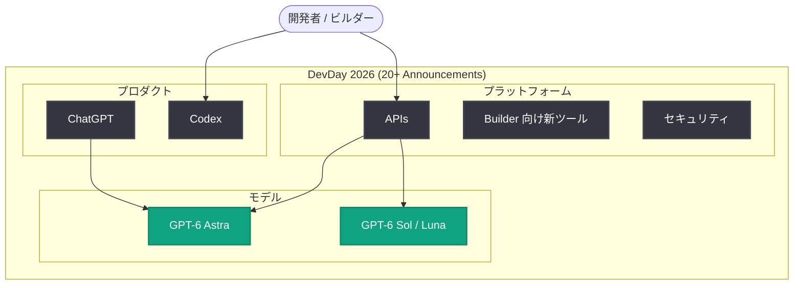

# DevDay 2026 Recap: GPT-6 Astra、ChatGPT、Codex、API など 20 件超の発表を総括

## メタデータ

| 項目 | 内容 |
|------|------|
| 発表日 | 2026-09-29 |
| ソース | OpenAI News (Company) |
| カテゴリ | イベント総括 / 新機能 / API 更新 |
| 公式リンク | https://openai.com/index/devday-2026-recap |

> **注記**: 本レポート作成時点で詳細ページ (openai.com) はボット保護 (Cloudflare チャレンジ) により本文を取得できませんでした。本レポートは公式告知の概要文 (「GPT-6 Astra、ChatGPT、Codex、API、セキュリティ、ビルダー向け新ツールを含む 20 件超の発表」) と、本リポジトリに蓄積された直近の関連レポート (2026 年 9 月分) に基づいて構成しています。個々の発表の正確な詳細は、必ず公式リンクを参照してください。

## 概要

OpenAI は 2026-09-29、開発者向け年次イベント **DevDay 2026** の総括記事「DevDay 2026 Recap」を公開しました。本記事では、DevDay 2026 で行われた **20 件を超える発表**がまとめられており、対象領域はフラッグシップモデル **GPT-6 Astra**、**ChatGPT**、コーディングエージェント **Codex**、**API**、**セキュリティ**、そして**ビルダー向けの新ツール**に及びます。

DevDay 2026 は、今月 (2026 年 9 月) の GPT-6 ファミリー展開 (GPT-6 Astra に続く GPT-6 Sol / Luna の発表、API 価格の 50% 引き下げ、プロンプトキャッシングの改善など) の直後に開催されており、モデル・製品・開発者プラットフォームの進化を一望できるマイルストーンとなっています。

## 主な内容

公式概要文で挙げられた発表領域を軸に、DevDay 2026 の発表を分野別に整理します。

### モデル: GPT-6 Astra を中心とした GPT-6 ファミリー

DevDay 2026 の中心は、フラッグシップモデル **GPT-6 Astra** に関する発表です。GPT-6 Astra は 2026 年 9 月に発表された OpenAI の最上位モデルで、専門的業務 (Professional work)、事実性 (Factuality)、コーディング、コンピュータ操作、アライメントにおける進歩が特徴とされています。

直近の関連発表 (本リポジトリの既存レポートより) は以下のとおりです。

| 発表 | 日付 | 要点 |
|------|------|------|
| GPT-6 Sol / Luna | 2026-09-22 | Astra の進歩を高速・低価格モデルに展開。API 価格は前世代比 50% 引き下げ |
| プロンプトキャッシング改善 | 2026-09-22 | GPT-6 向けキャッシング効率の向上によるコスト削減 |
| GPT-6 画像エンコーディング修正 | 2026-09-25 | 画像入力処理の品質改善 |

DevDay では、Airbnb、Harvey、invideo、Parallel、Basis など、GPT-6 Astra を活用する企業事例も相次いで紹介されています (各事例は個別レポートを参照)。

### ChatGPT

ChatGPT 関連の機能強化も DevDay の発表領域に含まれています。詳細は公式ページ未取得のため確認できていませんが、直近では ChatGPT の広告展開 (東南アジア・台湾への拡大、2026-09-23) など、ChatGPT のプラットフォームとしての拡張が進んでいます。

### Codex: コーディングエージェント

**Codex** は OpenAI のコーディングエージェントで、DevDay 2026 でも主要な発表領域の 1 つです。DevDay 前日の 2026-09-28 には、Codex の活用ストーリーを募集する「**Codex Originals**」プログラムが公開されており、ビルダー、ティンカラー、研究者、クリエイターによる Codex 活用事例の共有が呼びかけられています。

### API とビルダー向け新ツール

DevDay の伝統として、API と開発者ツールのアップデートは中心的なテーマです。今回も「新しいビルダー向けツール (new tools for builders)」が発表領域として明示されています。前提となる直近の API 動向は以下のとおりです。

- **API 価格の引き下げ**: GPT-6 Sol は入力 $2 / 出力 $10 (100 万トークンあたり)、GPT-6 Luna は入力 $0.10 / 出力 $0.50 と、前世代のプロモーション価格から 50% の値下げ
- **プロンプトキャッシングの改善**: キャッシングと推論基盤の改善によるコスト削減分のユーザー還元

### セキュリティ

セキュリティも発表領域の 1 つとして明示されています。OpenAI は直近で、第三者評価に関する方針「Priorities, Principles, Third-party Assessments」(2026-09-22) や、ウクライナの民間防衛向けサイバーアクセス拡大 (2026-09-23) などを発表しており、DevDay でもエンタープライズ・開発者向けのセキュリティ強化が扱われたとみられます。

## 発表領域の全体像

## 開発者への影響

- **モデル選択の幅が拡大**: 最高性能が必要な場合は GPT-6 Astra、コスト効率を重視する場合は GPT-6 Sol / Luna という使い分けが明確化
- **コスト構造の改善**: API 価格の 50% 引き下げとプロンプトキャッシング改善により、エージェント型ワークロードの運用コストが大幅に低下
- **Codex エコシステムの拡充**: Codex Originals などのプログラムを通じ、コーディングエージェント活用の知見共有が加速
- **セキュリティ関連の発表**: エンタープライズ導入時の評価・監査要件に影響する可能性があるため、公式ページでの詳細確認を推奨

## 関連リンク

- [DevDay 2026 Recap (公式)](https://openai.com/index/devday-2026-recap)
- [OpenAI News](https://openai.com/news)
- [OpenAI 公式ドキュメント](https://platform.openai.com/docs)
- [OpenAI API リファレンス](https://platform.openai.com/docs/api-reference)
- [Introducing GPT-6 Sol and Luna](https://openai.com/index/introducing-gpt-6-sol-and-luna)
- [Codex Originals 応募フォーム](https://openai.com/form/codex-originals)

## まとめ

DevDay 2026 Recap は、GPT-6 Astra を中心とするモデル群、ChatGPT、Codex、API、セキュリティ、ビルダー向け新ツールにまたがる **20 件超の発表**を総括する公式記事です。2026 年 9 月の GPT-6 ファミリー展開 (Sol / Luna の 50% 値下げ、キャッシング改善) と企業導入事例の流れを受けたイベントであり、開発者にとってはモデル選択・コスト・ツーリングの全面的なアップデートを確認する重要な起点となります。本レポート作成時点では詳細ページ本文を取得できなかったため、個々の発表内容 (20 件超の内訳) は公式ページで直接確認してください。
