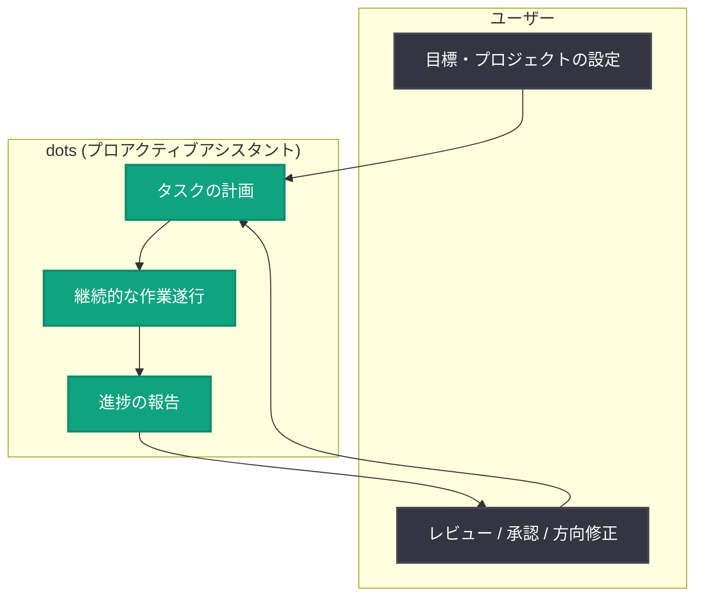

# Introducing dots: OpenAI がプロアクティブなアシスタント「dots」を発表

## メタデータ

| 項目 | 内容 |
|------|------|
| 発表日 | 2026-09-29 |
| ソース | OpenAI News (Product) |
| カテゴリ | 新機能 / 製品発表 |
| 公式リンク | https://openai.com/index/introducing-dots |

> **注記**: 本レポート作成時点で、公式詳細ページ (openai.com) はアクセス制限 (Cloudflare チャレンジ) により本文を取得できませんでした。本レポートは公式発表の概要 (アナウンス文) に基づいて作成しています。詳細仕様については公式ページを直接ご確認ください。

## 概要

OpenAI は 2026 年 9 月 29 日、新しいプロアクティブ (能動的) なアシスタント「dots」を発表しました。公式発表によると、dots は複雑なプロジェクトから日常的なタスクまで、ユーザーに代わって継続的に作業を進めることができるアシスタントです。

従来のチャット型 AI アシスタントが「ユーザーの指示を受けてから応答する」リアクティブな (受動的な) モデルであったのに対し、dots は「作業が進行している間もユーザーがコントロールを保てる (stay in control while work moves forward)」ことを重視した設計になっています。ユーザーの明示的な指示を待たずに作業を継続できる、エージェント型 AI の製品化における重要な一歩と位置づけられます。

## 主な内容

### プロアクティブなアシスタントという位置づけ

公式発表では、dots の特徴として以下の 2 点が強調されています。

- **継続的な作業遂行**: 複雑なプロジェクト (complex projects) と日常タスク (everyday tasks) の両方にまたがって、作業を止めずに進め続けることができる (can keep working)
- **ユーザーによるコントロールの維持**: 作業が自動的に進行する一方で、ユーザーが主導権と可視性を保てる仕組み (stay in control) を提供する

### 従来のアシスタントとの違い (発表概要からの整理)

| 観点 | 従来のチャット型アシスタント | dots (プロアクティブアシスタント) |
|------|------------------------------|-----------------------------------|
| 動作モデル | 指示への応答 (リアクティブ) | 能動的に作業を継続 (プロアクティブ) |
| 作業の単位 | 1 回の対話・タスク | 複数タスク・プロジェクト横断 |
| ユーザーの関与 | 都度指示が必要 | 進行中もコントロールを維持 |

### エージェント型 AI の流れの中での意味

OpenAI はこれまで、ChatGPT のタスク機能、Operator、Codex、ChatGPT Agent など、AI が自律的に作業を進めるエージェント型の機能を段階的に展開してきました。dots はこの流れを製品として前進させるものであり、「ユーザーが常に指示しなくても仕事が前に進む」体験と、「AI 任せにしすぎない安全なコントロール」の両立を目指した設計思想がうかがえます。

## 技術的な詳細

詳細ページの本文が取得できなかったため、API 仕様・対応プラン・利用方法などの技術詳細は本レポートでは確認できていません。公式ページおよび今後のドキュメント更新をご確認ください。

## アーキテクチャ (概念図)

以下は公式発表の概要から推定される、プロアクティブアシスタントの概念的な動作イメージです (公式のアーキテクチャ図ではありません)。

## 開発者・ユーザーへの影響

- **働き方の変化**: 指示のたびに AI を待つのではなく、AI が裏で作業を進め、ユーザーは要所でレビュー・判断に集中するワークフローへの移行が想定されます
- **エージェント活用の一般化**: 複雑なプロジェクト管理だけでなく日常タスクにも適用されるため、開発者以外の一般ユーザーにもエージェント型 AI の利用が広がる可能性があります
- **コントロール設計への注目**: 「作業が進む間もユーザーがコントロールを保つ」という設計は、自律エージェントを製品に組み込む際の UX・安全性設計の参考になります
- **今後の確認が必要な点**: 提供対象 (プラン・地域)、料金、API 連携の有無などは、現時点の公開情報からは確認できていません

## 関連リンク

- [Introducing dots (公式発表)](https://openai.com/index/introducing-dots)
- [OpenAI News](https://openai.com/news)
- [OpenAI 公式ドキュメント](https://platform.openai.com/docs)

## まとめ

OpenAI が発表した dots は、複雑なプロジェクトから日常タスクまで継続的に作業を進めるプロアクティブなアシスタントです。「作業が前に進む間もユーザーがコントロールを保つ」というコンセプトは、リアクティブなチャット型 AI からエージェント型 AI への移行を象徴するものであり、今後の詳細情報 (提供範囲、料金、API 対応など) の公開が注目されます。
