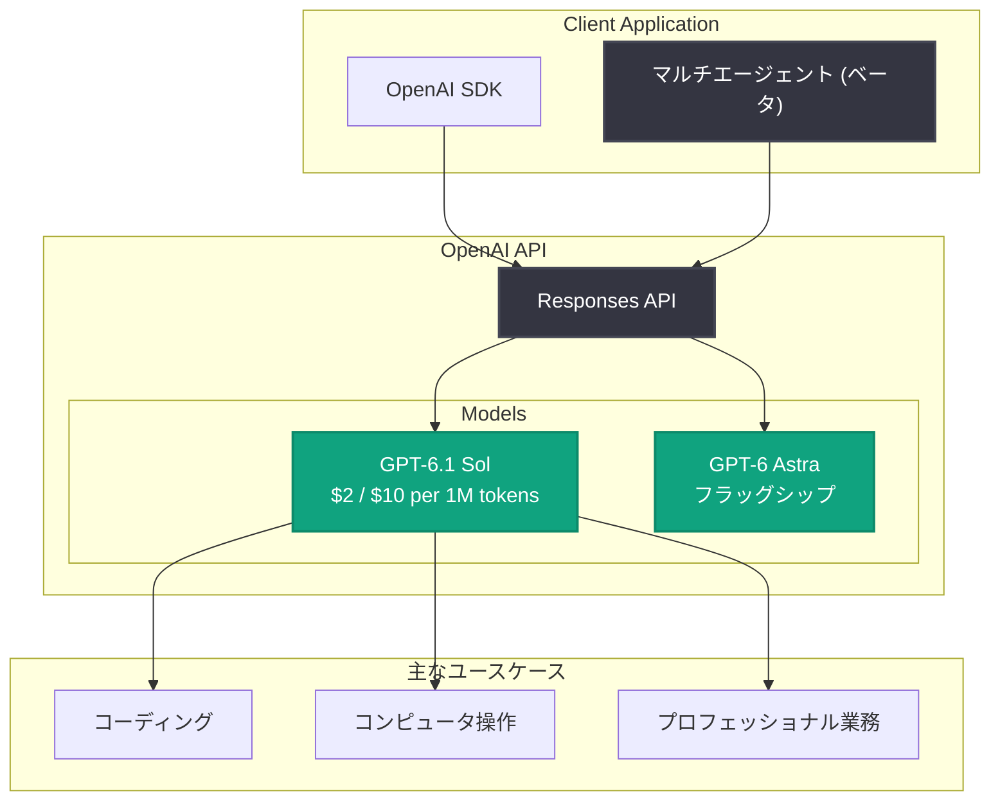

# GPT-6.1 Sol 発表: Astra 級の知能を 1/5 のコストで提供する新モデル

## メタデータ

| 項目 | 内容 |
|------|------|
| 発表日 | 2026-09-29 |
| ソース | OpenAI News (Product) |
| カテゴリ | 新機能 / 新モデル |
| 公式リンク | https://openai.com/index/introducing-gpt-6-1-sol |

## 概要

OpenAI は 2026 年 9 月 29 日、新モデル **GPT-6.1 Sol** (`gpt-6.1-sol`) を発表した。GPT-6.1 Sol は、コーディング、コンピュータ操作 (computer use)、プロフェッショナル業務において、フラッグシップモデルである GPT-6 Astra に迫る知能 (near-Astra intelligence) を実現しながら、API の標準価格を Astra の入力・出力トークン価格の 1/5 に抑えたコスト効率重視のモデルである。

API Changelog によると、標準価格は 100 万トークンあたり入力 $2、出力 $10 に設定されており、複雑なコーディングタスクやプロフェッショナル業務を低コストで処理できる。また、マルチエージェント機能がベータ版として提供される。

## 主な内容

### Astra 級の知能を低価格で

GPT-6.1 Sol の最大の特徴は、性能とコストのバランスである。フラッグシップの GPT-6 Astra に近い知能を維持しつつ、標準 API 価格を Astra の 1/5 に設定している。これにより、これまでコスト面でフラッグシップモデルの採用をためらっていた大規模ワークロードでも、高い知能を持つモデルを利用しやすくなる。

| 項目 | GPT-6.1 Sol |
|------|-------------|
| モデル ID | `gpt-6.1-sol` |
| 入力価格 | $2 / 100 万トークン |
| 出力価格 | $10 / 100 万トークン |
| 対 Astra 価格比 | 入力・出力ともに 1/5 |
| 主な用途 | コーディング、コンピュータ操作、プロフェッショナル業務 |
| マルチエージェント機能 | ベータ提供 |

### 主なユースケース

公式発表では、以下の 3 つの領域が主なターゲットとして挙げられている。

1. **コーディング**: 複雑なコーディングタスクへの対応。コード生成、リファクタリング、デバッグなどの開発ワークフローを低コストで自動化できる
2. **コンピュータ操作 (computer use)**: 画面操作を伴うエージェントタスク。ブラウザ操作や業務アプリケーションの自動操作など
3. **プロフェッショナル業務**: 文書作成、分析、レビューなどの専門的なナレッジワーク

### マルチエージェント機能 (ベータ)

API Changelog によると、GPT-6.1 Sol ではマルチエージェント機能がベータ版として提供される。複数のエージェントを連携させるワークフローを構築でき、低価格なモデル特性と組み合わせることで、多数のエージェントを並列に動かす構成でもコストを抑えやすい。

## 技術的な詳細

モデル ID `gpt-6.1-sol` を指定することで、既存の API から利用できる。

### コードサンプル

```python
from openai import OpenAI

client = OpenAI()

# GPT-6.1 Sol でコーディングタスクを実行
response = client.responses.create(
    model="gpt-6.1-sol",
    input=[
        {
            "role": "user",
            "content": "Python で CSV ファイルを読み込み、"
                       "列ごとの統計情報を出力する関数を書いてください。",
        }
    ],
)

print(response.output_text)
```

### コスト比較の考え方

Astra の 1/5 の価格設定により、同じ予算で 5 倍のトークンを処理できる。例えば月間 1 億トークン (入力 8,000 万 / 出力 2,000 万) を処理する場合、GPT-6.1 Sol では入力 $160 + 出力 $200 = 月額 $360 で運用できる計算になる。

## アーキテクチャ



## 開発者への影響

- **コスト削減**: Astra 級の知能を必要とするワークロードを 1/5 の価格で運用でき、大規模なバッチ処理やエージェント運用のコスト構造を大きく改善できる
- **エージェント構築の選択肢拡大**: コーディングやコンピュータ操作に強く、マルチエージェント機能 (ベータ) も利用できるため、エージェントワークフローの標準モデル候補になる
- **モデル選定の見直し**: これまで価格を理由に下位モデルを選んでいたユースケースで、GPT-6.1 Sol への移行を検討する価値がある
- **ベータ機能への注意**: マルチエージェント機能はベータ提供のため、本番導入前に仕様変更の可能性を考慮する必要がある

## 関連リンク

- [Introducing GPT-6.1 Sol (OpenAI 公式発表)](https://openai.com/index/introducing-gpt-6-1-sol)
- [OpenAI API Changelog](https://platform.openai.com/docs/changelog)
- [OpenAI 公式ドキュメント](https://platform.openai.com/docs)
- [OpenAI API リファレンス](https://platform.openai.com/docs/api-reference)
- [OpenAI News](https://openai.com/news)

## まとめ

GPT-6.1 Sol は、GPT-6 Astra に迫る知能を 1/5 の価格 (入力 $2 / 出力 $10 per 100 万トークン) で提供する新モデルである。コーディング、コンピュータ操作、プロフェッショナル業務が主なターゲットで、マルチエージェント機能もベータ提供される。高い知能と低コストの両立により、大規模ワークロードやエージェント構築におけるモデル選定の有力な選択肢となる。
