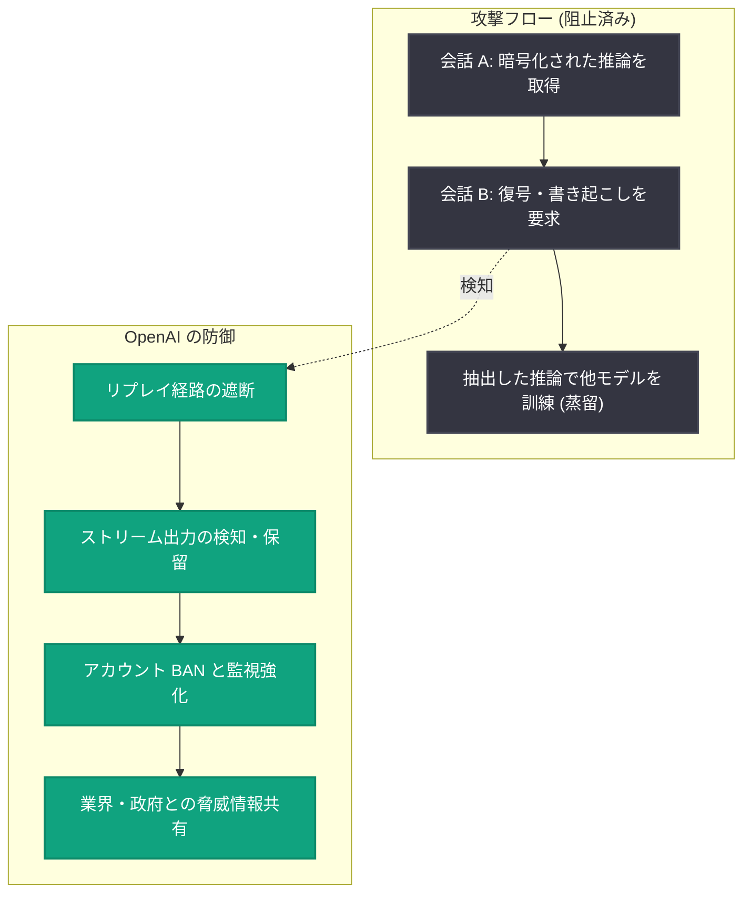

# 組織的なモデル蒸留キャンペーンの阻止 — 保護された推論の抽出攻撃への対応

## メタデータ

| 項目 | 内容 |
|------|------|
| 発表日 | 2026-09-30 |
| ソース | OpenAI News |
| カテゴリ | Security |
| 公式リンク | https://openai.com/index/disrupting-a-coordinated-model-distillation-campaign |

## 概要

OpenAI は、モデルの「保護された推論 (protected reasoning)」を抽出しようとする組織的なキャンペーンを特定し、阻止したことを発表した。保護された推論とは、モデルがタスクを処理する際の内部的な思考記録であり、最終的な回答には含まれない情報である。この抽出行為は「敵対的蒸留 (adversarial distillation)」に該当し、他モデルの出力や推論を無断で利用して別のモデルを訓練・複製・改善する行為にあたる。

攻撃は 7 月 1 日に低ボリュームで始まり、7 月 24〜25 日には 4,000 人超のユーザーから 16,000 件のリクエストに急増したが、OpenAI は 7 月 28 日までにこのキャンペーンを完全に阻止した。関連するプロンプトパターンの調査では、15,000 人超のユーザーからなるクラスターが特定された。OpenAI は、中核クラスターが Kimi の開発元である Moonshot AI に関係する個人に帰属すると評価している。

## 主な内容

### 攻撃の手法

攻撃者は暗号化を解読したり、保存された会話データベースに侵入したりしたわけではない。代わりに、モデルとのやり取りを巧妙に操作し、保護された推論を要求者に見える形で再現させる新規の手法を用いた。

- **リプレイ攻撃**: ある会話から暗号化された推論をコピーし、別の会話でモデルに復号・書き起こしを依頼する
- **組織的な実行**: 多数のアカウントを使った協調的なリクエストパターン
- **第三者サービスの悪用**: OpenAI の直接の API だけでなく、サードパーティプロバイダー経由でも活動が行われた

### キャンペーンの規模と時系列

| 時期 | 状況 |
|------|------|
| 7 月 1 日 | 活動開始 (当初は低ボリューム) |
| 7 月 24〜25 日 | 急増: 4,000 人超のユーザーから 16,000 件の抽出リクエスト |
| 7 月 28 日 | キャンペーンを完全に阻止 |

関連パターンの調査により、15,000 人超のユーザークラスターを特定。すべての操作者が単一アクターかは不明だが、中核クラスターは Moonshot AI (Kimi の開発元) に関係する個人に帰属すると評価された。

### OpenAI の対応

1. **アカウント対策**: 不正アカウントの BAN と制限、サインアップとインフラ管理の強化、関連ネットワークの監視拡大
2. **技術的対策**:
   - ユーザー・ワークスペース・組織・モデルファミリーを横断した隠れた推論の保護強化
   - 他ユーザーの暗号化推論をリプレイして内容を復元できる経路の遮断
   - 推論を露出しうるストリーム出力を検知・保留するチェックの追加
3. **業界連携**: サードパーティプロバイダーと協力して関与アカウントを特定・排除。Frontier Model Forum や政府の情報共有チャネルを通じて知見を共有
4. **責任ある開示**: 独立したセキュリティ研究者が、クロスモデルおよび会話圧縮 (conversation-compaction) に関する脆弱性を報告。OpenAI は攻撃経路の実在を確認し、対策を加速した

## 技術的な詳細

攻撃の中心は、推論モデルが内部的に保持する「暗号化された推論トークン」を、会話をまたいだリプレイによって平文として引き出す手口である。OpenAI はこれに対し、推論データの保護スコープを拡大し、リプレイ経路の遮断とストリーミング出力の検査を導入した。

## アーキテクチャ

## 開発者・ユーザーへの影響

- **正規ユーザーへの影響は限定的**: 対策は抽出パターンを標的としており、通常の API 利用や ChatGPT の利用には影響しない
- **安全性の維持**: 抽出された推論は、元モデルに適用された安全対策を保持しないまま別モデルの訓練に使われる恐れがあり、今回の対策はこのリスクを低減する
- **サードパーティ経由の利用**: パートナーホスト型のデプロイメントにも同等の保護が展開される予定であり、クラウドパートナー経由の利用者にも保護が及ぶ
- **業界全体の課題**: この脆弱性は OpenAI 固有ではなく、推論モデルを提供するすべての事業者に共通する課題である

## 今後の対策

OpenAI は蒸留攻撃が今後さらに高度化すると予想しており、以下の 3 点を重点として多層的・適応的な防御を継続する。

1. 抽出に対する技術的保護の強化 (ツール防御、分類器カバレッジ、モデルの拒否応答の改善)
2. 協調キャンペーンの検知と執行の改善
3. 業界・政府との脅威情報共有の深化

## 関連リンク

- [公式発表: Disrupting a coordinated model-distillation campaign](https://openai.com/index/disrupting-a-coordinated-model-distillation-campaign)
- [OpenAI News](https://openai.com/news)
- [OpenAI 公式ドキュメント](https://platform.openai.com/docs)

## まとめ

OpenAI は、保護された推論を抽出する組織的な蒸留キャンペーンを約 4 週間で検知・阻止し、リプレイ経路の遮断やストリーム出力の検査などの技術的防御を強化した。中核クラスターは Moonshot AI に関係する個人に帰属すると評価されている。この種の攻撃は業界全体の共有課題であり、OpenAI は技術的保護、検知・執行、脅威情報共有の 3 本柱で防御を継続する方針である。
