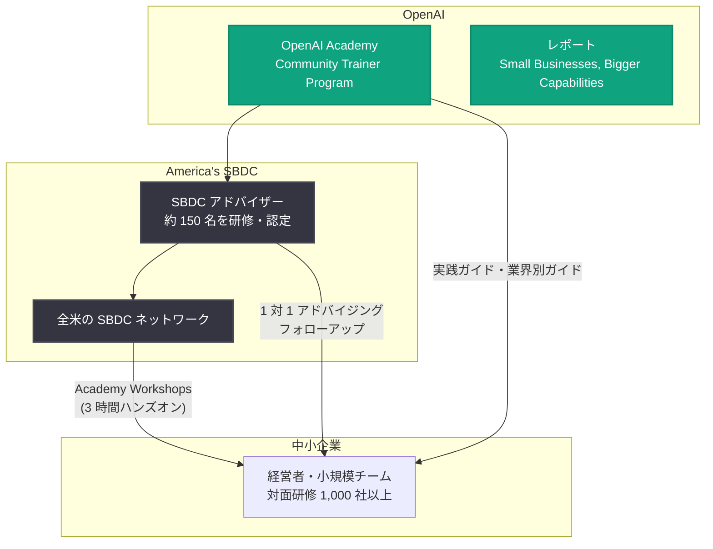

# 中小企業の AI 活用を支援: OpenAI が America's SBDC と提携し研修と地域支援を拡大

## メタデータ

| 項目 | 内容 |
|------|------|
| 発表日 | 2026-09-30 |
| ソース | OpenAI News |
| カテゴリ | Global Affairs |
| 公式リンク | https://openai.com/index/helping-small-businesses-put-ai-to-work |

## 概要

OpenAI は、年間 100 万の起業家を支援する全米の中小企業支援ネットワーク America's SBDC (Small Business Development Centers) との提携を発表した。初期フェーズでは、OpenAI Academy の Community Trainer Program を通じて約 150 名の SBDC アドバイザーを研修し、全米の SBDC ネットワークで実践的なワークショップを展開する。対面研修で少なくとも 1,000 社の中小企業に、さらに 1 対 1 のアドバイジングや共同開発するリソースを通じてより多くの企業に支援を届けることを目指す。

あわせて、中小企業の AI 活用実態を分析した新レポート「Small Businesses, Bigger Capabilities」も公開された。レポートによると、2026 年 9 月 9 日から 15 日のわずか 1 週間で、世界中の約 400 万人の小規模企業従業員が OpenAI のツールを利用したという。

## 主な内容

### アドバイザーの研修と認定

America's SBDC は、中小企業の AI 適用支援に特化した OpenAI Academy の研修・認定パスウェイに参加するアドバイザーを選定する。この研修では、SBDC が持つ地域コミュニティの専門知識と信頼されるアドバイザー関係に AI ツールを組み合わせ、経営者が有用な出発点を選び、AI を責任を持って利用し、ビジネスへの効果を評価できるよう支援する。アドバイザーとスタッフは、別途用意されるファシリテーター向けパスウェイと中小企業向けワークショップモジュールを通じて、グループセッションの進行役も担えるようになる。

### 実践的な地域ワークショップ

OpenAI は SBDC ネットワークと協力して Academy Workshops を開催し、参加する各ネットワークで少なくとも 1 回のワークショップを実施する予定。OpenAI Academy の 3 時間のハンズオン形式をモデルとしたこのセッションでは、経営者が実際のビジネスタスクで ChatGPT の活用方法を構築・検証し、ツールを実践に移すための計画を持ち帰ることができる。ワークショップ後は SBDC アドバイザーがフォローアップを行い、疑問点の解消や効果の確認を支援する。

### ビジネスニーズに基づくリソース開発

America's SBDC と共同で、AI を業務に活用するための実践ガイドと、特定業界に焦点を当てたコンパニオンガイドを作成し、OpenAI Academy と America's SBDC のチャネルで共有する。想定されるトピックには、マーケティング、オペレーション、製造、輸出、政府調達などが含まれる。ガイドの内容には、ワークショップやアドバイジングから得られた知見が反映される。

## 新レポート「Small Businesses, Bigger Capabilities」の主な調査結果

利用データと経営者の体験を組み合わせ、中小企業が OpenAI のツールをどのように活用しているかを分析したレポート。主な調査結果は以下のとおり。

- **週間 400 万人が利用**: 2026 年 9 月の 1 週間 (9 月 9 日〜15 日) に、従業員 500 人未満の企業で約 400 万人が OpenAI 製品を利用した
- **零細企業の利用も活発**: 利用者のほぼ 5 人に 1 人が、従業員 10 人未満の企業に勤務していた
- **エージェント利用が急増**: 2026 年 8 月時点で、ChatGPT Work や Codex などのエージェント型出力トークンが中小企業の全出力トークンの 3 分の 2 を占め、2026 年 4 月の 3 分の 1 から倍増した
- **専門職不在の業務領域で活用**: 財務・会計、サプライチェーン、法務・コンプライアンス、マーケティングの各分野では、中小企業ユーザーの AI エージェントとのやり取りに占める割合が、大企業ユーザーの少なくとも 3 倍に達した

### 活用事例

- **メニュー価格の競合分析**: ニューメキシコ州で 3 つのレストランを経営する Ted Taylor 氏と Tami Taylor 氏は、自店の価格改定前に ChatGPT Work で競合店のメニュー価格を比較。競争力を損なう値上げを回避できた。この比較作業は、AI がなければ実施されなかったという
- **新規営業の開拓**: Teri Moten 氏は ChatGPT Work で南テキサスの学区をリサーチし、カスタマイズしたアウトリーチ資料を作成 (本人がレビューして送付)。開始から 10 日以内に有料研修セッションの受注につながったと報告している

## これまでの中小企業支援との関係

今回の提携は、OpenAI がこれまで進めてきた中小企業向け支援を発展させるもの。

- **Small Business AI Jams (2025 年 11 月)**: OpenAI Academy が DoorDash、SCORE、地域のビジネス団体と協力し、米国 5 都市でマーケティング、顧客コミュニケーション、日常業務などのハンズオン支援を実施
- **ChatGPT for Small Business Program (2026 年 7 月)**: 経営者が業務で AI を活用するための研修とリソースを提供

パイロット期間中、OpenAI は経営者へのフォローアップを継続し、何が役立っているか、何が使われ続けているか、どこに追加支援が必要かを把握する。得られた知見は、共同開発する研修とリソースに反映される。

## 支援体制の全体像

## 影響

### 中小企業への影響

- **信頼できる窓口からの AI 導入支援**: 既に地域で経営者を支援している SBDC アドバイザーが AI 活用の相談役となるため、「どこから始めればよいか分からない」という導入初期のハードルが下がる
- **実務直結のスキル習得**: 3 時間のハンズオンワークショップで、実際のビジネスタスクを題材に ChatGPT の活用方法を構築・検証し、実践計画を持ち帰ることができる
- **専門職の不在を補完**: 財務・会計、法務・コンプライアンス、サプライチェーン、マーケティングなど、専任スタッフを置きにくい領域で AI が小規模チームの能力を拡張する
- **継続的なフォローアップ**: ワークショップ後もアドバイザーによる個別支援が受けられ、一過性の研修で終わらない

### ユーザー・業界への影響

- **AI 活用の裾野拡大**: 週間 400 万人という利用規模と、エージェント型トークンの急増 (4 か月で 3 分の 1 から 3 分の 2 へ) は、中小企業における AI の実務定着が加速していることを示す
- **業界別ガイドの整備**: マーケティング、製造、輸出、政府調達など、業界・業務別の実践ガイドが OpenAI Academy と SBDC のチャネルで公開される見込み
- **支援モデルの横展開**: 地域の支援機関と連携した研修モデルは、Small Business AI Jams や ChatGPT for Small Business Program に続く取り組みであり、今後の他地域・他分野への展開の基盤となり得る

## 関連リンク

- [公式発表: Helping small businesses put AI to work](https://openai.com/index/helping-small-businesses-put-ai-to-work)
- [レポート: Small Businesses, Bigger Capabilities (PDF)](https://cdn.openai.com/pdf/66991d3b-5dac-48b5-aa3d-f40ccc5d6d0f/small-businesses-bigger-capabilities-september-2026.pdf)
- [America's SBDC](https://americassbdc.org/)
- [OpenAI Academy の 2 年間](https://openai.com/index/two-years-of-openai-academy/)
- [Small Business AI Jam](https://openai.com/index/small-business-ai-jam/)
- [ChatGPT for Small Business Program](https://openai.com/index/introducing-chatgpt-small-business-program/)
- [中小企業向けツールとリソース](https://openai.com/business/why-openai/small-business/)

## まとめ

OpenAI と America's SBDC の提携は、約 150 名のアドバイザー研修と全米でのハンズオンワークショップを通じて、少なくとも 1,000 社の中小企業に実践的な AI 活用支援を届けるパイロットプログラムである。同時公開されたレポート「Small Businesses, Bigger Capabilities」は、週間約 400 万人の小規模企業従業員が OpenAI 製品を利用し、エージェント型の利用が急速に拡大している実態を示した。信頼される地域アドバイザーを介した支援モデルにより、専任スタッフを持たない小規模チームでも AI を実務に取り入れやすくなることが期待される。
