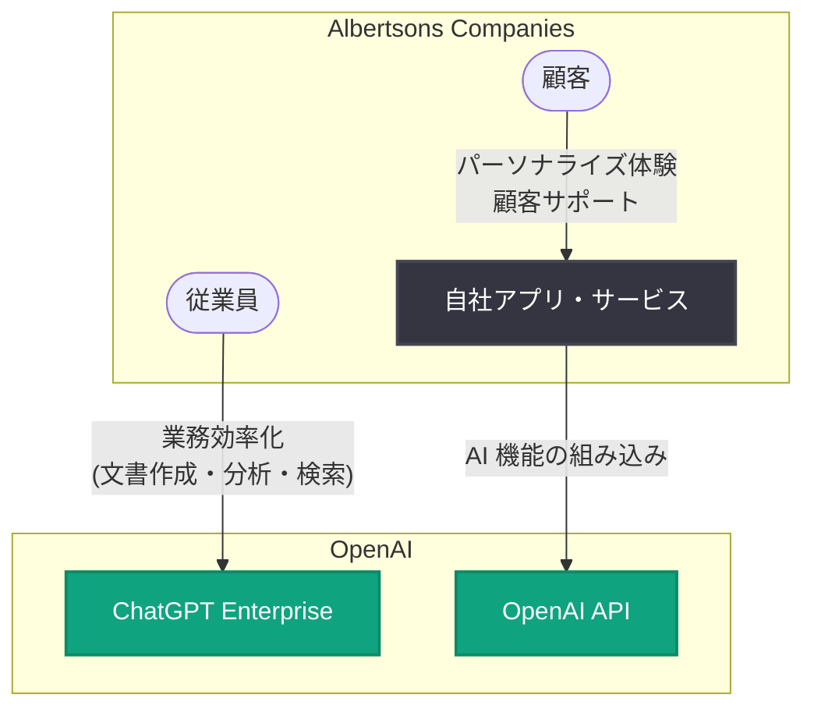

# Albertsons Companies が小売業務を内側から再構築: ChatGPT Enterprise と OpenAI API の全社活用事例

## メタデータ

| 項目 | 内容 |
|------|------|
| 発表日 | 2026-10-01 |
| ソース | OpenAI News |
| カテゴリ | 導入事例 |
| 公式リンク | https://openai.com/index/albertsons-reimagining-retail |

> **注記**: 本レポート作成時点で記事ページへのアクセスが制限されていたため (HTTP 403)、内容は公式発表の概要 (RSS 配信情報) に基づいて構成している。具体的な成果数値や導入規模の詳細は、公式リンクから原文を参照のこと。

## 概要

OpenAI は、米国の大手食品小売企業 Albertsons Companies による AI 活用事例を公開した。Albertsons は、Safeway や Jewel-Osco などの小売ブランドを傘下に持ち、全米で店舗網を展開する大手小売グループである。

本事例では、Albertsons が ChatGPT Enterprise と OpenAI API を組み合わせて活用し、社内業務の効率化と顧客体験の向上の両面で成果を上げたことが紹介されている。タイトルの「reimagining retail from the inside out (小売を内側から再構築する)」が示すとおり、従業員向けの業務改革を起点に、店舗運営や顧客接点まで AI 活用を広げるアプローチが特徴である。

## 主な内容

### ChatGPT Enterprise による社内業務の効率化

ChatGPT Enterprise は、企業向けのセキュリティ・管理機能を備えた ChatGPT の法人プランであり、入力データがモデルの学習に使用されない設計となっている。Albertsons のような大規模小売企業では、一般に以下のような業務での活用が想定される。

- **ドキュメント作成・要約**: 社内レポート、販促資料、業務マニュアルの作成支援
- **データ分析の民主化**: 専門チームに依存せず、現場担当者が自然言語でデータを分析
- **ナレッジ検索**: 社内規程や商品情報への迅速なアクセス
- **業務プロセスの自動化検討**: 定型業務の洗い出しと効率化

### OpenAI API による顧客体験の向上

ChatGPT Enterprise が従業員向けの活用であるのに対し、OpenAI API は自社サービスへの AI 機能組み込みに用いられる。小売業における代表的な適用領域は以下のとおり。

- **パーソナライズされた買い物体験**: 顧客の嗜好に応じた商品提案やレシピ提案
- **顧客サポートの高度化**: 問い合わせ対応の自動化・品質向上
- **商品情報の整備**: 商品説明文の生成や検索体験の改善
- **需要予測・在庫最適化の支援**: 店舗オペレーションに関わる意思決定の補助

### 「内側から」の変革アプローチ

本事例のタイトルが示す「inside out」のアプローチは、まず従業員の生産性向上とAI リテラシーの底上げから着手し、その知見を顧客向けサービスへ展開する段階的な導入戦略を示唆している。全社規模で AI を定着させる際の現実的なモデルとして、他の小売企業にも参考になる構成である。

## アーキテクチャ (想定される構成)

## 影響

### 小売業界への影響

- **大手小売の AI 導入事例の蓄積**: 食品小売という利益率が薄くオペレーション中心の業界で、ChatGPT Enterprise と API を併用する全社的な導入モデルが示された
- **従業員起点の変革モデル**: 顧客向け機能の前に社内活用から始める「inside out」アプローチは、AI 導入の定着率を高める現実的な手法として他社の参考になる
- **競争環境の変化**: Walmart や Kroger など競合他社も AI 投資を加速しており、小売業における AI 活用は差別化要因から必須要件へと移行しつつある

### 開発者・企業への影響

- **ChatGPT Enterprise と API の使い分け**: 従業員の生産性向上には ChatGPT Enterprise、顧客向けサービスには OpenAI API という役割分担の実例となる
- **エンタープライズ導入の参照事例**: 大規模組織でのセキュリティ・ガバナンスを担保した AI 展開の事例として、導入検討時の材料になる

## 関連リンク

- [公式発表: How Albertsons Companies is reimagining retail from the inside out](https://openai.com/index/albertsons-reimagining-retail)
- [ChatGPT Enterprise](https://openai.com/chatgpt/enterprise/)
- [OpenAI API ドキュメント](https://platform.openai.com/docs)
- [OpenAI 導入事例 (Stories)](https://openai.com/stories/)
- [OpenAI News](https://openai.com/news/)

## まとめ

Albertsons Companies の事例は、米大手食品小売企業が ChatGPT Enterprise による社内業務の効率化と、OpenAI API による顧客体験の向上を両輪で進める全社的な AI 活用の実例である。従業員向けの活用から始めて顧客接点へ広げる「内側から」のアプローチは、大規模組織における AI 導入の段階的なモデルとして、小売業界にとどまらず幅広い企業の参考になる。具体的な活用方法や成果数値の詳細は、公式記事の原文を参照されたい。
