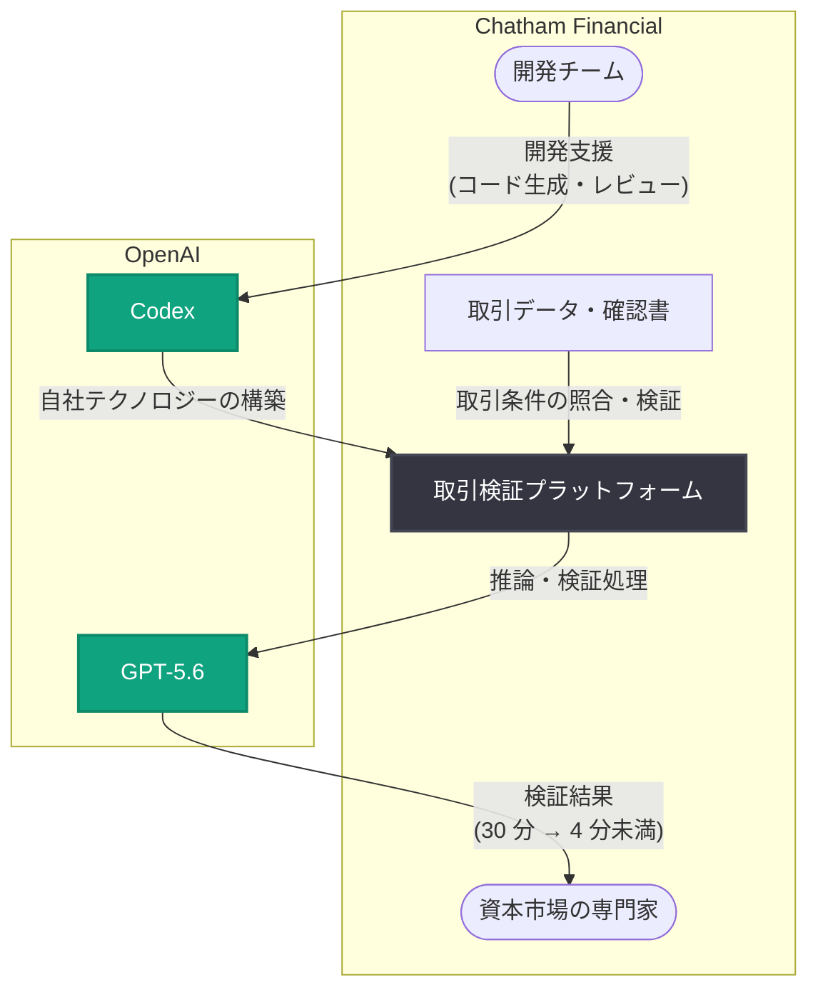

# Chatham Financial が資本市場の専門知識をスケール: Codex と GPT-5.6 で取引検証を 30 分から 4 分未満に短縮

## メタデータ

| 項目 | 内容 |
|------|------|
| 発表日 | 2026-10-02 |
| ソース | OpenAI News |
| カテゴリ | 導入事例 (ケーススタディ) |
| 公式リンク | https://openai.com/index/chatham-financial |

> **注記**: 本レポート作成時点で記事ページへのアクセスが制限されていたため (HTTP 403)、内容は公式発表の概要 (RSS 配信情報) に基づいて構成している。具体的な導入経緯や成果数値の詳細は、公式リンクから原文を参照のこと。

## 概要

OpenAI は、金融リスク管理・資本市場アドバイザリー企業 Chatham Financial による AI 活用事例を公開した。Chatham Financial は、金利・為替・コモディティなどのデリバティブ取引やヘッジ戦略に関する助言を提供する独立系のアドバイザリー企業であり、世界中の企業や金融機関を顧客に持つ。

公式発表によると、Chatham Financial は Codex と GPT-5.6 を活用して自社テクノロジーを構築し、業務ワークフローを再設計 (redesign workflows) した。その結果、取引検証 (trade validation) にかかる時間を従来の 30 分から 4 分未満へと大幅に短縮している。タイトルの「scales its capital markets expertise (資本市場の専門知識をスケールさせる)」が示すとおり、専門家の知見を AI によって組織全体に拡張するアプローチが本事例の特徴である。

## 統計情報

| 指標 | Before | After | 改善 |
|------|--------|-------|------|
| 取引検証 (trade validation) の所要時間 | 30 分 | 4 分未満 | 約 87% 以上の時間短縮 (7.5 倍以上の高速化) |

## 主な内容

### Codex による技術構築の加速

Codex は、OpenAI が提供するソフトウェアエンジニアリング向けのエージェント型コーディング支援ツールである。コードの生成・レビュー・リファクタリングなどを自律的に実行できるため、金融機関のように規制対応や品質要件が厳しい環境でも、開発チームの生産性を高める手段として採用が進んでいる。Chatham Financial では、Codex を活用して自社テクノロジーの構築 (build technology) を加速したとされる。

- **開発スピードの向上**: 社内ツールや検証システムの開発サイクルを短縮
- **専門知識のコード化**: 資本市場の専門家が持つ検証ロジックをソフトウェアとして実装
- **エンジニアリングリソースの最適化**: 定型的な実装作業を AI に委ね、人間は設計・判断に集中

### GPT-5.6 によるワークフローの再設計

GPT-5.6 は OpenAI のフラッグシップモデルであり、高度な推論能力と長文コンテキスト処理を備える。Chatham Financial は GPT-5.6 を用いて業務ワークフローそのものを再設計 (redesign workflows) しており、単なる既存業務の自動化にとどまらない点が重要である。

- **取引検証の自動化・高速化**: デリバティブ取引の条件照合や整合性確認といった、専門家が時間をかけて行っていた検証プロセスを AI が支援
- **プロセス全体の見直し**: AI の能力を前提に業務フローを組み直すことで、30 分かかっていた検証を 4 分未満に短縮
- **専門家の役割シフト**: 検証作業の反復部分を AI が担うことで、専門家は例外対応や顧客への助言といった高付加価値業務に注力

### 取引検証 (Trade Validation) 短縮の意義

取引検証は、デリバティブ取引の条件 (想定元本、金利、期日、カウンターパーティなど) が契約書・確認書・システム記録の間で一致しているかを確認する業務であり、ミスが金銭的損失や規制違反に直結するため、従来は熟練スタッフによる慎重な手作業が必要だった。

この検証が 30 分から 4 分未満になることで、以下の効果が期待できる。

- **処理能力の拡大**: 同じ人員でより多くの取引を扱えるため、事業のスケールが可能になる
- **リードタイムの短縮**: 顧客への確認・報告が迅速化し、サービス品質が向上する
- **一貫性の向上**: AI による検証は手順のばらつきが少なく、品質の標準化に寄与する

## アーキテクチャ (想定される構成)

## 影響

### 金融業界への影響

- **専門サービス業の AI 活用モデル**: 高度な専門知識を要するアドバイザリー業務でも、検証・照合といった構造化可能なプロセスは AI で大幅に高速化できることが実証された
- **ミドル・バックオフィス業務の変革**: 取引検証はミドルオフィス業務の代表例であり、同様の照合・確認業務 (コンファメーション、リコンシリエーションなど) への波及が見込まれる
- **規制産業での採用事例**: 金融という規制の厳しい業界で Codex と GPT-5.6 を実務に組み込んだ事例として、同業他社の導入検討を後押しする

### 開発者・企業への影響

- **Codex と GPT の併用パターン**: 開発支援 (Codex) と業務プロセスへの AI 組み込み (GPT-5.6) を組み合わせる実例であり、エンジニアリングと業務変革を一体で進めるモデルとなる
- **「自動化」ではなく「再設計」**: 既存フローに AI を差し込むのではなく、AI を前提にワークフローを組み直すことで大きな改善 (30 分 → 4 分未満) が得られることを示している
- **定量的な効果測定の重要性**: 所要時間という明確な KPI で効果を示しており、AI 導入の投資対効果を説明する際の参考になる

## 関連リンク

- [公式発表: Chatham scales its capital markets expertise with OpenAI](https://openai.com/index/chatham-financial)
- [Codex](https://openai.com/codex/)
- [OpenAI API ドキュメント](https://platform.openai.com/docs)
- [OpenAI 導入事例 (Stories)](https://openai.com/stories/)
- [OpenAI News](https://openai.com/news/)

## まとめ

Chatham Financial の事例は、資本市場アドバイザリー企業が Codex による技術構築と GPT-5.6 によるワークフロー再設計を組み合わせ、取引検証の所要時間を 30 分から 4 分未満 (約 87% 以上の短縮) に改善した導入事例である。専門家の知見を AI でスケールさせるアプローチは、金融に限らず高度な専門知識を扱うあらゆる業種にとって参考になる。導入の詳細な経緯や追加の成果数値は、公式記事の原文を参照されたい。
