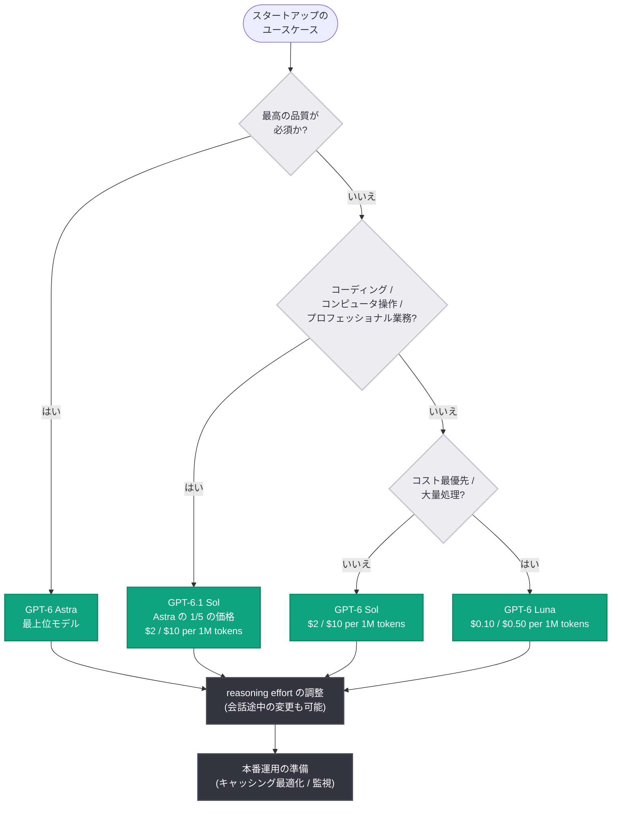

# GPT-6 ファミリーのモデルガイド: スタートアップ向けにモデル選択から本番運用までを解説

## メタデータ

| 項目 | 内容 |
|------|------|
| 発表日 | 2026-10-02 |
| ソース | OpenAI News (Product) |
| カテゴリ | ガイド / ベストプラクティス |
| 公式リンク | https://openai.com/index/practical-guide-building-gpt-6 |

## 概要

OpenAI は 2026 年 10 月 2 日、スタートアップ向けの実践ガイド「A model guide for the GPT-6 family」を公開した。公式の紹介文によると、本ガイドは GPT-6 ファミリーのモデル選択、推論努力レベル (reasoning effort) の調整、プロンプトとスキルの改善、ツールの連携 (coordinate tools)、そして本番運用に向けたワークフローの準備方法を解説するものである。

GPT-6 ファミリーは、2026 年 9 月 3 日のフラッグシップモデル GPT-6 Astra の発表以降、GPT-6 Sol / Luna (9 月 22 日)、GPT-6.1 Sol (9 月 29 日) と約 1 か月の間に 4 モデルへ急速に拡大した。性能と価格のレンジが広がったことで「どのモデルをどう使い分けるか」が開発者にとって重要な論点となっており、本ガイドはその判断基準を公式に整理する位置付けと言える。

## 主な内容

公式の説明文で挙げられているトピックは以下の 5 点である。

1. **モデル選択**: GPT-6 ファミリーの中からユースケースに合ったモデルを選ぶ方法
2. **推論努力レベルの調整**: reasoning effort をタスクの難易度に合わせてチューニングする方法
3. **プロンプトとスキルの改善**: プロンプトおよびスキルの品質を高める方法
4. **ツールの連携**: 複数のツールを協調させる方法
5. **本番運用の準備**: ワークフローを本番環境 (production) に備える方法

### GPT-6 ファミリーの構成とモデル選択

ガイドの前提となる GPT-6 ファミリーの構成は以下の通り (価格は API Changelog および各モデルの発表時点の情報)。

| モデル | リリース日 | 位置付け | API 価格 (100 万トークンあたり) |
|--------|-----------|----------|------------------------------|
| GPT-6 Astra | 2026-09-03 | 最上位。推論・コーディング・コンピュータ操作・調査・文書作成 | 標準価格 (ファミリー中最高) |
| GPT-6 Sol | 2026-09-22 | 性能とコストのバランス型 | 入力 $2 / 出力 $10 |
| GPT-6 Luna | 2026-09-22 | 低価格・高速 | 入力 $0.10 / 出力 $0.50 |
| GPT-6.1 Sol | 2026-09-29 | Astra に迫る知能を Astra の API 価格の 1/5 で提供 | 入力 $2 / 出力 $10 |

モデル選択の基本的な考え方は、これまでの公式発表で示されてきた方針と一致する。

- **最高の結果が必要な場合**: GPT-6 Astra。最も困難なエンドツーエンドの作業向けで、コンピュータ操作を含む複雑なタスクを最初の依頼から完成まで遂行できる
- **コーディング・コンピュータ操作・プロフェッショナル業務を低コストで**: GPT-6.1 Sol。near-Astra の知能を Astra の 1/5 の価格で利用でき、マルチエージェント機能 (ベータ) も備える
- **バランス重視の汎用ワークロード**: GPT-6 Sol
- **大量処理・低レイテンシ・コスト最優先**: GPT-6 Luna

### 推論努力レベル (reasoning effort) の調整

GPT-6 ファミリーは推論モデルであり、reasoning effort の設定によってコスト・レイテンシ・品質のトレードオフを制御できる。Responses API では会話の途中でも推論努力レベルを変更でき、キャッシュ済みプロンプトのプレフィックスを保持したまま、難しい作業では effort を上げ、定型的なフォローアップでは下げるという運用が可能である (2026-09-03 の API 更新で導入)。

なお、GPT-6 Astra では推論努力レベル `none` は非対応である点に注意が必要となる。

### プロンプト・スキルの改善とツール連携

ガイドではプロンプトとスキル (skills) の改善、複数ツールの協調方法が扱われる。GPT-6 でツール呼び出しを利用する場合、特に GPT-6 Astra では **Responses API が必須**であり、Chat Completions API でツールを使用している既存アプリケーションは移行が必要になる。Responses API には非同期ツール呼び出しや WebSocket 経由のターン途中ステアリングといった長時間タスク向けの機能も用意されており、ツール連携を設計する際の基盤となる。

### 本番運用への準備

本番運用の観点では、GPT-6 世代で強化されたプロンプトキャッシング (デフォルトでの高キャッシュヒット率、キャッシュ読み取り 90% 割引、Prompt Caching Dashboard による監視・診断、明示的ブレークポイント) が、コストとレイテンシの最適化における重要な要素となる。reasoning effort の変更やツールの有効化 / 無効化を行ってもキャッシュが保持されるため、本番ワークフローの中で動的なチューニングを行いやすい。

## 技術的な詳細

### モデル選択フロー



### コードサンプル

reasoning effort をタスクに応じて切り替える Responses API の利用例。

```python
from openai import OpenAI

client = OpenAI()

# 難しいタスク: GPT-6.1 Sol + 高い reasoning effort
response = client.responses.create(
    model="gpt-6.1-sol",
    reasoning={"effort": "high"},
    input=[
        {
            "role": "user",
            "content": "このリポジトリの認証周りをリファクタリングする"
                       "計画を立て、変更案を提示してください。",
        }
    ],
)
print(response.output_text)

# 定型タスク: GPT-6 Luna + 低い reasoning effort でコストを抑える
response = client.responses.create(
    model="gpt-6-luna",
    reasoning={"effort": "low"},
    input=[
        {"role": "user", "content": "この文章を 3 行で要約してください。"}
    ],
)
print(response.output_text)
```

## 開発者への影響

- **モデル選定の公式な指針が得られる**: 1 か月で 4 モデルに拡大した GPT-6 ファミリーについて、スタートアップ視点での使い分け基準が整理され、PoC から本番までのモデル選定を進めやすくなる
- **コスト最適化の体系化**: reasoning effort の調整とプロンプトキャッシングを組み合わせることで、品質を維持しながらコストとレイテンシを最適化する設計指針が明確になる
- **Responses API 中心の設計へ**: ツール連携を本格的に行う場合は Responses API が前提となるため、Chat Completions API ベースの既存アプリケーションは移行計画を検討する必要がある
- **本番運用の準備の重要性**: ガイドが「ワークフローの本番準備」を明示的に扱っており、プロトタイプ段階から監視・診断 (Prompt Caching Dashboard など) を組み込む運用が推奨される流れにある

## 関連リンク

- [A model guide for the GPT-6 family (公式ガイド)](https://openai.com/index/practical-guide-building-gpt-6)
- [Introducing GPT-6.1 Sol (公式発表)](https://openai.com/index/introducing-gpt-6-1-sol)
- [Introducing GPT-6 Sol and Luna (公式発表)](https://openai.com/index/introducing-gpt-6-sol-and-luna)
- [GPT-6 Astra: A new generation of intelligence (公式発表)](https://openai.com/index/gpt-6-astra)
- [OpenAI API Changelog](https://platform.openai.com/docs/changelog)
- [OpenAI 公式ドキュメント](https://platform.openai.com/docs)
- [OpenAI News](https://openai.com/news)

## まとめ

「A model guide for the GPT-6 family」は、スタートアップが GPT-6 ファミリー (Astra / Sol / Luna / 6.1 Sol) を活用するための実践ガイドである。モデル選択、reasoning effort の調整、プロンプトとスキルの改善、ツールの連携、本番運用の準備という 5 つのトピックを扱い、性能と価格のレンジが広がった GPT-6 世代における使い分けの公式な指針を提供する。最高品質なら Astra、コスト効率と知能の両立なら GPT-6.1 Sol、大量処理なら Luna という選択肢に、reasoning effort とキャッシング最適化を組み合わせることが、GPT-6 時代のアプリケーション設計の基本形になる。

---

注記: 本レポートは、公式記事ページが取得できなかったため (HTTP 403)、OpenAI News RSS フィードの公式説明文、OpenAI API Changelog、および関連する公式発表 (GPT-6 Astra / Sol / Luna / 6.1 Sol) の情報に基づいて作成している。
