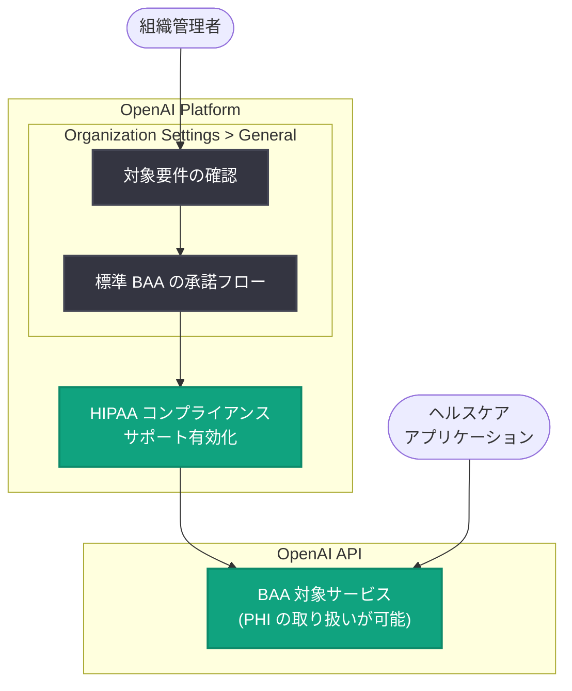

# API 組織設定に HIPAA コンプライアンス対応のプロダクト内フローを追加

## メタデータ

| 項目 | 内容 |
|------|------|
| 発表日 | 2026-10-05 |
| ソース | OpenAI API Changelog |
| カテゴリ | 新機能 (コンプライアンス / 組織管理) |
| 公式リンク | https://developers.openai.com/api/docs/changelog |

## 概要

OpenAI は 2026 年 10 月 5 日、API の組織設定 (Organization settings > General) に HIPAA コンプライアンス対応のためのプロダクト内フローを追加した。これにより、対象組織の管理者は OpenAI の標準 BAA (Business Associate Agreement、事業提携契約) をプロダクト内で直接承諾し、組織の HIPAA コンプライアンスサポートを有効化できるようになった。

従来、OpenAI API で保護対象保健情報 (PHI) を扱うには、営業窓口やサポート経由で BAA の締結を申請する必要があり、手続きに時間を要していた。今回の変更により、対象要件を満たす組織はセルフサービスで BAA を承諾でき、ヘルスケア分野での API 利用開始までのリードタイムが大幅に短縮される。

## 主な内容

### プロダクト内 BAA 承諾フロー

Changelog の原文では以下のように説明されている。

> "Added an in-product flow for HIPAA compliance support in API Organization settings > General."
>
> "Admins of eligible organizations can now accept the standard Business Associate Agreement (BAA)"

主なポイントは次のとおり。

- **設定場所**: API 組織設定の「General」セクション ([Organization settings](https://platform.openai.com/settings/organization/general))
- **操作可能なロール**: 対象組織の管理者 (Admin / Owner)
- **承諾対象**: OpenAI の標準 BAA
- **効果**: 組織単位で HIPAA コンプライアンスサポートが有効化される

### 対象要件と設定要件

すべての組織が無条件に有効化できるわけではなく、対象要件 (eligibility)、カバーされるサービス、設定要件が定められている。詳細は OpenAI ヘルプセンターの BAA に関する記事を参照するよう案内されている。

- 対象要件: 組織が BAA 締結の条件を満たしている必要がある
- カバーされるサービス: BAA の対象となるエンドポイント / サービスが定義されている
- 設定要件: HIPAA 対応のために必要な組織設定 (データ保持設定など) が求められる場合がある

### HIPAA と BAA の背景

HIPAA (Health Insurance Portability and Accountability Act) は、米国における医療情報のプライバシーとセキュリティを定める法律である。医療機関などの対象事業者 (Covered Entity) が PHI (Protected Health Information、保護対象保健情報) を外部ベンダーに取り扱わせる場合、そのベンダー (Business Associate) との間で BAA を締結することが義務付けられている。

OpenAI API を利用して PHI を処理するヘルスケア関連のアプリケーションを構築する場合、開発者の組織は OpenAI と BAA を締結する必要がある。

## 技術的な詳細

今回の変更は API のエンドポイントやパラメータの変更ではなく、プラットフォームの組織管理機能の拡張である。有効化の流れは以下のとおり。

1. 組織の管理者が [Organization settings > General](https://platform.openai.com/settings/organization/general) にアクセス
2. HIPAA コンプライアンスサポートのセクションで対象要件を確認
3. 標準 BAA の内容を確認し、プロダクト内で承諾
4. 組織の HIPAA コンプライアンスサポートが有効化され、対象サービスで PHI を扱う構成が可能に

## アーキテクチャ

## 開発者への影響

- **BAA 締結のセルフサービス化**: 従来必要だった営業・サポート経由の個別手続きが不要になり、対象組織はプロダクト内で即座に BAA を承諾できる
- **ヘルスケア開発の加速**: PHI を扱うアプリケーションの開発着手までのリードタイムが短縮され、医療分野での API 活用が容易になる
- **組織管理者の確認事項**: 有効化の前に、対象要件、BAA がカバーするサービスの範囲、必要な設定要件をヘルプセンターで確認する必要がある
- **コンプライアンス責任の明確化**: BAA を承諾しても、アプリケーション側での適切なアクセス制御やログ管理など、開発者自身の HIPAA 対応義務は引き続き残る点に注意が必要

## 関連リンク

- [OpenAI API Changelog](https://developers.openai.com/api/docs/changelog)
- [Organization settings (General)](https://platform.openai.com/settings/organization/general)
- [Getting a Business Associate Agreement for the OpenAI API (ヘルプセンター)](https://help.openai.com/en/articles/8660679-getting-a-business-associate-agreement-for-the-openai-api)
- [OpenAI API リファレンス](https://platform.openai.com/docs/api-reference)

## まとめ

OpenAI は API 組織設定に HIPAA コンプライアンス対応のプロダクト内フローを追加し、対象組織の管理者がセルフサービスで標準 BAA を承諾できるようにした。ヘルスケア分野で OpenAI API を利用する開発者にとって、BAA 締結の手続きが大幅に簡素化される重要なアップデートである。有効化にあたっては、対象要件、カバーされるサービス、設定要件をヘルプセンターで事前に確認することが推奨される。
