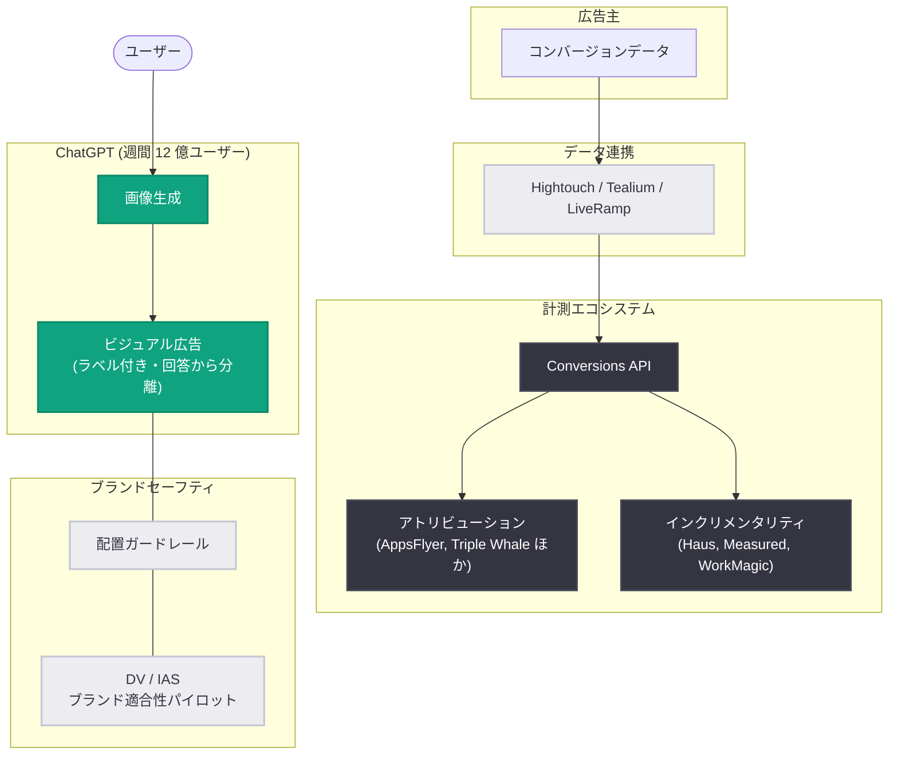

# ChatGPT の新ビジュアル広告フォーマットと計測基盤の拡充

## メタデータ

| 項目 | 内容 |
|------|------|
| 発表日 | 2026-10-05 |
| ソース | OpenAI News |
| カテゴリ | 新機能 / 広告プラットフォーム |
| 公式リンク | https://openai.com/index/new-chatgpt-ads-format-and-measurement |

## 概要

OpenAI は、人々の AI 利用に合わせた広告体験の構築を目指し、ChatGPT 内の新しいビジュアル広告フォーマットを発表した。あわせて、計測ツールの拡充、アトリビューションパートナーシップの拡大、ブランド適合性 (Brand Suitability) への取り組みを明らかにした。

ChatGPT は週間 12 億人が利用する「世界最大の AI ネイティブ消費者プラットフォーム」と位置付けられており、広告はサブスクリプション単体よりも大きな市場へのアクセスを広告主に提供するとしている。新しいビジュアル広告のテストは今月後半に米国で初期の広告主グループと開始される予定である。

## 主な内容

### 新しいビジュアル広告フォーマット

ChatGPT の画像生成時に表示されるビジュアル広告が導入される。主な特徴は以下のとおり。

- 製品のインスピレーション、使用例、体験を画像で示し、ブランド発見や購買判断を支援
- 広告は明確にラベル付けされ、生成される画像とは分離して表示
- 広告は ChatGPT の回答内容に影響を与えない方針
- テストは今月後半に米国で初期の広告主グループと実施

### 計測ツールとパートナーシップの拡大

広告効果の計測を支援するため、以下のエコシステムが整備される。

**データ連携**: Hightouch、Tealium、LiveRamp との統合により、広告主は既存システムからコンバージョンデータを送信可能。

**アトリビューションパートナー** (Conversions API、レポーティング、クリックアトリビューション対応):

- AppsFlyer、Triple Whale、Adjust、DV Rockerbox、Northbeam、Branch、Singular、Kochava、Airbridge、Tenjin

**フルファネル・高度計測**: Fospha、Measured、INCRMNTAL。

**インクリメンタリティ計測** (初期段階): Haus、Measured、WorkMagic と地域ベースの実験を検討中。

### 初期の成果データ

| 広告主 | 計測パートナー | 結果 |
|--------|---------------|------|
| WeightWatchers | DV Rockerbox | ChatGPT 広告の CPA が検索広告ベンチマーク比 15.3% 低い |
| Dose | WorkMagic | 統計的に有意なリフトを確認、増分購入の 67% が新規顧客 |
| Portland Leather | Triple Whale | ChatGPT 広告経由の訪問者の 93% が新規 |

### ブランドセーフティとブランド適合性

- 配置ガードレールにより、感情的に脆弱な状況やセンシティブな文脈への広告表示を回避
- 自動審査、人間による監督、継続的モニタリングを組み合わせた運用
- 対象広告主向けに「Negative Phrases」(除外フレーズ) 機能を提供
- DoubleVerify (DV) および Integral Ad Science (IAS) とブランド適合性評価のパイロットを開発中
- 独立パートナーはユーザーの非公開会話にアクセスせず、管理されたテスト環境で安全基準の適用を評価

### 広告原則

OpenAI は「ChatGPT の回答は独立性を保ち、会話はプライベートに保たれる」ことを広告の基本原則として掲げ、ユーザーが体験をコントロールできる点を強調している。

## 技術的な詳細

広告主は Conversions API を通じてコンバージョンデータを送信でき、Hightouch、Tealium、LiveRamp などのデータ連携基盤を経由した統合も可能である。アトリビューションパートナー経由では、レポーティングやクリックアトリビューションにも対応する。広告掲載の申し込みは ads.openai.com から行える。

## アーキテクチャ

## 開発者・広告主への影響

- 広告主は ChatGPT の画像生成体験の中で新しいビジュアル広告フォーマットを利用可能になる (まずは米国でテスト)
- Conversions API とデータ連携 (Hightouch、Tealium、LiveRamp) により、既存のマーケティングスタックから計測基盤へ接続できる
- 10 社以上のアトリビューションパートナー対応により、既存のモバイル・EC 計測ワークフローをそのまま活用可能
- インクリメンタリティ計測や DV / IAS によるブランド適合性評価など、第三者検証の仕組みが整備されつつある
- ユーザーの会話プライバシーと回答の独立性は維持される設計のため、会話データへの直接アクセスは前提としない

## 関連リンク

- [発表記事: Building advertising for the way people use AI](https://openai.com/index/new-chatgpt-ads-format-and-measurement)
- [OpenAI Ads](https://ads.openai.com)
- [OpenAI News](https://openai.com/news)

## まとめ

OpenAI は ChatGPT の画像生成に連動する新しいビジュアル広告フォーマットを発表し、今月後半から米国でテストを開始する。Hightouch、Tealium、LiveRamp とのデータ連携、10 社以上のアトリビューションパートナー、DV / IAS とのブランド適合性パイロットなど、計測と安全性のエコシステムを本格的に整備している点が特徴である。初期データでは検索広告比 15.3% 低い CPA や新規顧客比率 93% などの成果が報告されており、「回答の独立性」と「会話のプライバシー」を広告原則として維持しながら、AI ネイティブな広告プラットフォームの構築を進めている。
