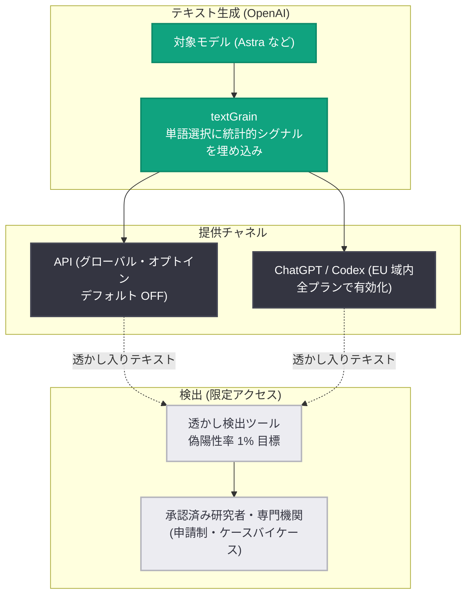

# EU テキスト来歴ルールへの OpenAI のアプローチ: テキスト透かし "textGrain" の段階的展開

## メタデータ

| 項目 | 内容 |
|------|------|
| 発表日 | 2026-10-05 |
| ソース | OpenAI News |
| カテゴリ | ポリシー / 新機能 (コンテンツ来歴) |
| 公式リンク | https://openai.com/index/eu-text-provenance |

## 概要

OpenAI は、EU AI 法 (EU AI Act) が求める「生成テキストを機械可読な形で識別可能にする」要件に対応するため、テキスト透かし (text watermarking) への段階的なアプローチを発表した。画像・音声についてはすでに検証ツールを公開済みであり、今回の発表はコンテンツ来歴 (content provenance) の取り組みをテキストへ拡張するものである。

テキスト透かしと検出は依然として初期段階の技術であり、大きな制約があることから、OpenAI は (1) API 顧客向けのグローバルなオプトイン提供、(2) EU 域内の ChatGPT / Codex 出力への不可視透かしの追加、(3) 検出ツールへのアクセスを承認済み研究者・専門機関に限定して開始、という 3 本柱の段階的展開を採用した。透かしが「何を示し、何を示さないか」についての透明性を重視している点が特徴である。

## 主な内容

### 段階的展開の 3 本柱

1. **API 顧客向けオプトイン (本日から)**: 世界中の API 顧客が、対象モデルについてテキスト透かしをオプトインで有効化できる。API ではデフォルトでは無効のまま。クラウドパートナー経由で提供される OpenAI モデル出力への透かし対応も数週間以内に展開予定。
2. **EU 域内での透かし付与 (数週間以内)**: EU の対象となる ChatGPT および Codex のテキスト出力に、全プラン対象で不可視透かしを追加する。グローバルなデフォルト化は行わず、EU 限定の地域的アプローチにより実運用からの学習とフィードバック収集を優先する。
3. **検出ツールへの研究者限定アクセス (申請受付開始)**: テキスト透かし検出ツールへのアクセス申請を開始。EU の [Code of Practice](https://digital-strategy.ec.europa.eu/en/policies/code-practice-ai-generated-content) に沿って、当初は承認済みの研究者・専門機関にケースバイケースで提供し、技術の評価と改善に役立てる。誤検出 (偽陽性) と見逃し (偽陰性) のリスクを踏まえ、ローンチ時点では一般公開しない。

なお、この限定アクセスはテキスト来歴のみに適用される。画像・音声向けの検証ツール ([openai.com/verify](https://openai.com/verify) および [Content Provenance API](https://developers.openai.com/api/docs/guides/content-provenance)) は引き続き一般の組織が利用できる。

### 透かし技術 "textGrain" の仕組み

OpenAI のテキスト透かし技術 **textGrain** は、モデルの単語選択に不可視の統計的シグナルを埋め込む。検出器はこのシグナルを探索し、文章に OpenAI の透かしが含まれるかを評価する。技術詳細は[テクニカルレポート](https://cdn.openai.com/pdf/e9508624-d767-41b6-a26d-e34ca798ada6/textgrain-entropy-calibrated-watermarking-for-language-model-text.pdf)で公開されており、今後数週間で追記される予定。さらに、この技術は**オープンソース化**も計画されている。

OpenAI の評価では、textGrain は Google の SynthID for text を含む他のアプローチと同等以上の性能を示した。ただし、理想的条件下での高性能が日常利用での信頼性を保証するわけではないと明記されている。

### 検出性能の限界 (評価結果)

検出器には偽陽性 (透かしがないのに検出) と偽陰性 (透かしがあるのに見逃し) の 2 種類のエラーがある。ELI5 データセットを用いた評価 (目標偽陽性率 1%) では以下の制約が示された。

| 条件 | 検出率 |
|------|--------|
| 心理学系コンテンツ、200 トークン | 約 80% |
| 心理学系コンテンツ、400 トークン | 約 95% |
| 数学系コンテンツ (語彙選択の自由度が低い) | 大幅に低下 |
| 400 トークン、編集なし | 約 92% |
| 400 トークン、単語の 10% を同義語に置換 | 約 66% |
| 400 トークン、単語の 25% を同義語に置換 | 約 17% |

- **短い、または制約の強いテキストは検出が難しい**: 語彙選択の余地が少ない数学などの分野では検出率が大幅に低下する。
- **編集により透かしは弱まる**: 同義語置換の割合が増えるほど検出率は急激に低下する。

これらの限界が、検出ツールのアクセスを当初は研究者・専門機関に限定する判断の根拠となっている。

### 出力品質への影響

最新フロンティアモデル **Astra** を用いたベンチマーク評価では、透かしの有無による有意な性能差は見られなかった。

| ベンチマーク | 透かしなし (Astra, max) | 透かしあり (Astra, max) |
|------|------|------|
| Artificial Analysis Intelligence Index | 49.57 点 | 49.76 点 |
| AutomationBench | 34.09% | 34.86% |
| DeepSWE v1.1 | 72.80% | 71.68% |
| Terminal-Bench 4.0 | 53.90% | 56.06% |
| Terminal-Bench Science 0.1 | 56.90% | 60.00% |
| BrowseComp | 87.92% | 87.35% |
| HealthBench Professional | 64.27% | 64.60% |
| GPQA Diamond | 94.44% | 93.94% |

### テキスト透かしが示さないこと

OpenAI は、検出結果から導ける結論の限界について以下を強調している。

- **人間の貢献度は測定できない**: OpenAI システムが文章の一部を生成・処理したことは示せても、人間の判断・編集・創造性がどの程度加わったかは分からない。
- **所有権や責任は立証できない**: テキストの所有者、利用の適法性、開示義務の有無、責任の所在は判定できない。
- **ユーザーを特定しない**: 個人・組織・アカウント・プロンプト・会話とテキストを結び付けない。
- **正確性は検証できない**: 文章が真実か、誤解を招くか、有害か、適切な文脈かは判断できない。
- **透かしが検出されないことは人間の執筆を証明しない**: 短すぎる、編集済み、翻訳済みのテキストや、非対応モデル・透かし導入前・他社ツールによる生成テキストでは検出できない場合がある。

## 技術的な詳細

### 透かしの埋め込みと検出のフロー

### 多層的なコンテンツ来歴アプローチ

単一の来歴技術では不十分であるため、OpenAI はオープン標準・耐久性のある透かし・検証ツールを組み合わせた多層的アプローチを採用している。

- 対応する画像出力への **Content Credentials** の付与 ([C2PA](https://c2pa.org/conformance/) 準拠)
- 対応する画像・音声への不可視 **SynthID** 透かしの埋め込み
- [openai.com/verify](https://openai.com/verify) と Content Provenance API による画像・音声の検証提供

Content Credentials はファイルの出所と履歴を記録でき、不可視透かしはメタデータが除去されてもシグナルを保持できるため、両者は補完関係にある。テキストは書き換え・翻訳・編集が容易であるため、来歴の拡張にはこうした実務的限界の考慮が必要とされる。

## 開発者への影響

- **API のテキスト透かしはオプトイン**: デフォルトは無効のため、既存の API 統合に自動的な変更はない。透明性義務やユーザー体験の要件に応じて、対象モデルで有効化を選択できる。
- **EU 向けプロダクトは透かしが有効化される**: EU の ChatGPT / Codex ユーザー向け出力には数週間以内に不可視透かしが付与される。EU 向けにサービスを提供する開発者は、EU AI 法のコンテンツ透明性要件との関係を確認するとよい。
- **検出ツールは当面利用不可 (研究者を除く)**: AI 生成テキストの判定機能をプロダクトに組み込みたい場合でも、検出ツールは一般公開されていない。研究者・専門機関は[申請フォーム](https://openai.com/form/content-provenance-api/)から申請できる。
- **オープンソース化の予定**: textGrain はオープンソースとして公開予定であり、独自の透かし実装や研究の基盤として活用できる見込み。
- **クラウドパートナー経由の利用**: クラウドサービス経由で OpenAI モデルを利用する場合も、数週間以内に透かしオプションが提供される予定。

## 関連リンク

- [発表記事: Our approach to EU text provenance rules](https://openai.com/index/eu-text-provenance)
- [textGrain テクニカルレポート (PDF)](https://cdn.openai.com/pdf/e9508624-d767-41b6-a26d-e34ca798ada6/textgrain-entropy-calibrated-watermarking-for-language-model-text.pdf)
- [検出ツールアクセス申請フォーム](https://openai.com/form/content-provenance-api/)
- [Content Provenance API ガイド](https://developers.openai.com/api/docs/guides/content-provenance)
- [openai.com/verify (画像・音声検証ツール)](https://openai.com/verify)
- [EU Code of Practice on AI-generated content](https://digital-strategy.ec.europa.eu/en/policies/code-practice-ai-generated-content)
- [ヘルプセンター: Provenance signals in OpenAI-generated content](https://help.openai.com/articles/8912793-provenance-signals-content-credentials-synthid-in-openai-generated-content)

## まとめ

OpenAI は EU AI 法のテキスト来歴要件に対し、独自透かし技術 textGrain による段階的対応を開始した。API ではグローバルにオプトイン提供 (デフォルト無効)、EU 域内の ChatGPT / Codex では数週間以内に透かしを有効化し、検出ツールは当初、承認済み研究者・専門機関に限定して提供する。ベンチマークでは透かしによる出力品質の劣化は見られない一方、短文・低エントロピーな内容・編集後のテキストでは検出率が大きく低下するなど技術的限界は明確であり、OpenAI は「透かしが示さないこと」(人間の貢献度・所有権・ユーザー特定・正確性の非証明) の周知を重視している。技術・標準・エビデンスの進展に応じてアプローチを見直し、検出ツールのアクセス拡大も検討するとしている。
