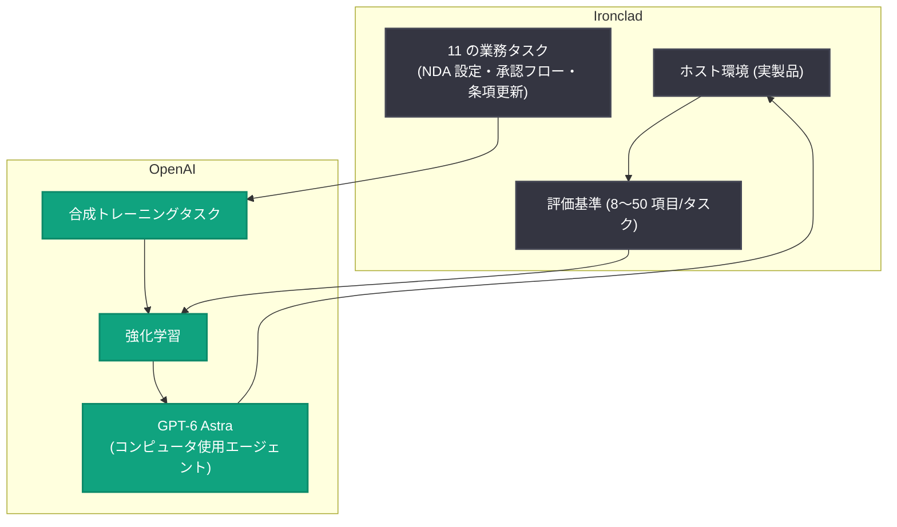

# Ironclad との協業によるコンピュータ使用 (Computer Use) の進化

## メタデータ

| 項目 | 内容 |
|------|------|
| 発表日 | 2026-10-06 |
| ソース | OpenAI News |
| カテゴリ | 研究成果 / パートナーシップ |
| 公式リンク | https://openai.com/index/advancing-computer-use-with-ironclad |

## 概要

OpenAI は、AI 契約管理分野のリーダーである Ironclad と提携し、複雑な契約ワークフロー上で AI エージェントをトレーニング・評価する取り組みを発表した。GPT-6 Astra の発表時に、モデルが文書作成やウェブサイトのテストなどコンピュータを使ったプロフェッショナルな作業を行える段階に達したことが示されたが、次の目標は専門ソフトウェアを使って複雑なビジネス課題を解決できるエージェントの開発である。

本取り組みでは、Ironclad の実製品環境を使った 11 のタスクで評価が行われ、GPT-6 Astra は GPT-5.6 Sol と比較して平均スコアが 32% 高く、試行あたりの推定時間が 48% 短縮されるという成果が確認された。GPT-6 Astra は Ironclad タスクで訓練された初のフロンティアモデルである。

## 主な内容

### 協業の背景

OpenAI は、ワークフローを熟知した少数のソフトウェア企業と直接提携し、高価値な業務タスクを研究課題に変換する取り組みを開始した。最初のパートナーが Ironclad であり、以下のようなタスクを共同開発した。

- 契約書の設定
- 承認フローの構築
- 再利用可能な法的条項の設定

### トレーニングと評価の方法

- Ironclad 社員と OpenAI 社内の Ironclad ユーザーが、法務・商務・調達業務にわたる **11 のタスク**を特定 (NDA 設定、調達承認プロセスの作成、申請者が選択した管轄に応じた再利用条項の更新など)
- 熟練ユーザーでもタスクあたり平均 30〜40 分かかる作業と推定
- 各タスクは複雑さに応じて **8〜50 の基準**で評価
- Ironclad が製品のホスト環境を提供し、モデルが実際の製品上で練習できるようにした
- 研究者は代表的なワークフローに基づく合成トレーニングタスクを開発し、**強化学習**でモデルを改善

### 契約ワークフローの例

ソフトウェア購入プロセスの設定を例にとると、次のような分岐ルールが求められる。

- 一定金額以上の購入は財務の承認が必要
- 特定の申請はセキュリティのレビューが必要
- 非標準条項は法務のレビューが必要

エージェントは支出閾値の上下で正しい経路が機能するかを確認する必要があり、個々のステップの正しさだけでなく、プロセス全体が想定された状況で機能することが求められる。

## 技術的な詳細

### 評価結果

| 指標 | GPT-6 Astra | GPT-5.6 Sol |
|------|------------|------------|
| 11 タスクの平均スコア | 55.0% | 41.6% |
| 試行あたりの推定平均時間 | 19.2 分 | 37.0 分 |
| 推論設定 | Max reasoning | High reasoning |

- GPT-6 Astra の平均スコアは GPT-5.6 Sol より **32% 高く**、試行あたりの推定時間は **48% 短縮**
- GPT-6 Astra の開発に使われた内部モデルは **63.7%** を達成
- 比較はいずれも各モデルが最高スコアを出す推論設定で実施

### デモの結果

同一タスクにおいて、GPT-6 Astra は推定 20 分で評価基準の約 94% を満たしたのに対し、GPT-5.6 Sol は推定 32 分で約 85% を満たした。

## アーキテクチャ

## 開発者への影響

- **専門ソフトウェア上でのエージェント活用の進展**: 汎用的なブラウザ操作にとどまらず、業務特化型 SaaS 上の複雑なワークフローをエージェントが実行できる可能性が示された
- **評価基準 (ルーブリック) 設計の重要性**: タスクごとに 8〜50 の基準を定義する手法は、エージェントの業務適用を検証する際の参考になる
- **人間による監督の必要性**: エージェントはタスク途中でビジネスルールを見失う可能性があるため、人間の監督と完全な契約プラットフォームの併用が引き続き重要
- **パートナー企業の募集**: OpenAI は、現在のエージェントが確実に完了できない重要な業務タスクを持つソフトウェア企業を少数募集している。求められるのは、具体的なタスク例、失敗の証拠、成功の判断基準、業務に精通した人材、安全なテスト環境、研究に安全に使えるデータである

## 関連リンク

- [Advancing computer use with Ironclad (OpenAI)](https://openai.com/index/advancing-computer-use-with-ironclad)
- [OpenAI News](https://openai.com/news)
- [Ironclad 公式サイト](https://ironcladapp.com/)
- [OpenAI 公式ドキュメント](https://platform.openai.com/docs)

## まとめ

OpenAI と Ironclad の協業は、実際の業務ソフトウェア上でエージェントをトレーニング・評価する新しいアプローチを示した。GPT-6 Astra は Ironclad タスクで訓練された初のフロンティアモデルであり、GPT-5.6 Sol と比較して平均スコアが 32% 向上、所要時間が 48% 短縮された。一方で、複雑なビジネスルールの完全な遵守にはまだ課題があり、人間による監督が引き続き重要である。OpenAI はこのモデルで他のソフトウェア企業との協業も拡大する方針を示している。
