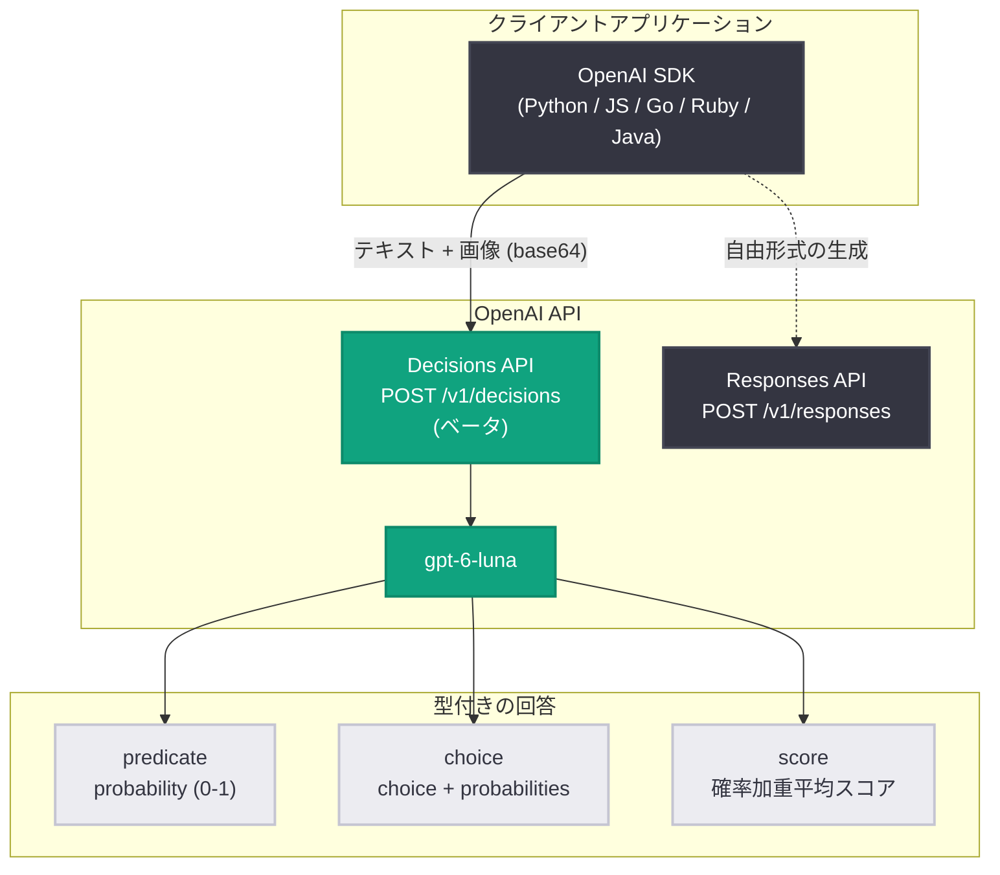

# OpenAI API アップデート (2026-10-06): Decisions API ベータリリースと利用ティアの簡素化

## メタデータ

| 項目 | 内容 |
|------|------|
| 発表日 | 2026-10-06 |
| ソース | OpenAI API Changelog |
| カテゴリ | 新機能 / API 更新 |
| 公式リンク | https://developers.openai.com/api/docs/changelog |

## 概要

OpenAI は 2026 年 10 月 6 日、API Changelog で 2 件のアップデートを発表した。1 つ目は **Decisions API** のベータリリースで、`gpt-6-luna` モデルに対応し、テキストと画像から型付きの回答 (typed answers) を生成する専用 API である。公式ドキュメントによると、Responses API と比較して 10 倍高速とされており、コンテンツ分類、リクエストのルーティング、作業の優先順位付けといった「判断」に特化したユースケースを対象とする。

2 つ目は **API 利用ティアの簡素化**で、従来の 5 段階から Build、Launch、Grow の 3 段階に再編された。組織のクレジット購入総額が各ティアの最低額に達すると、自動的に上位ティアへアップグレードされる仕組みである。

## 主な内容

### 1. Decisions API (ベータ)

Changelog 原文: "Released the Decisions API in beta with `gpt-6-luna`. Turn text and images into typed answers 10x faster than the Responses API."

Decisions API は、テキスト・画像 (またはその両方) を評価し、構造化された型付きの回答を返す新しい API である。主な特徴は以下の通り。

- **専用エンドポイント**: `POST /v1/decisions`
- **対応モデル**: `gpt-6-luna` のみ (ベータ期間中)
- **速度**: Responses API 比で約 10 倍高速 (相対値のみ公表、具体的なレイテンシ数値は未記載)
- **ステータス**: パブリックベータ。数週間以内の GA (一般提供) を予定
- **Playground**: platform.openai.com/decisions で事前に試用可能

#### 3 つの質問タイプ

リクエストの `questions` 配列に 1 つ以上の質問を指定する。各質問には一意の `name` を付与し、レスポンスの `answers` 配列で同じ `name` が返される。

| タイプ | 用途 | 返却値 |
|--------|------|--------|
| `predicate` | 条件判定 (真偽) | `probability` (真である確率、0〜1) |
| `choice` | 固定選択肢から 1 つ選択 (順序のないカテゴリ) | `choice` + `probabilities` 配列 + `confidence` |
| `score` | 順序付き `levels` に対する評価 | 確率加重平均の `score` + `probabilities` + `confidence` |

`score` タイプの結果はレベルインデックス (0 始まり) の確率加重平均であり、レベル間の中間値になり得る。なお、独自 JSON スキーマの生成には Structured Outputs、ツール呼び出しには function calling を使うことが推奨されており、Decisions API はあくまで「判断」に特化している。

#### 設計上のポイント

- 独立した質問は同一リクエストの `questions` 配列にまとめられる (タイプ混在可)
- 前の回答に依存する判断は別リクエストに分ける
- 質問は観察可能な基準で記述し、選択肢や隣接レベルの意味を明確に区別する
- しきい値は自アプリのラベル付きデータで調整し、偽陽性 / 偽陰性のコストに基づいて選ぶ
- 回答タイプが `refusal` (拒否) の場合の分岐処理を実装する

#### 料金・コンプライアンス

- **料金**: `gpt-6-luna` の入力 $0.10 / 100 万トークン。**入力トークンのみ課金**で、キャッシュ読み書きや出力トークンの課金はなし。地域処理プレミアムと長文コンテキストの価格乗数は適用される。この料金は `/v1/decisions` のみに適用され、他用途の `gpt-6-luna` は通常の料金体系に従う
- **コンプライアンス**: 対象顧客向けに ZDR (Zero Data Retention) と HIPAA 利用をサポート
- **データレジデンシー**: 米国および欧州 (EEA + スイス) での地域処理に対応

#### 制限事項

- 画像はインライン base64 データ URL のみ対応。HTTP/HTTPS のホスト済み URL と `file_id` は非対応
- 対応モデルは `gpt-6-luna` のみ
- 必要 SDK バージョン: Python 3.26.0 以上、JavaScript 7.30.0 以上、Go 3.73.0 以上、Ruby 0.101.0 以上、Java 4.78.0 以上

### 2. API 利用ティアの簡素化 (5 段階 → 3 段階)

Changelog 原文: "Simplified API usage tiers from five to three: Build, Launch, and Grow. Organizations automatically upgrade as total credit purchases reach tier minimums."

有料の利用ティアが従来の 5 段階から 3 段階 (Build、Launch、Grow) に再編された。各ティアの条件と月間利用上限は以下の通り。

| ティア | 条件 (クレジット購入総額) | 月間利用上限 |
|--------|---------------------------|--------------|
| Free | 許可された地域のユーザー | $100/月 |
| Build | $5 | $500/月 |
| Launch | $100 | $5,000/月 |
| Grow | $500 | $200,000/月 |

- **自動アップグレード**: 組織のクレジット購入総額が各しきい値に達すると自動的にアップグレードされる。ダッシュボードの Usage Tiers セクションから「Upgrade tier」による手動アップグレードも可能
- **レート制限の確認**: 自組織のモデル別制限は Settings > Organization > Limits の「Rate limits」で確認できる
- **補足**: 月間利用上限は、組織・プロジェクト単位で設定できる支出制限 (spend limits) とは別の仕組み。標準レート制限は Ultrafast レート制限とも別物

#### ティア別の標準レート制限 (抜粋)

| ティア | モデル | RPM | TPM |
|--------|--------|-----|-----|
| Build | Astra, Sol, Terra | 5,000 | 1,000,000 |
| Build | Luna | 5,000 | 2,000,000 |
| Launch | Astra, Sol, Terra | 10,000 | 4,000,000 |
| Launch | Luna | 10,000 | 10,000,000 |
| Grow | Astra, Sol, Terra | 15,000 | 40,000,000 |
| Grow | Luna | 30,000 | 180,000,000 |

Pay-as-you-go トラフィックが頻繁にレート制限へ達するエンタープライズ顧客向けには、Scale Tier (GPT-5.6 以降は Reserved Tier) が案内されている。

## 技術的な詳細

### リクエスト構造

| フィールド | 内容 |
|-----------|------|
| `model` | 評価に使うモデル (`gpt-6-luna` のみ) |
| `input` | 共有の証拠。テキスト文字列、またはテキスト + 画像を含むユーザーメッセージ |
| `questions` | 評価内容。各質問の `type`、`instructions`、選択肢やスコアレベル |

### コードサンプル

#### 例 1: 苦情のルーティング (choice)

```python
from openai import OpenAI

client = OpenAI()

decision = client.decisions.create(
    model="gpt-6-luna",
    input="I was charged twice for my order.",
    questions=[
        {
            "name": "route",
            "type": "choice",
            "instructions": "Classify the customer complaint into a support queue.",
            "choices": [
                {"name": "billing", "description": "Charges, refunds, invoices"},
                {"name": "technical", "description": "Bugs, errors, outages"},
                {"name": "shipping", "description": "Delivery, tracking, delays"},
                {"name": "other", "description": "Anything else"},
            ],
        }
    ],
)

answer = decision.answers[0]
if answer.type == "refusal":
    print(f"Refused: {answer.name}")
else:
    # choice: "billing", confidence: 0.93
    print(answer.choice, answer.confidence)
```

#### 例 2: 画像の損傷チェック (predicate)

```python
import base64
from openai import OpenAI

client = OpenAI()

with open("package.png", "rb") as f:
    image_b64 = base64.b64encode(f.read()).decode()

decision = client.decisions.create(
    model="gpt-6-luna",
    input=[
        {
            "role": "user",
            "content": [
                {"type": "input_text", "text": "Delivered package photo"},
                {
                    "type": "input_image",
                    "image_url": f"data:image/png;base64,{image_b64}",
                },
            ],
        }
    ],
    questions=[
        {
            "name": "visible_damage",
            "type": "predicate",
            "instructions": (
                "Is there visible damage such as cracks, tears, or dents? "
                "Ignore shadows and packaging wear."
            ),
        }
    ],
)

# probability: 0.92
print(decision.answers[0].probability)
```

#### 例 3: 深刻度スコア (score)

```python
decision = client.decisions.create(
    model="gpt-6-luna",
    input="Export fails in Safari but works in Chrome.",
    questions=[
        {
            "name": "severity",
            "type": "score",
            "instructions": "Rate the severity of this bug report.",
            "levels": [
                {"name": "Cosmetic"},
                {"name": "Workaround available"},
                {"name": "Fully blocked"},
            ],
        }
    ],
)

# probabilities: [0.1, 0.7, 0.2] -> score: 1.1, confidence: 0.55
print(decision.answers[0].score)
```

## アーキテクチャ



## 開発者への影響

- **分類・ルーティング処理の高速化とコスト削減**: これまで Responses API + Structured Outputs で実装していた分類、ルーティング、優先順位付けのワークロードを Decisions API に移行することで、約 10 倍の高速化が見込める。入力トークンのみの課金 ($0.10 / 100 万トークン) で出力トークンが課金されないため、大量処理のコスト構造も有利になる
- **確率ベースのしきい値設計が可能に**: 回答が確率 (`probability`、`probabilities`、`confidence`) 付きで返るため、アプリケーション側で偽陽性 / 偽陰性のコストに応じたしきい値調整ができる。従来の「ラベルのみ」の分類実装より柔軟な制御が可能
- **ベータ段階での制約に注意**: 対応モデルは `gpt-6-luna` のみ、画像はインライン base64 のみ対応 (ホスト済み URL と `file_id` は不可)。GA は数週間以内の予定のため、本番導入はタイミングを検討したい。利用には SDK の更新 (Python 3.26.0 以上など) が必要
- **利用ティアの再確認が必要**: 5 段階から 3 段階 (Build / Launch / Grow) への再編により、自組織のティアと月間利用上限、モデル別レート制限が変わっている可能性がある。Settings > Organization > Limits での確認を推奨
- **アップグレードの手間が削減**: クレジット購入総額 ($5 / $100 / $500) に応じた自動アップグレードにより、申請や待機期間なしで上位ティアのレート制限を利用できる

## 関連リンク

- [OpenAI API Changelog](https://developers.openai.com/api/docs/changelog)
- [Decisions API ガイド](https://developers.openai.com/api/docs/guides/decisions)
- [Rate Limits / Usage Tiers ガイド](https://developers.openai.com/api/docs/guides/rate-limits#usage-tiers)
- [Decisions Playground](https://platform.openai.com/decisions)

## まとめ

2026 年 10 月 6 日の API アップデートは、「判断」に特化した新 API の提供と課金体系の簡素化という、開発体験の両面を改善する内容である。Decisions API は、テキストと画像から型付きの回答 (predicate / choice / score) を Responses API 比 10 倍の速度で返し、入力トークンのみの課金で分類・ルーティング用途のコスト効率を大きく高める。現時点ではベータ (`gpt-6-luna` のみ対応) だが、数週間以内の GA が予定されている。また、利用ティアは Build / Launch / Grow の 3 段階に簡素化され、クレジット購入総額に応じた自動アップグレードにより、スケール時の運用負荷が軽減される。
