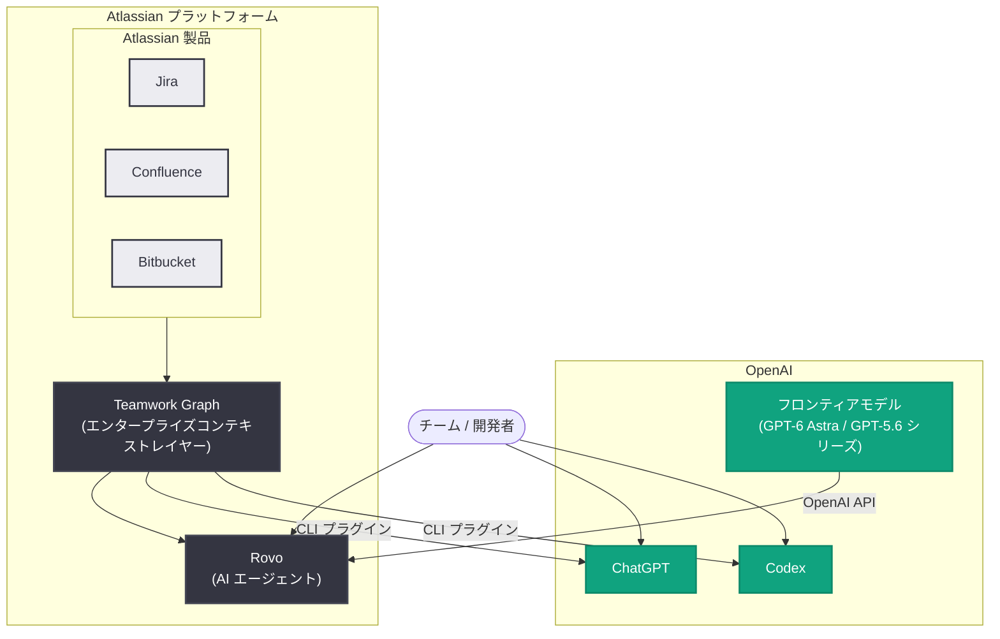

# Atlassian と OpenAI がパートナーシップを拡大 — エンタープライズナレッジをアクションへ

## メタデータ

| 項目 | 内容 |
|------|------|
| 発表日 | 2026-10-06 |
| ソース | OpenAI News |
| カテゴリ | パートナーシップ / エンタープライズ |
| 公式リンク | https://openai.com/index/atlassian-partnership |

## 概要

Atlassian と OpenAI は、2023 年に始まった協業を拡大し、GPT-6 ファミリーのフロンティアモデルを Atlassian プラットフォーム全体に展開することを発表した。新たな契約により、OpenAI のフロンティアモデルが Atlassian プラットフォームおよび Rovo 全体のエージェントを支え、チームの計画・構築・デリバリーを支援する AI 体験を強化する。

Rovo は OpenAI のインテリジェンスと Atlassian の Teamwork Graph (人・プロジェクト・ドキュメント・意思決定をつなぐエンタープライズコンテキストレイヤー) を組み合わせることで、AI が企業の働き方を深く理解できるようになる。両社は、ビジネスが既に使用しているツールにフロンティアインテリジェンスを組み込み、AI エージェントをチームの日常業務に自然に溶け込ませることを目指している。

## 主な内容

### 契約の主要ポイント

- **フロンティアモデルへの拡大アクセス**: Atlassian は GPT-6 Astra や GPT-5.6 シリーズを含む最新の OpenAI フロンティアモデルへの拡大アクセスを獲得。OpenAI はモデルの能力・効率・価格性能比を継続的に向上させる
- **Rovo と Teamwork Graph の統合**: OpenAI モデルが Atlassian プラットフォームと Rovo 全体のエージェントを駆動。Teamwork Graph が AI に企業コンテキストを提供
- **Atlassian 社内での OpenAI 製品採用**: Atlassian は Codex と ChatGPT Enterprise の社内採用を拡大。3,000 人以上の Atlassian 開発者がターミナル、IDE、コードレビューワークフローで Codex を使用
- **相互利用**: OpenAI は引き続き Jira を利用して社内の重要なワークフローを管理

### OpenAI モデルとエンタープライズナレッジの接続

OpenAI API を通じて、Atlassian はモデルの進化に合わせて新しい推論能力を Rovo に直接組み込むことができ、顧客は既存のツール内でますます高性能な AI を利用できるようになる。

**ユースケース例**: ローンチ準備中のプロダクトマネージャーが Rovo に「チームは予定通りか」と質問すると、Rovo は Teamwork Graph を活用して Jira チケット、Confluence ドキュメント、関連する議論を接続し、エンジニアリング上のブロッカーの特定、未達マイルストーンの検出、注意が必要な意思決定の抽出を行う。OpenAI モデルがこれらの情報をローンチ準備状況の明確な評価と推奨される次のステップに変換するため、チームは情報収集に費やす時間を減らし、作業を前に進めることに集中できる。

### Atlassian 製品の枠を超えた連携

協業は Atlassian 自身の製品にとどまらない。

- **ChatGPT / Codex 向け Atlassian・Teamwork Graph CLI プラグイン**: 顧客は ChatGPT と Codex を既存のワークフローに接続し、適切な権限管理のもとで、AI がプロジェクト情報、ドキュメント、開発コンテキストにアクセスできるようにする
- **プラグイン拡張機能**: Jira の作業アイテム、Confluence のコンテンツ、人物情報を ChatGPT と Codex のプロンプトに直接取り込む拡張機能を最近リリース。ピン留めされた Atlassian Home では、割り当てられた作業、最近の Loom、プロジェクト、Bitbucket プルリクエストが表示され、チームが関連コンテキストにアクセスしてアクションを実行できる
- **Codex と Teamwork Graph の連携**: Teamwork Graph を活用した Atlassian プラグインにより、Codex ユーザーは関連する作業アイテムや技術ドキュメントにアクセスでき、ソフトウェアの作成・テスト・リリースを支援する

### 次世代の AI 駆動チームワークに向けて

両社は Jira とのより深い統合を模索しており、チームが AI エージェントに作業を割り当て、進捗を追跡し、意思決定を記録し、結果をレビューしやすくすることを目指している。Atlassian の開発者生産性・エンジニアリングパフォーマンス測定プラットフォームである DX と組み合わせることで、エンジニアリングリーダーは人間による管理を維持しながら、開発速度、サイクルタイム、開発者体験に対する AI の影響を測定できるようになる可能性がある。

## アーキテクチャ

## 開発者への影響

- **開発コンテキストへの AI アクセス**: Atlassian プラグインを通じて、Codex が Jira の作業アイテムや Confluence の技術ドキュメントを参照できるため、コード作成・テスト・リリースの各段階でプロジェクト固有のコンテキストを活用した支援が受けられる
- **ワークフローの統合**: ChatGPT と Codex を既存の Atlassian ワークフローに接続することで、ツール間のコンテキスト切り替えが減り、プロンプトに Jira チケットや Confluence コンテンツを直接取り込める
- **AI エージェントへの作業割り当て**: Jira との深い統合が実現すれば、AI エージェントへのタスク割り当て、進捗追跡、結果レビューが標準的な開発プロセスの一部になる可能性がある
- **AI 効果の計測**: DX との組み合わせにより、開発速度やサイクルタイムに対する AI の影響を定量的に評価でき、エンジニアリング組織における AI 導入の意思決定を支援する
- **権限管理**: AI のデータアクセスは適切な権限 (permissions) に従うため、エンタープライズのセキュリティ要件を維持しながら利用できる

## 関連リンク

- [公式発表 (OpenAI)](https://openai.com/index/atlassian-partnership)
- [Atlassian プラグイン拡張の発表 (Atlassian Community)](https://community.atlassian.com/forums/discussion/3288784/bring-your-atlassian-work-into-chatgpt-and-codex)
- [OpenAI 公式ドキュメント](https://platform.openai.com/docs)
- [OpenAI News](https://openai.com/news)

## まとめ

Atlassian と OpenAI のパートナーシップ拡大は、GPT-6 Astra や GPT-5.6 シリーズといったフロンティアモデルを Rovo と Teamwork Graph に統合し、エンタープライズナレッジを実際のアクションに変換することを目指すものである。3,000 人以上の Atlassian 開発者による Codex 活用や、OpenAI 社内での Jira 利用など、両社の相互採用も進んでいる。今後は Jira への AI エージェント統合や DX による AI 効果測定など、人間の管理を維持しつつ AI をチームワークの中核に組み込む取り組みが期待される。

---

*注記: 本レポートは r.jina.ai 経由で取得した記事全文に基づいて作成した (openai.com への直接アクセスは 403 でブロックされたため)。*
