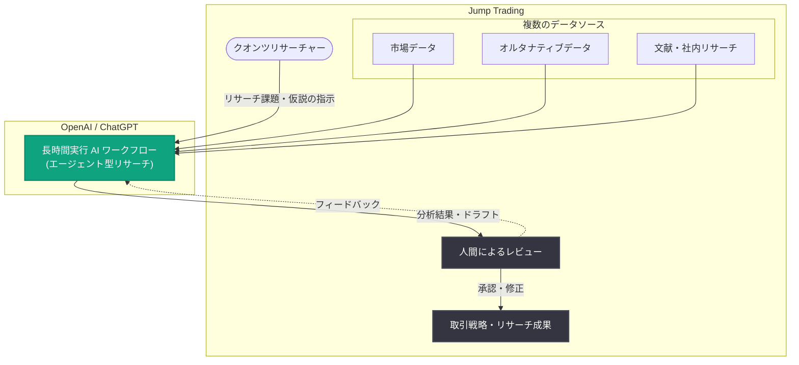

# Jump Trading が ChatGPT でクオンツリサーチをスケール: 長時間 AI ワークフローと人間によるレビューの組み合わせ

## メタデータ

| 項目 | 内容 |
|------|------|
| 発表日 | 2026-10-06 |
| ソース | OpenAI News |
| カテゴリ | 導入事例 (ケーススタディ) |
| 公式リンク | https://openai.com/index/jump-trading |

> **注記**: 本レポート作成時点で記事ページへのアクセスが制限されていたため (HTTP 403、Wayback Machine にもスナップショットなし)、内容は公式発表の概要情報に基づいて構成している。具体的な導入経緯、使用モデル、成果数値の詳細は、公式リンクから原文を参照のこと。

## 概要

OpenAI は、クオンツトレーディング企業 Jump Trading による AI 活用事例を公開した。Jump Trading はシカゴに本拠を置く独立系のプロプライエタリトレーディング企業であり、高頻度取引 (HFT) と定量的 (クオンツ) リサーチを事業の中核としている。市場データの統計的分析に基づいて取引戦略を構築するクオンツリサーチは、大量のデータ処理と仮説検証の反復を伴う、計算集約的かつ人材集約的な業務である。

公式発表の概要によると、Jump Trading は OpenAI の技術を活用してクオンツリサーチを拡大 (expand quantitative research) しており、その特徴は「より長時間実行される AI ワークフロー (longer-running AI workflows)」が「複数のデータソース (multiple data sources)」を組み合わせ、「人間によるレビュー (human review)」と連携する点にある。単発のプロンプト応答ではなく、長時間にわたり自律的に動作するエージェント型のワークフローを研究プロセスに組み込み、最終判断には人間の専門家が関与するという、human-in-the-loop 型の構成が示唆されている。

## 主な内容

### 長時間実行される AI ワークフロー

概要で言及されている「longer-running AI workflows」は、数秒で完結する従来のチャット型応答とは異なり、長時間 (数分から数時間規模) にわたって自律的にタスクを遂行するエージェント型のワークフローを指すと考えられる。クオンツリサーチの文脈では、以下のような適用が想定される。

- **仮説検証の自動化**: リサーチャーが立てた仮説に対し、AI がデータ収集・分析・検証のステップを連続的に実行
- **リサーチの並列化**: 複数のリサーチタスクを AI ワークフローとして同時並行で走らせ、リサーチャー 1 人あたりの探索範囲を拡大
- **反復作業の委譲**: データクリーニング、特徴量の探索、文献・レポートの調査といった時間のかかる作業を AI に任せ、人間は戦略設計に集中

### 複数データソースの統合

クオンツリサーチでは、市場価格データ、オルタナティブデータ、ニュース、学術論文、社内の過去リサーチなど、性質の異なる多様なデータソースを横断的に扱う必要がある。概要では AI ワークフローが「複数のデータソースを組み合わせる (combine multiple data sources)」と明記されており、AI が異種データを横断して情報を収集・統合し、一貫した分析としてまとめる役割を担っていることが示唆される。

- **構造化データと非構造化データの橋渡し**: 数値データの分析とテキスト情報 (ニュース、開示資料など) の解釈を単一のワークフローで接続
- **情報収集コストの削減**: 人手では時間のかかるソース横断の調査を AI が代行
- **分析の網羅性向上**: 人間が見落としがちなソースも含めて体系的に探索

### 人間によるレビュー (Human Review)

概要のもう 1 つの重要な要素が「human review」である。金融取引は誤った分析が直接的な損失につながる領域であり、AI の出力をそのまま採用するのではなく、専門家であるクオンツリサーチャーが結果をレビューし、品質を担保する体制が取られていると考えられる。

- **品質ゲートとしての専門家**: AI が生成した分析・コード・リサーチ結果を人間が検証してから次工程へ進める
- **責任の所在の明確化**: 最終的な投資判断・戦略採用の責任は人間が持つ
- **フィードバックループ**: レビュー結果を踏まえて AI ワークフローの指示や前提を改善し、精度を継続的に向上

## アーキテクチャ (想定される構成)

## 影響

### 金融業界への影響

- **クオンツリサーチの生産性モデルの変化**: リサーチャーの能力を AI ワークフローで拡張することで、同じ人員でより多くの仮説を検証できるようになり、リサーチの「量」が競争力に直結するクオンツ業界での AI 活用が加速する
- **トップティアのトレーディング企業による採用事例**: 機密性と競争優位性を重視するプロプライエタリトレーディング企業が OpenAI の技術を公に採用した事例として、同業他社やヘッジファンドの導入判断に影響を与える
- **human-in-the-loop の標準化**: 高リスク領域における「AI による実行 + 人間によるレビュー」という役割分担が、金融 AI 活用のベストプラクティスとして定着していく可能性がある

### 開発者・企業への影響

- **長時間ワークフローの実用性の実証**: 単発の応答ではなく、長時間実行されるエージェント型ワークフローが実務の中核プロセス (リサーチ) で機能している実例であり、同様のワークフロー設計の参考になる
- **データ統合が鍵**: AI 活用の価値は複数データソースを安全に接続できるかに大きく依存するため、データ基盤・コネクタの整備が導入の前提条件となる
- **レビュー工程の設計**: AI の出力をどの粒度で誰がレビューするかというプロセス設計が、品質とスピードの両立を左右する

## 関連リンク

- [公式発表: How Jump Trading is scaling quant research with ChatGPT](https://openai.com/index/jump-trading)
- [ChatGPT Enterprise](https://openai.com/chatgpt/enterprise/)
- [OpenAI 導入事例 (Stories)](https://openai.com/stories/)
- [OpenAI API ドキュメント](https://platform.openai.com/docs)
- [OpenAI News](https://openai.com/news/)

## まとめ

Jump Trading の事例は、クオンツトレーディング企業が ChatGPT を活用し、長時間実行される AI ワークフローで複数のデータソースを統合しながら、人間によるレビューで品質を担保するという形でクオンツリサーチをスケールさせている導入事例である。「AI が長時間の調査・分析を実行し、人間が検証・判断する」という役割分担は、精度が収益に直結する金融リサーチにおける現実的な AI 活用モデルを示している。具体的な使用製品、ワークフローの詳細、定量的な成果については、公式記事の原文を参照されたい。
