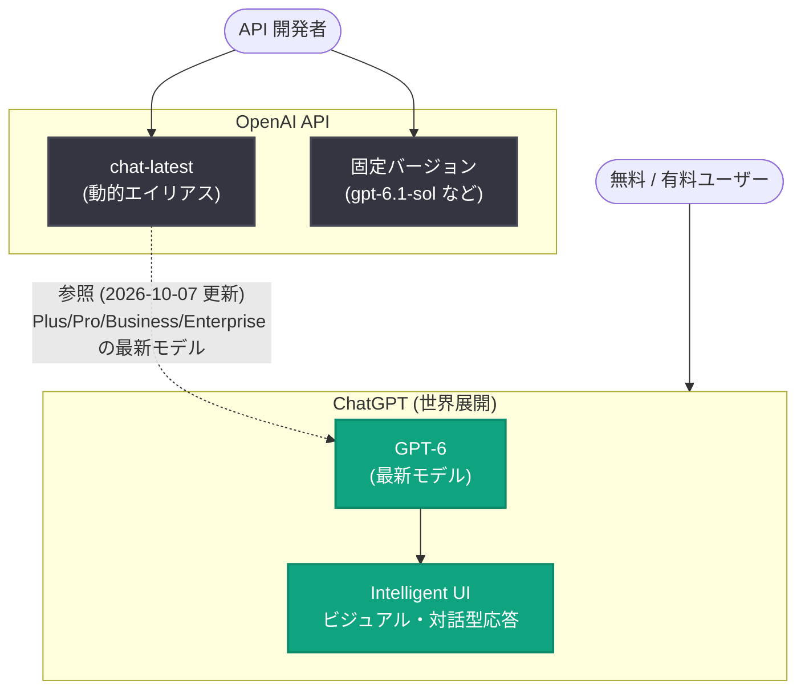

# GPT-6 と Intelligent UI が ChatGPT で全ユーザーに展開

## メタデータ

| 項目 | 内容 |
|------|------|
| 発表日 | 2026-10-07 |
| ソース | OpenAI News (Product) |
| カテゴリ | 新機能 / 製品アップデート |
| 公式リンク | https://openai.com/index/gpt-6-for-everyone |

## 概要

OpenAI は 2026 年 10 月 7 日、「GPT-6 and Intelligent UI for everyone」を発表した。公式の紹介文によると、GPT-6 が Intelligent UI とともに ChatGPT で世界展開され、より高速な応答と、ビジュアルかつ対話型の体験が提供される。2026 年 9 月 3 日の GPT-6 Astra 発表以降、API 向けにファミリーが拡充されてきた GPT-6 世代が、消費者向けプロダクトである ChatGPT の標準体験として全ユーザーに届く節目のアップデートである。

同日の OpenAI API Changelog (2026-10-07) では、`chat-latest` スナップショットが更新され、ChatGPT の Plus/Pro/Business/Enterprise で利用可能な最新モデルを参照するようになったことが告知されており、API 側でも今回の ChatGPT の刷新に追従できる体制が整えられている。

## 主な内容

### GPT-6 の ChatGPT への世界展開

公式の紹介文によると、GPT-6 が ChatGPT で世界展開 (global rollout) される。これまで GPT-6 ファミリー (Astra / Sol / Luna / 6.1 Sol) は主に API と開発者向けの文脈で展開が進んできたが、今回の発表により ChatGPT の一般ユーザーも GPT-6 世代のモデルを利用できるようになる。

「for everyone」というタイトルから、有料プランに限定されず無料ユーザーを含む広範な提供が示唆されるが、プランごとの提供条件や利用上限の詳細は、公式記事ページが取得できなかったため本レポートでは確認できていない (推測を含む)。

### Intelligent UI: ビジュアル・対話型の応答体験

今回の発表のもう 1 つの柱が Intelligent UI である。公式の紹介文では「ビジュアルかつ対話型の体験 (visual and interactive experiences)」を提供するとされている。

名称と説明文から、Intelligent UI は従来の静的なテキスト応答に代わり、ChatGPT がプロンプトの内容に応じて図表・カード・操作可能なウィジェットなどの UI 要素を動的に生成・表示する仕組みであると考えられる。ただし、これは紹介文からの推測であり、具体的な UI コンポーネントの種類、生成の仕組み、開発者によるカスタマイズ可否などの詳細は未確認である。

### より高速な応答

公式の紹介文では、より高速な応答 (faster responses) も挙げられている。GPT-6 世代では reasoning effort による推論量の制御や、強化されたプロンプトキャッシングが導入されており (2026-09-03 の API 更新)、こうした基盤改善が ChatGPT の応答速度向上にも寄与していると考えられる (推測)。

### 関連する API 更新: chat-latest スナップショットの更新

OpenAI API Changelog (2026-10-07) によると、`chat-latest` スナップショットが更新され、ChatGPT の Plus/Pro/Business/Enterprise で利用可能な最新モデルを参照するようになった。

`chat-latest` は、ChatGPT で稼働中の最新モデルを常に参照する動的エイリアスであり、2026 年 3 月の初期リリース以降、定期的にスナップショットが更新されてきた。今回の更新により、API 開発者は `chat-latest` を指定するだけで、GPT-6 世代に刷新された ChatGPT と同等のモデル挙動をテストできる。なお、OpenAI は従来から本番環境では固定バージョンの利用を推奨しており、`chat-latest` はスナップショットが予告なく変更され得る点に引き続き注意が必要である。

## 技術的な詳細

### ChatGPT と API の関係 (今回のアップデート後)



### コードサンプル

ChatGPT で展開された最新モデルの挙動を API からテストする例。

```python
from openai import OpenAI

client = OpenAI()

# chat-latest は ChatGPT (Plus/Pro/Business/Enterprise) の
# 最新モデルを参照する動的エイリアス (2026-10-07 更新)
response = client.responses.create(
    model="chat-latest",
    input=[
        {"role": "user", "content": "GPT-6 の新機能を教えてください。"}
    ],
)
print(response.output_text)
```

## 開発者への影響

- **ユーザー体験の基準が変わる**: ChatGPT の標準体験が GPT-6 と Intelligent UI に刷新されることで、エンドユーザーが期待する AI アプリケーションの応答品質・表現力の水準が上がり、API を使う自社プロダクトの UI/UX 設計にも影響し得る
- **chat-latest で ChatGPT の挙動を追跡可能**: API Changelog (2026-10-07) の更新により、`chat-latest` エイリアスで刷新後の ChatGPT と同等のモデル挙動をテストできる。本番環境では引き続き固定バージョンの利用が推奨される
- **Intelligent UI の API 提供は未確認**: Intelligent UI に相当する機能が API 経由で提供されるかどうかは、本レポート作成時点では確認できていない。公式ドキュメントや今後の API Changelog での続報を確認する必要がある

## 関連リンク

- [GPT-6 and Intelligent UI for everyone (公式発表)](https://openai.com/index/gpt-6-for-everyone)
- [A model guide for the GPT-6 family (公式ガイド)](https://openai.com/index/practical-guide-building-gpt-6)
- [OpenAI API Changelog](https://platform.openai.com/docs/changelog)
- [chat-latest モデルドキュメント](https://platform.openai.com/docs/models/chat-latest)
- [OpenAI 公式ドキュメント](https://platform.openai.com/docs)
- [OpenAI News](https://openai.com/news)

## まとめ

「GPT-6 and Intelligent UI for everyone」は、GPT-6 を ChatGPT の全ユーザーに世界展開し、あわせて Intelligent UI によるビジュアル・対話型の応答体験と、より高速な応答を提供するアップデートである。API 側でも同日に `chat-latest` スナップショットが更新され、ChatGPT の Plus/Pro/Business/Enterprise で利用可能な最新モデルを参照するようになったため、開発者は API 経由で刷新後の挙動を追跡できる。Intelligent UI の具体的な仕組みや API での提供有無は未確認であり、公式ドキュメントでの続報確認が推奨される。

---

注記: 本レポートは、公式記事ページが取得できなかったため (HTTP 403)、提供された公式紹介文の概要、OpenAI API Changelog (2026-10-07)、および関連する公式発表 (GPT-6 ファミリー、chat-latest の過去更新) の情報に基づいて作成している。推測に基づく箇所はその旨を明示した。
