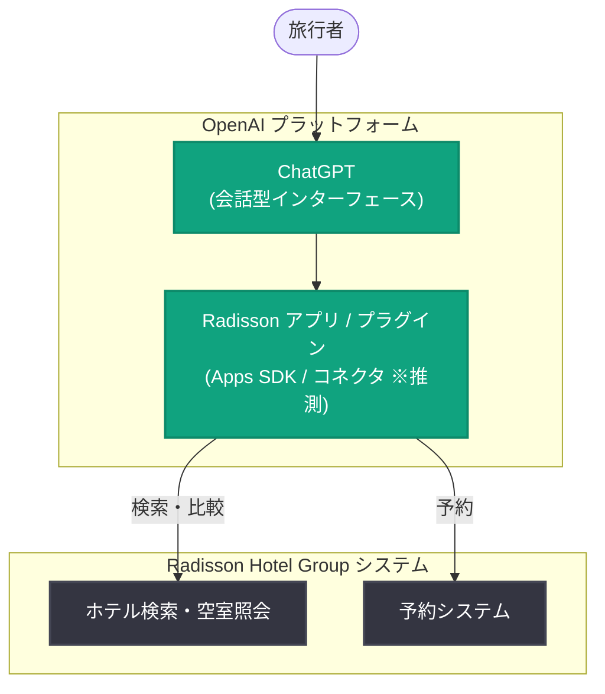

# Radisson Hotel Group がホテル検索・予約体験を ChatGPT に統合

## メタデータ

| 項目 | 内容 |
|------|------|
| 発表日 | 2026-10-07 |
| ソース | OpenAI News |
| カテゴリ | パートナーシップ / ChatGPT 連携 (旅行・ホスピタリティ) |
| 公式リンク | https://openai.com/index/radisson |

> **注記**: 公式ページ (https://openai.com/index/radisson) は取得時に 403 Forbidden で参照できなかったため、本レポートは提供された概要情報と一般的な背景知識に基づいて作成している。詳細な仕様・数値・関係者コメントは未確認であり、推測に基づく箇所は明示している。

## 概要

Radisson Hotel Group は、アクセンチュア (Accenture) と協力し、旅行者が ChatGPT 内で直接ホテルの検索・比較・予約を行える連携機能 (アプリ / プラグイン) を構築したことを発表した。これにより、ユーザーは ChatGPT との自然な会話を通じて、旅行計画の文脈に沿ったホテル探し (ホテルディスカバリー) から予約までをシームレスに完結できるようになる。

ホスピタリティ業界の大手ブランドが ChatGPT を新たな顧客接点 (ディスカバリーチャネル) として採用した事例であり、検索エンジンや OTA (オンライン旅行代理店) を経由しない、会話型 AI 起点の旅行体験への移行を示す動きといえる。

## 主な内容

### ChatGPT 内でのホテルディスカバリー

発表の中心は、旅行者が ChatGPT の会話の中でホテルを「発見」できる体験の提供である。概要情報から確認できるポイントは以下の通り。

- **検索**: 目的地や日程、好みなどを自然言語で伝えると、条件に合う Radisson 系列ホテルを提示
- **比較**: 複数のホテルを会話の中で比較検討
- **予約**: ChatGPT 内から予約フローへ接続

### アクセンチュアとの協業

本連携はアクセンチュアとの協力により構築された。Radisson Hotel Group は以前からアクセンチュアおよび OpenAI と協業し、全社的な AI 導入 (従業員向け ChatGPT 活用や AI を活用したマーケティングなど) を進めてきた経緯があり、今回の発表はその取り組みを顧客向け体験に拡張したものと位置づけられる (この経緯の位置づけは背景知識に基づく推測を含む)。

### 推測される技術基盤

**以下は推測である**。発表時期 (2026 年 10 月) を踏まえると、本連携は OpenAI が 2025 年の DevDay で発表した Apps SDK (ChatGPT 内アプリ) の仕組み、あるいは MCP (Model Context Protocol) ベースのコネクタを利用して実装されている可能性が高い。この仕組みでは、ChatGPT が会話の文脈に応じてパートナーアプリを呼び出し、在庫・料金などのリアルタイム情報を取得して、会話内のインタラクティブな UI として表示できる。ただし、公式ページを確認できていないため、実際の実装方式 (アプリかプラグインか、予約完結の範囲など) は未確認である。

## アーキテクチャ (推測)

公表情報を確認できていないため、一般的な ChatGPT アプリ連携の構成に基づく推測図である。

## 開発者・業界への影響

- **会話型 AI が新たなディスカバリーチャネルに**: 検索エンジンや OTA を経由せず、ChatGPT の会話から直接ブランドの在庫・予約へ到達する動線が広がる。ホスピタリティ企業にとって ChatGPT 連携は新しい顧客獲得チャネルになり得る
- **エンタープライズの実装パターン**: 大手ブランドが SIer (本件ではアクセンチュア) と組んで ChatGPT 連携を構築する事例であり、同様の顧客向け AI 体験を検討する企業の参考になる
- **旅行業界での競争**: Expedia や Booking.com など旅行系サービスの ChatGPT 連携が先行しており、ホテルブランド自身が直接連携する動きが加速する可能性がある (競合状況の評価は推測)

## 関連リンク

- [公式発表 (OpenAI)](https://openai.com/index/radisson) ※取得時 403 のため未確認
- [OpenAI News](https://openai.com/news)
- [Radisson Hotel Group 公式サイト](https://www.radissonhotels.com/)
- [Apps SDK ドキュメント (OpenAI)](https://developers.openai.com/apps-sdk/)

## まとめ

Radisson Hotel Group はアクセンチュアと協力し、ChatGPT 内でホテルの検索・比較・予約を完結できる連携を構築した。会話型 AI を起点とした旅行体験 (ホテルディスカバリー) を大手ホテルブランドが直接提供する事例であり、ChatGPT が商取引の新たな入口になりつつある流れを示している。実装方式などの詳細は公式ページが取得できず未確認のため、確認でき次第の更新が望ましい。

---

*注記: 本レポートは公式ページが 403 Forbidden で取得できなかったため、提供された概要情報と背景知識に基づいて作成した。推測に基づく箇所は本文中に明示している。*
