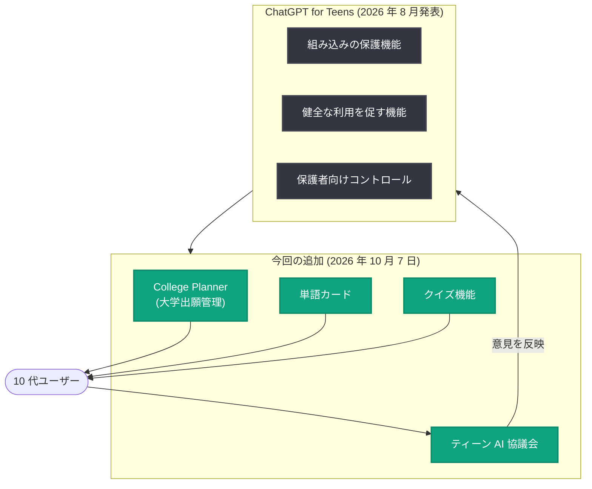

# ChatGPT for Teens に College Planner などの学習・進学支援機能が追加、ティーン AI 協議会も発足

## メタデータ

| 項目 | 内容 |
|------|------|
| 発表日 | 2026-10-07 |
| ソース | OpenAI News |
| カテゴリ | 新機能 / プロダクト / 教育 |
| 公式リンク | https://openai.com/index/teens-learn-and-plan |

> **注**: 本レポートの作成時点で詳細ページ (https://openai.com/index/teens-learn-and-plan) へのアクセスが 403 Forbidden で拒否されたため、記事全文は確認できていない。本レポートは、提供された概要 (タイトル・要約) と、OpenAI がこれまでに公表してきた関連施策 (ChatGPT for Teens など) の文脈に基づいて記述しており、詳細な仕様に関する記述には推測が含まれる。推測に基づく箇所はその旨を明示する。

## 概要

OpenAI は 2026 年 10 月 7 日、「Helping teens learn, plan, and shape the future of AI」と題した発表を行い、10 代向け専用体験「ChatGPT for Teens」に新機能を追加した。確認できている主な内容は次の 2 点である。

1. **学習・進学支援機能の追加**: 大学出願のプロセスを管理する「College Planner」、暗記学習を支援する単語カード (フラッシュカード)、理解度を確認するクイズ機能が ChatGPT for Teens に追加された
2. **ティーン AI 協議会の発足**: 10 代のユーザー自身が AI のあり方について意見を届けるための協議会 (Teen Advisory Council に相当する組織と推測される) が発足した

2026 年 8 月の ChatGPT for Teens 発表時に掲げられた「学習のために構築 (Built for learning)」という方針を、具体的な学習・進学支援機能として拡充するとともに、タイトルの「shape the future of AI」が示すとおり、10 代を保護の対象としてだけでなく、AI の未来を形づくる当事者として位置づける取り組みと言える。

## 主な内容

### College Planner: 大学出願管理

概要によれば、College Planner は大学出願 (college application) のプロセスを管理するための機能である。詳細仕様は未確認だが、米国の大学出願プロセスの一般的な構成要素を踏まえると、以下のような支援が含まれると**推測される**。

- 出願校リストの整理と出願締め切りの管理
- エッセイ (出願書類) 作成の壁打ち・ブレインストーミング支援
- 奨学金・入試要件などの情報整理

米国では大学出願は Common App などを通じて秋学期 (10 月〜1 月) に集中するため、10 月というタイミングでの提供開始は出願シーズンに合わせたものと考えられる (推測)。

### 単語カードとクイズ機能: 能動的な学習の支援

単語カード (フラッシュカード) とクイズは、いずれも「能動的想起 (active recall)」に基づく学習手法であり、受動的に回答を読むだけの AI 利用から、自ら思い出し・確認する学習への転換を促すものである。

- **単語カード**: 学習内容をカード形式で反復練習できる機能
- **クイズ**: 学習した内容の理解度をクイズ形式で確認できる機能

これらは、ChatGPT for Teens が掲げる「批判的思考の育成」「答えを渡すのではなく学びを支援する」という設計方針 (2026 年 8 月の発表、および ChatGPT の Study Mode の方向性) と整合する。会話内容から自動的にカードやクイズを生成する形式かどうかなど、具体的な動作は未確認である。

### ティーン AI 協議会: 10 代の声を AI 開発へ

概要によれば、ティーン AI 協議会が発足した。これは 10 代のユーザーが AI プロダクトや安全施策の設計に意見を反映させるための組織と考えられる。OpenAI は 2025 年に、ウェルビーイングと AI に関する専門家評議会 (Expert Council on Well-Being and AI) を設置しており、今回の協議会は当事者である 10 代自身の視点を直接取り入れる仕組みとして、これを補完するものと**推測される**。

タイトルの「shape the future of AI (AI の未来を形づくる)」という表現は、この協議会を指しており、10 代を単なる保護対象ではなく、AI の設計に参画する主体として扱う姿勢を示している。

## 全体像

今回の発表を ChatGPT for Teens の文脈に位置づけると、以下のように整理できる。

## 利用者・開発者への影響

- **10 代ユーザー**: 大学出願という高校生活の重要イベントを AI で管理できるようになり、単語カード・クイズにより ChatGPT が「答えを教えるツール」から「学習を定着させるツール」へと進化する
- **保護者・教育者**: ChatGPT for Teens の保護機能の枠内で進学準備・学習支援が完結するため、安全性と実用性を両立した選択肢が広がる
- **教育系プロダクトの開発者**: 保護機能を前提とした上で学習サイクル (計画 → 練習 → 確認) を製品内に組み込む設計は、若年層向け AI 教育プロダクトの参照モデルとなる
- **AI ガバナンス**: ティーン AI 協議会は、影響を受ける当事者 (10 代) をプロダクト設計・政策形成に参加させる試みであり、ユーザー参加型の AI ガバナンスの事例となる

## 関連リンク

- [Helping teens learn, plan, and shape the future of AI (公式発表)](https://openai.com/index/teens-learn-and-plan)
- [Introducing ChatGPT for Teens](https://openai.com/index/chatgpt-for-teens)
- [Introducing parental controls](https://openai.com/index/introducing-parental-controls)
- [Introducing the Teen Safety Blueprint](https://openai.com/index/introducing-the-teen-safety-blueprint)
- [OpenAI News](https://openai.com/news)

## まとめ

本発表により、ChatGPT for Teens に College Planner (大学出願管理)、単語カード、クイズ機能が追加され、「学習のために構築」という方針が具体的な学習・進学支援機能として拡充された。また、ティーン AI 協議会の発足により、10 代が AI のあり方に意見を届ける公式な経路が設けられた。保護 (2025 年〜) → 専用体験 (2026 年 8 月) → 学習機能の拡充と当事者参加 (今回) という流れで、OpenAI の 10 代向け施策は「守る」段階から「育て、参画させる」段階へと進んでいる。

*注: 詳細ページが 403 Forbidden のため記事全文は未確認であり、本レポートは提供された概要と OpenAI の過去の公式発表の文脈に基づいて作成した。機能の具体的な仕様に関する記述の一部は推測であり、本文中にその旨を明示している。*
