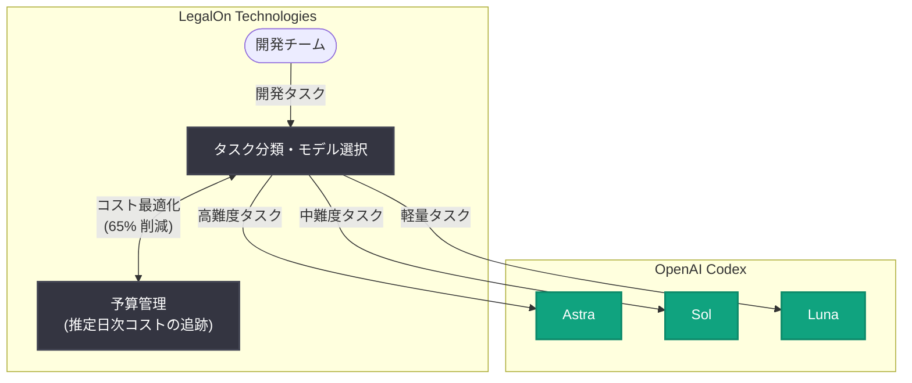

# LegalOn が開発スピードを維持したまま Codex のコストを半減: モデルの使い分けと予算管理で推定日次コストを 65% 削減

## メタデータ

| 項目 | 内容 |
|------|------|
| 発表日 | 2026-10-08 |
| ソース | OpenAI News |
| カテゴリ | 導入事例 (Customer Story) |
| 公式リンク | https://openai.com/index/legalon-halves-codex-costs |

> **注記**: 本レポート作成時点で記事ページへのアクセスが制限されていたため (HTTP 403)、内容は公式発表の概要 (RSS 配信情報) に基づいて構成している。具体的な導入経緯、各モデルの使い分け基準、成果数値の詳細は、公式リンクから原文を参照のこと。

## 概要

OpenAI は、リーガルテック企業 LegalOn Technologies による Codex のコスト最適化事例を公開した。LegalOn は AI による契約書レビュー支援サービスを提供する企業であり、日本発のリーガルテック企業として国内外の法務部門に広く採用されている。

公式発表の概要によると、LegalOn は開発スピードを維持したまま、Codex の推定日次コスト (estimated daily Codex costs) を 65% 削減した (タイトルでは「コストを半減 (halves)」と表現されている)。その手法の中心は、Astra、Sol、Luna という各モデルをタスクの性質に応じて使い分けること (モデルとタスクのマッチング) と、予算を戦略的に管理すること (strategic budget management) である。AI コーディングエージェントの活用が開発組織に定着するにつれ、「どう使うか」だけでなく「どうコストを最適化するか」が課題となる中、本事例はその実践的な解答例を示すものといえる。

## 統計情報

| 指標 | 内容 |
|------|------|
| Codex の推定日次コスト | 65% 削減 (タイトルでは「半減」と表現) |
| 開発スピード | 維持 (削減によるスピード低下なし) |

## 主な内容

### タスクに応じたモデルの使い分け (Astra / Sol / Luna)

公式概要によると、LegalOn はコスト削減の中核施策として、Astra、Sol、Luna の各モデルをタスクに応じてマッチングさせた。すべてのタスクに最上位のモデルを一律に適用するのではなく、タスクの難易度や性質に見合ったモデルを割り当てることで、品質と開発スピードを維持しながらコストを抑えるアプローチである。

一般に、コーディングエージェントのタスクは次のように性質が分かれる。

- **高難度タスク**: 大規模なリファクタリング、設計を伴う実装、複雑なデバッグなど、深い推論能力が求められるもの
- **中難度タスク**: 一般的な機能実装、テスト作成、コードレビューなど
- **軽量タスク**: 定型的な修正、ドキュメント更新、小規模な変更など

タスクごとに最適なモデルを選択することで、「過剰性能によるコストの無駄」を排除できる。これはクラウドインフラにおけるインスタンスサイズの最適化 (right-sizing) と同様の考え方を、AI コーディングエージェントに適用したものと位置づけられる。

### 戦略的な予算管理

もう 1 つの柱は、予算の戦略的な管理である。公式概要では "managed budgets strategically" と表現されており、推定日次コストという指標を用いて利用状況を可視化・管理していたことがうかがえる。

- **日次単位でのコスト把握**: 推定日次コストを KPI として追跡し、削減効果 (65%) を定量的に測定
- **投資対効果に基づく配分**: 効果の大きい領域に予算を重点配分し、費用対効果の低い使い方を見直す
- **スピードとコストの両立**: コスト削減が開発スピードの低下を招かないよう、効果を継続的にモニタリング

### 「開発スピードを維持したまま」の意義

コスト削減施策は、しばしば生産性の低下とトレードオフになる。本事例のポイントは、開発スピードを維持したままコストを 65% 削減した点にある。これは、コスト削減が「利用の抑制」によってではなく、「利用の最適化」によって実現されたことを示している。AI コーディングエージェントの価値を損なわずにコスト構造だけを改善できることを示す点で、導入企業にとって重要な示唆となる。

## アーキテクチャ (想定される構成)

※ 図はモデルとタスクのマッチングという公式概要の記述に基づく想定構成であり、各モデルの実際の役割分担は公式記事を参照のこと。

## 開発者・企業への影響

- **モデル選択によるコスト最適化の実例**: 最上位モデルの一律利用ではなく、タスクに応じたモデルの使い分け (right-sizing) により、品質・スピードを維持したまま大幅なコスト削減が可能であることを示した
- **コスト管理の KPI 設計**: 推定日次コストという具体的な指標で効果 (65% 削減) を測定しており、AI 開発ツールのコストガバナンスを設計する際の参考になる
- **AI 活用の成熟フェーズへの移行**: AI コーディングエージェントの導入期を過ぎた組織にとって、次の課題は運用コストの最適化であり、本事例はそのベストプラクティスとなる
- **リーガルテック企業による先行事例**: 品質要件の厳しい法務領域のソフトウェア開発においても、モデルの使い分けが実用的に機能することを示している

## 関連リンク

- [公式発表: LegalOn halves Codex costs while maintaining development speed](https://openai.com/index/legalon-halves-codex-costs)
- [Codex](https://openai.com/codex/)
- [OpenAI API ドキュメント](https://platform.openai.com/docs)
- [OpenAI 導入事例 (Stories)](https://openai.com/stories/)
- [OpenAI News](https://openai.com/news/)

## まとめ

LegalOn の事例は、Astra、Sol、Luna の各モデルをタスクに応じて使い分け、予算を戦略的に管理することで、開発スピードを維持したまま Codex の推定日次コストを 65% 削減した導入事例である。AI コーディングエージェントの活用が広がる中、「タスクとモデルのマッチング」と「コストの可視化・管理」という 2 つの実践は、Codex を利用するあらゆる開発組織にとって再現可能な最適化手法となる。モデルの具体的な使い分け基準や導入経緯の詳細は、公式記事の原文を参照されたい。
