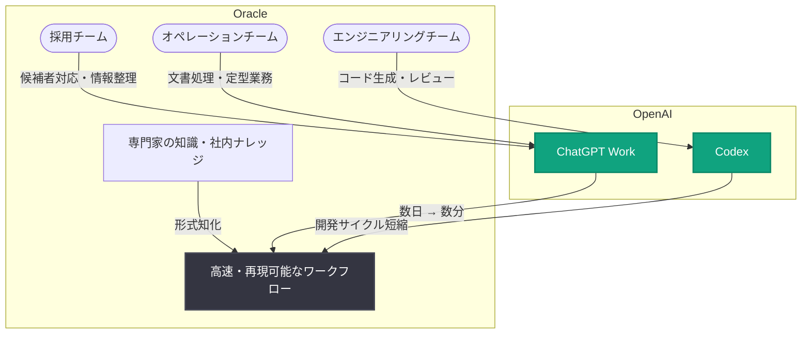

# Oracle が ChatGPT と Codex で数日かかる業務を数分に短縮: 採用・エンジニアリング・オペレーションを横断するワークフロー変革

## メタデータ

| 項目 | 内容 |
|------|------|
| 発表日 | 2026-10-08 |
| ソース | OpenAI News |
| カテゴリ | 導入事例 (Company/Customer Story) |
| 公式リンク | https://openai.com/index/oracle |

> **注記**: 本レポート作成時点で記事ページへのアクセスが制限されていたため (HTTP 403)、内容は公式発表の概要 (RSS 配信情報) に基づいて構成している。具体的な導入経緯や成果数値の詳細は、公式リンクから原文を参照のこと。

## 概要

OpenAI は、エンタープライズソフトウェア・クラウドインフラ大手の Oracle による AI 活用事例「How Oracle turns days of work into minutes with ChatGPT and Codex (Oracle が ChatGPT と Codex で数日かかる業務を数分に変える方法)」を公開した。Oracle はデータベース、クラウド (OCI)、業務アプリケーションを提供するグローバル企業であり、世界中に大規模な従業員基盤を持つ。

公式発表の概要によると、Oracle は採用 (recruiting)、エンジニアリング (engineering)、オペレーション (operations) の各領域を横断して、ChatGPT Work と Codex を活用し、専門家の知識 (specialist knowledge) を高速かつ再現可能なワークフロー (fast, repeatable workflows) へと転換している。タイトルが示すとおり、従来は数日 (days) を要していた業務を数分 (minutes) で完了できるレベルにまで効率化した点が本事例の核心である。

## 主な内容

### 専門知識の「高速で再現可能なワークフロー」への転換

本事例のキーメッセージは、「専門家の知識を、速く・繰り返し使えるワークフローに変える」というアプローチである。大企業では、特定の社員だけが持つ暗黙知や専門ノウハウが業務のボトルネックになりやすい。Oracle は ChatGPT Work と Codex を用いて、こうした属人的な知識を組織全体で再利用可能なプロセスとして定着させているとされる。

- **属人化の解消**: 専門家の判断基準や手順を AI ワークフローとして形式知化
- **再現性の確保**: 誰が実行しても同じ品質で結果が得られる反復可能なプロセスを構築
- **所要時間の劇的短縮**: 数日単位の業務を数分単位に圧縮

### 採用 (Recruiting) 領域での活用

採用業務は、候補者情報の整理、職務要件とのマッチング、面接準備、社内調整など、情報集約型のタスクが多い領域である。Oracle 規模の企業では採用パイプラインが膨大であり、ChatGPT Work による支援は以下のような効果が想定される。

- **候補者スクリーニングの効率化**: 要件との照合や情報の要約を AI が支援
- **採用担当者の高付加価値業務へのシフト**: 定型作業を AI に委ね、候補者との対話や意思決定に注力
- **採用ナレッジの標準化**: 優秀なリクルーターの判断基準をワークフローとして共有

### エンジニアリング (Engineering) 領域での活用

エンジニアリング領域では、OpenAI のエージェント型コーディングツールである Codex が中心的な役割を果たしているとみられる。Codex はコードの生成・レビュー・リファクタリング・デバッグなどを自律的に実行でき、大規模なコードベースを持つ Oracle のような企業で開発生産性を高める手段となる。

- **開発サイクルの短縮**: 実装・テスト・レビューの反復作業を Codex が支援
- **レガシーコードへの対応**: 長年蓄積されたコードベースの理解・改修を加速
- **エンジニアリング知見のスケール**: シニアエンジニアの知識を組織全体の開発ワークフローに反映

### オペレーション (Operations) 領域での活用

オペレーション領域では、社内手続き、ドキュメント処理、問い合わせ対応、レポート作成といった定型的かつ大量の業務が存在する。ChatGPT Work の活用により、以下のような改善が想定される。

- **ドキュメント処理の自動化**: 社内文書の要約・分類・下書き作成を AI が支援
- **問い合わせ対応の迅速化**: 社内ナレッジに基づく回答生成で対応時間を短縮
- **業務プロセスの標準化**: 部門ごとにばらついていた手順を再現可能なワークフローに統一

## アーキテクチャ (想定される構成)

## 影響

### 企業への影響

- **全社横断型の AI 導入モデル**: 採用・エンジニアリング・オペレーションという性質の異なる 3 領域を横断して AI を展開した事例であり、特定部門に閉じない全社変革の参考になる
- **エンタープライズ大手同士の協業事例**: Oracle のような大規模エンタープライズ企業が OpenAI 製品を実務に組み込んだ事例として、他の大企業の導入検討を後押しする
- **「知識のワークフロー化」という視点**: 単なるタスク自動化ではなく、専門知識を再現可能なプロセスに変換するという導入設計の考え方を示している

### 開発者への影響

- **Codex のエンタープライズ採用の進展**: 大規模コードベースを持つ企業でのエージェント型コーディングツール活用が広がっており、開発ワークフローへの AI 統合が標準的な選択肢になりつつある
- **ChatGPT Work と Codex の併用パターン**: ビジネス部門向け (ChatGPT Work) と開発部門向け (Codex) を組み合わせ、組織全体の生産性を底上げするモデルの実例となる
- **定量的な効果の提示**: 「数日 → 数分」という時間短縮の訴求は、AI 導入の投資対効果を社内で説明する際のベンチマークとして参考になる

## 関連リンク

- [公式発表: How Oracle turns days of work into minutes with ChatGPT and Codex](https://openai.com/index/oracle)
- [ChatGPT for Work](https://openai.com/business/)
- [Codex](https://openai.com/codex/)
- [OpenAI 導入事例 (Stories)](https://openai.com/stories/)
- [OpenAI News](https://openai.com/news/)

## まとめ

Oracle の事例は、採用・エンジニアリング・オペレーションの 3 領域を横断して ChatGPT Work と Codex を導入し、専門家の知識を高速かつ再現可能なワークフローへと転換することで、数日かかっていた業務を数分に短縮した導入事例である。属人的な専門知識を組織全体で再利用可能にするアプローチは、大規模企業における AI 活用の実践的なモデルとして注目に値する。導入の詳細な経緯や具体的な成果数値は、公式記事の原文を参照されたい。
