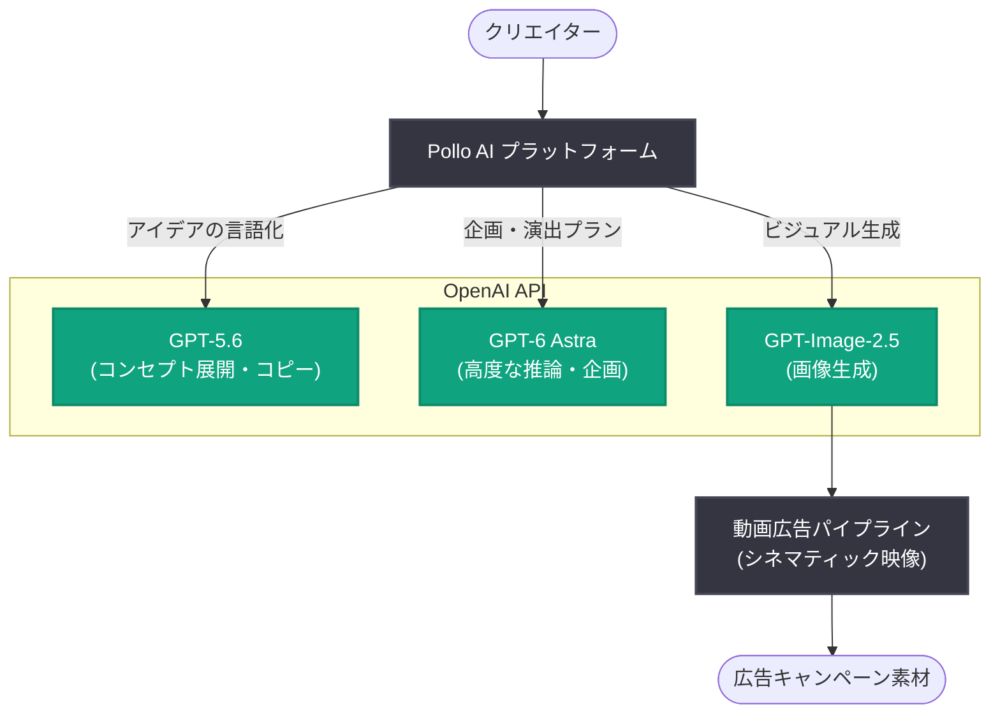

# Pollo AI が OpenAI のモデルでクリエイティブなアイデアを広告キャンペーンに変換

## メタデータ

| 項目 | 内容 |
|------|------|
| 発表日 | 2026-10-08 |
| ソース | OpenAI News |
| カテゴリ | 導入事例 (Startup) |
| 公式リンク | https://openai.com/index/pollo-ai |

> **注記**: 公式ページ (https://openai.com/index/pollo-ai) は取得時に 403 Forbidden で参照できなかったため、本レポートは提供された概要情報と一般的な背景知識に基づいて作成している。詳細な数値・関係者コメント・実装仕様は未確認であり、推測に基づく箇所は明示している。

## 概要

AI クリエイティブプラットフォームを提供するスタートアップ Pollo AI が、OpenAI のモデル群 (GPT-5.6、GPT-6 Astra、GPT-Image-2.5) を活用し、クリエイターの大胆なアイデアを精細な画像やシネマティックな動画広告へと変換する事例が OpenAI News で紹介された。アイデア出しからビジュアル生成、キャンペーン制作までを一気通貫で支援するワークフローを実現している。

テキストベースの発想を、そのまま広告キャンペーンとして成立するレベルの画像・動画コンテンツへ落とし込める点が特徴であり、生成 AI がマーケティング・広告制作の実務に深く組み込まれつつある流れを示す導入事例である。

## 主な内容

### 活用されている OpenAI モデル

概要情報から確認できる、Pollo AI が利用している OpenAI のモデルは以下の通り。

| モデル | 想定される役割 (※一部推測) |
|--------|---------------------------|
| GPT-5.6 | アイデアの具体化、コンセプト展開、コピーライティングなどの言語処理 |
| GPT-6 Astra | より高度な推論・企画立案やマルチモーダルな指示理解 |
| GPT-Image-2.5 | 精細な画像生成 (キービジュアル、広告素材) |

各モデルの正確な役割分担は公式ページを確認できていないため、**上表の役割は推測を含む**。概要情報で確認できるのは「これらのモデルにより、クリエイターが大胆なアイデアを精細な画像とシネマティックな動画広告に変換できる」という点である。

### アイデアからキャンペーンへのワークフロー

発表の中心は、クリエイターの発想を広告キャンペーンへ変換するエンドツーエンドの制作体験である。

- **アイデアの言語化・展開**: 自然言語で伝えたコンセプトを、GPT 系モデルが具体的なクリエイティブブリーフやプロンプトへ展開 (※推測)
- **画像生成**: GPT-Image-2.5 により、キャンペーンのトーンに合った精細な画像を生成
- **動画広告化**: 生成した画像やコンセプトを基に、シネマティックな動画広告を制作

### Pollo AI について

Pollo AI は、複数の生成 AI モデルを 1 つのインターフェースから利用できるオールインワン型の AI 画像・動画生成プラットフォームとして知られている (背景知識に基づく記述)。今回の事例は、同プラットフォームの中核に OpenAI の最新モデル群を組み込み、個人クリエイターからマーケティングチームまでが広告品質のコンテンツを制作できるようにした取り組みと位置づけられる (※位置づけは推測を含む)。

## アーキテクチャ (推測)

公式情報を確認できていないため、一般的な生成 AI クリエイティブプラットフォームの構成に基づく推測図である。

## 開発者・企業への影響

- **マルチモデル構成の実践例**: 言語モデル (GPT-5.6、GPT-6 Astra) と画像生成モデル (GPT-Image-2.5) を役割分担させてパイプラインを構築する設計は、生成 AI プロダクトを開発するスタートアップにとって参考になる
- **広告・マーケティング制作の民主化**: 専門的な制作チームがなくても、アイデアさえあれば広告品質の画像・動画を制作できる環境が広がり、中小企業や個人クリエイターの参入障壁が下がる
- **動画広告市場への波及**: 静止画生成にとどまらず「シネマティックな動画広告」まで生成 AI で完結させる事例であり、動画制作ワークフローの自動化・短縮化が業界全体で加速する可能性がある (市場影響の評価は推測)
- **API ビジネスの事例価値**: OpenAI の最新モデル群を組み合わせて垂直統合型のクリエイティブ SaaS を構築するパターンは、他ドメイン (音楽、ゲームアセット、EC 商品画像など) への応用が考えられる

## 関連リンク

- [公式発表 (OpenAI)](https://openai.com/index/pollo-ai) ※取得時 403 のため未確認
- [OpenAI News](https://openai.com/news)
- [Pollo AI 公式サイト](https://pollo.ai/)
- [OpenAI API ドキュメント](https://platform.openai.com/docs)

## まとめ

Pollo AI は GPT-5.6、GPT-6 Astra、GPT-Image-2.5 という OpenAI のモデル群を組み合わせ、クリエイターの大胆なアイデアを精細な画像とシネマティックな動画広告に変換するプラットフォームを提供している。アイデアからキャンペーン素材までを一気通貫で生成するこの事例は、生成 AI が広告・マーケティング制作の実務インフラとなりつつあることを示している。各モデルの具体的な役割分担や成果指標などの詳細は公式ページが取得できず未確認のため、確認でき次第の更新が望ましい。

---

*注記: 本レポートは公式ページが 403 Forbidden で取得できなかったため、提供された概要情報と背景知識に基づいて作成した。推測に基づく箇所は本文中に明示している。*
