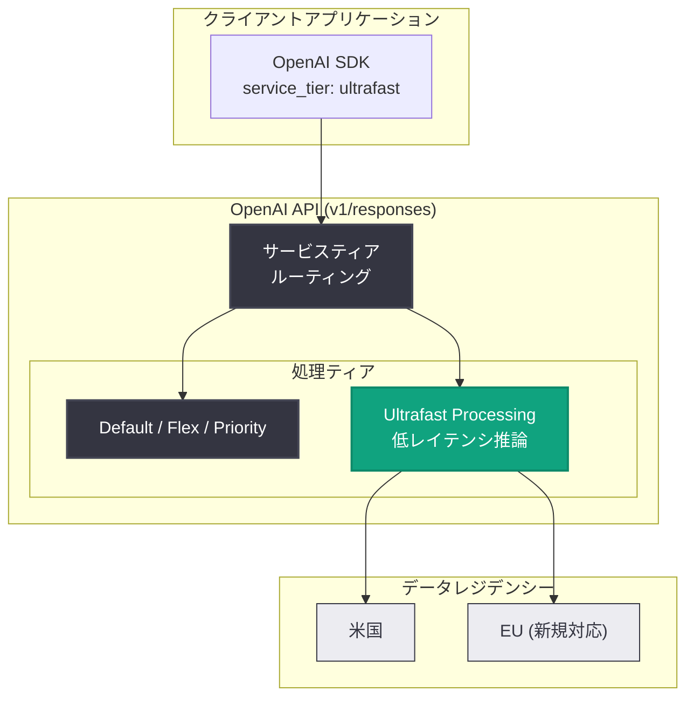

# Responses API に GPT-6.1 Sol 向け Ultrafast モードを追加

## メタデータ

| 項目 | 内容 |
|------|------|
| 発表日 | 2026-10-08 |
| ソース | OpenAI API Changelog |
| カテゴリ | API アップデート |
| 公式リンク | https://developers.openai.com/api/docs/changelog |

## 概要

OpenAI は 2026 年 10 月 8 日、Responses API において GPT-6.1 Sol (`gpt-6.1-sol`) 向けの Ultrafast モードを追加した。リクエスト時に `service_tier: "ultrafast"` を指定することで、出力トークン生成間のレイテンシを大幅に短縮した高速推論が利用できる。レート制限はあるものの全 API ユーザーが利用可能で、グローバル処理に加えて米国および EU のデータレジデンシーに対応する。

Ultrafast モード自体は 2026 年 9 月 29 日に GPT-6 Astra (`gpt-6-astra`) 向けに先行リリースされていたが、その時点では米国データレジデンシーのみの対応で、EU やその他リージョンの推論レジデンシーは非対応と明記されていた。今回のアップデートの新しい点は、対象モデルの GPT-6.1 Sol への拡大と、EU データレジデンシーへの対応である。

## 主な内容

### Ultrafast モードとは

Ultrafast モードは、出力トークン生成間の時間 (inter-token latency) を短縮することを目的とした高速推論向けのサービスティアである。リクエストボディの `service_tier` パラメータに `"ultrafast"` を指定して利用し、このティアで処理されたレスポンスには `service_tier: "ultrafast"` が返却される。

今回の変更点は以下のとおり。

- **対象モデル**: `gpt-6.1-sol` (Responses API / `v1/responses`)
- **指定方法**: `service_tier: "ultrafast"` パラメータ
- **提供範囲**: 全 API ユーザー (レート制限あり)
- **データレジデンシー**: グローバル処理に加え、米国および EU のデータレジデンシーに対応
- **価格**: 専用の Ultrafast pricing が適用される (詳細は料金ページを参照)

### GPT-6 Astra 向け先行リリースとの比較

2026 年 9 月 29 日には GPT-6 Astra 向けに Ultrafast モードが先行リリースされていた。両エントリの違いは以下のとおり。

| 項目 | 2026-09-29 (gpt-6-astra) | 2026-10-08 (gpt-6.1-sol) |
|------|--------------------------|--------------------------|
| 対象モデル | GPT-6 Astra | GPT-6.1 Sol |
| 対象 API | v1/responses | v1/responses |
| 提供範囲 | API カスタマー | 全 API ユーザー |
| 米国データレジデンシー | 対応 | 対応 |
| EU データレジデンシー | 非対応 | **対応 (新規)** |
| レート制限 | あり | あり |

なお GPT-6.1 Sol 自体も 2026 年 9 月 29 日にリリースされたモデルで、GPT-6 Astra より低コストに複雑なコーディングやプロフェッショナル業務をこなす位置づけとされている。標準価格は入力 272K トークンまでの場合、100 万トークンあたり入力 $2、キャッシュ入力 $0.10、キャッシュ書き込み $2.50、出力 $10 である (Ultrafast モードには別途専用価格が適用される)。

### service_tier パラメータの位置づけ

公式 API リファレンスによると、`service_tier` パラメータには以下の値を指定できる。

| 値 | 説明 |
|----|------|
| `auto` | プロジェクト設定で構成されたサービスティアで処理 (未設定時のデフォルト動作) |
| `default` | 選択したモデルの標準的な価格・性能で処理 |
| `flex` | Flex Processing ティアで処理 (低コスト・レイテンシ許容) |
| `scale` | Scale ティアで処理 |
| `fast` / `priority` | リクエスト単位で Fast mode にオプトイン (レスポンスではいずれも `priority` と表示) |
| `ultrafast` | アクセス制御付きの Ultrafast Processing ティアで処理 |

レスポンスボディの `service_tier` には、実際にリクエストの処理に使われた処理モードが返却され、リクエストで指定した値と異なる場合がある点に注意が必要である。

## 技術的な詳細

### コードサンプル

Responses API で GPT-6.1 Sol の Ultrafast モードを利用する例。

```python
from openai import OpenAI

client = OpenAI()

response = client.responses.create(
    model="gpt-6.1-sol",
    service_tier="ultrafast",
    input="リアルタイムチャット向けに短い応答を生成してください。",
)

print(response.output_text)
# 実際に適用されたティアを確認
print(response.service_tier)  # => "ultrafast"
```

cURL での例。

```bash
curl https://api.openai.com/v1/responses \
  -H "Authorization: Bearer $OPENAI_API_KEY" \
  -H "Content-Type: application/json" \
  -d '{
    "model": "gpt-6.1-sol",
    "service_tier": "ultrafast",
    "input": "Hello!"
  }'
```

## アーキテクチャ



## 開発者への影響

- **低レイテンシ用途の選択肢拡大**: リアルタイムチャット、音声対話、コーディング支援など、トークン生成速度が UX を左右するアプリケーションで、GPT-6.1 Sol の品質と Ultrafast の速度を両立できる
- **EU リージョン要件への対応**: GDPR などの規制で EU データレジデンシーが必須の組織でも Ultrafast モードを採用できるようになり、欧州向けプロダクトでの利用障壁が解消された
- **コスト最適化の幅が広がる**: GPT-6.1 Sol は GPT-6 Astra より低コストなモデルであるため、「高速だが比較的安価」な構成が可能になる。ただし Ultrafast は専用価格が適用されるため、料金ページでの事前確認が必要
- **レート制限への考慮**: 全 API ユーザーが利用可能だがレート制限があるため、本番投入時はフォールバック (例: `service_tier` を `default` に切り替える) の実装を検討するとよい
- **移行の容易さ**: 既存の Responses API 呼び出しに `service_tier` パラメータを 1 つ追加するだけで利用でき、コード変更は最小限で済む

## 関連リンク

- [OpenAI API Changelog](https://developers.openai.com/api/docs/changelog)
- [Responses API リファレンス (service_tier パラメータ)](https://developers.openai.com/api/docs/api-reference/responses/create)
- [OpenAI API 料金ページ](https://openai.com/api/pricing/)
- [OpenAI 公式ドキュメント](https://platform.openai.com/docs)

## まとめ

2026 年 10 月 8 日のアップデートにより、Responses API の Ultrafast モード (`service_tier: "ultrafast"`) が GPT-6.1 Sol でも利用可能になった。9 月 29 日の GPT-6 Astra 向け先行リリースと比べ、対象モデルの拡大に加えて EU データレジデンシーに新たに対応した点が大きな進展である。低レイテンシが求められるアプリケーションを EU リージョン要件下で運用する開発者にとって、有力な選択肢となるアップデートである。
