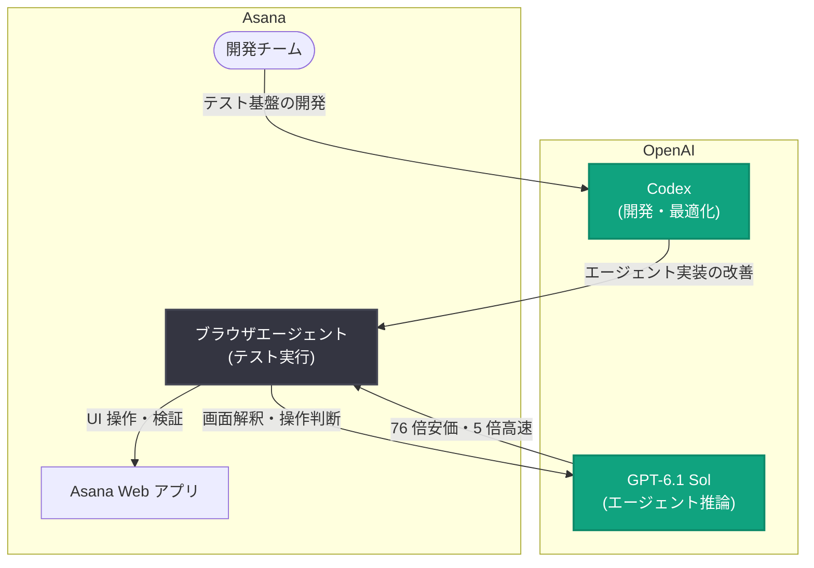

# Asana がブラウザテストのモデルコストを 76 分の 1 に削減: Codex と GPT-6.1 Sol でブラウザエージェントを 5 倍高速化

## メタデータ

| 項目 | 内容 |
|------|------|
| 発表日 | 2026-10-09 |
| ソース | OpenAI News |
| カテゴリ | 導入事例 (Customer Story) |
| 公式リンク | https://openai.com/index/asana-browser-agent |

## 概要

OpenAI は、ワークマネジメントプラットフォームを提供する Asana によるブラウザエージェントの最適化事例を公開した。Asana は、プロジェクト管理やタスク管理のための SaaS を提供する企業であり、世界中の多くの組織に利用されている。

公式発表の概要によると、Asana は Codex を活用し、ブラウザエージェントによるテストを従来比で 76 倍安価 (モデルコストを 76 分の 1 に削減)、かつ 5 倍高速に実行できるようにした。利用モデルは GPT-6.1 Sol である。ブラウザエージェントは Web UI を実際に操作してテストや検証を行うため、実行回数が多くなるほどモデルコストとレイテンシが課題になりやすい。本事例は、モデル選択と Codex を組み合わせた最適化によって、コストと速度の両面を大幅に改善できることを示すものである。

## 統計情報

| 指標 | 内容 |
|------|------|
| ブラウザテストのモデルコスト | 76 分の 1 に削減 (76 倍安価) |
| ブラウザエージェントの実行速度 | 5 倍高速化 |
| 利用モデル | GPT-6.1 Sol |
| 活用ツール | Codex |

## 主な内容

### ブラウザエージェントによるテストの課題

ブラウザエージェントは、人間のユーザーと同様に Web アプリケーションの画面を解釈し、クリックや入力などの操作を自律的に実行する。E2E テストや UI 検証に応用すると、従来のセレクタベースのテストでは壊れやすかったシナリオを柔軟にカバーできる一方、次のような課題がある。

- **モデルコストの増大**: 画面の解釈と操作判断のたびにモデル呼び出しが発生し、テストスイート全体では呼び出し回数が膨大になる
- **実行時間の長さ**: 推論レイテンシがテスト 1 件ごとに積み重なり、CI などでの実行時間を押し上げる
- **スケールの難しさ**: テストを拡充するほどコストと時間が線形以上に増えやすい

Asana の事例は、この「ブラウザエージェントはコストが高く遅い」という課題に対する実践的な解答例といえる。

### GPT-6.1 Sol の活用

公式概要によると、Asana は本取り組みで GPT-6.1 Sol を利用している。GPT-6.1 Sol は、2026 年 10 月 8 日に Responses API で Ultrafast モード (`service_tier: "ultrafast"`) への対応が発表されたモデルであり、高速推論との親和性が高い。ブラウザエージェントのように多数のステップでモデル呼び出しを繰り返すワークロードでは、ステップ単価の低減と推論の高速化がそのまま全体のコスト削減 (76 倍) と実行時間短縮 (5 倍) に直結する。

最上位モデルを一律に使うのではなく、ワークロードの性質 (UI 操作の判断という比較的定型的なタスクの反復) に見合ったモデルを選択することで、品質を保ちながらコスト効率を最大化するアプローチである。

### Codex による最適化

公式概要によると、Asana は本取り組みに Codex を活用している。Codex は OpenAI のコーディングエージェントであり、テストコードやエージェントロジックの実装・改善をエンジニアリングワークフローに組み込める。ブラウザエージェントのテスト基盤のような、反復的な改善と検証を要する開発において、Codex の活用は開発スピードの面でも有効に機能する。

## アーキテクチャ (想定される構成)

※ 図は公式概要の記述 (Codex の活用、GPT-6.1 Sol の利用、ブラウザエージェントのテスト) に基づく想定構成であり、実際の構成の詳細は公式記事を参照のこと。

## 開発者・企業への影響

- **ブラウザエージェントの実用性向上**: モデルコスト 76 分の 1、速度 5 倍という改善は、ブラウザエージェントによるテストを CI などの日常的なワークフローに組み込む際の最大の障壁 (コストと実行時間) を取り除く実例となる
- **モデル選択によるコスト最適化**: ワークロードの性質に合わせて GPT-6.1 Sol のような高速・低コストなモデルを選択することで、品質を維持したまま大幅なコスト削減が可能であることを示した
- **Codex とエージェント基盤開発の組み合わせ**: エージェントの実装・改善という反復的な開発作業に Codex を活用するパターンは、他の組織でも再現しやすい
- **テスト自動化の次の段階**: セレクタベースの E2E テストから、UI を解釈して操作するエージェントベースのテストへの移行が、コスト面でも現実的になりつつあることを示唆している

## 関連リンク

- [公式発表: Asana cuts model costs 76x in browser tests with GPT-6.1 Sol](https://openai.com/index/asana-browser-agent)
- [Codex](https://openai.com/codex/)
- [OpenAI API ドキュメント](https://platform.openai.com/docs)
- [OpenAI 導入事例 (Stories)](https://openai.com/stories/)
- [OpenAI News](https://openai.com/news/)

## まとめ

Asana の事例は、Codex を活用してブラウザエージェントによるテストを最適化し、GPT-6.1 Sol の利用によってモデルコストを 76 分の 1、実行速度を 5 倍に改善した導入事例である。ブラウザエージェントはコストとレイテンシが普及の障壁とされてきたが、ワークロードに適したモデルの選択と Codex によるエージェント基盤の改善を組み合わせることで、大規模なテスト自動化にも耐えうるコスト構造を実現できることを示した。導入経緯や最適化手法の詳細は、公式記事の原文を参照されたい。
