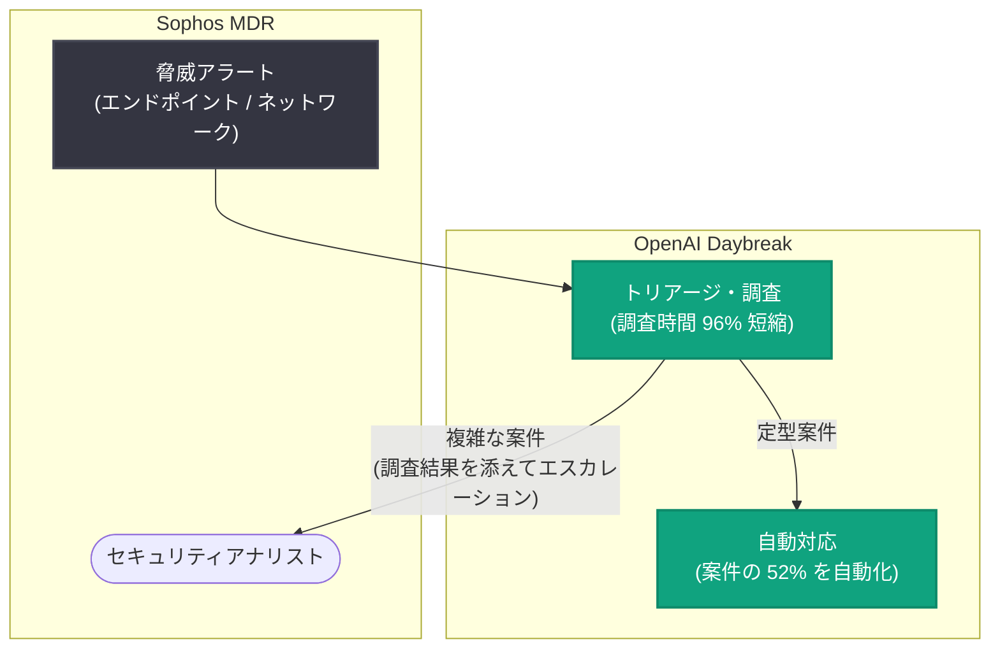

# Sophos が OpenAI Daybreak で脅威調査時間を 96% 短縮: MDR 案件の 52% を自動化

## メタデータ

| 項目 | 内容 |
|------|------|
| 発表日 | 2026-10-09 |
| ソース | OpenAI News |
| カテゴリ | 導入事例 (Customer Story) |
| 公式リンク | https://openai.com/index/sophos |

## 概要

OpenAI は、サイバーセキュリティ企業 Sophos による OpenAI Daybreak の導入事例を公開した。Sophos はエンドポイント保護やネットワークセキュリティ、MDR (Managed Detection and Response) サービスを世界規模で提供するセキュリティベンダーであり、日々膨大な量の脅威アラートとインシデントを調査・対応している。

公式発表の概要によると、Sophos は OpenAI Daybreak を活用してサイバー脅威の調査 (threat investigation) にかかる時間を 96% 短縮し、MDR 案件 (ケース) の 52% を自動化した。セキュリティ運用の現場では、アラートのトリアージや調査に要する時間がアナリストの大きな負担となっており、対応の遅れがそのまま被害拡大のリスクに直結する。本事例は、AI エージェントがセキュリティオペレーション (SecOps) の中核業務を実用レベルで自動化できることを示すものである。

## 統計情報

| 指標 | 内容 |
|------|------|
| 脅威調査時間 | 96% 短縮 |
| MDR 案件の自動化率 | 52% |

## 主な内容

### 脅威調査時間の 96% 短縮

公式概要によると、Sophos は OpenAI Daybreak の導入により、サイバー脅威の調査にかかる時間を 96% 短縮した。

一般に、セキュリティインシデントの調査は次のような工程で構成され、多くの時間を要する。

- **アラートのトリアージ**: 大量のアラートから対応が必要なものを選別する
- **コンテキスト収集**: 関連するログ、エンドポイント情報、ネットワーク挙動、脅威インテリジェンスを横断的に集約する
- **影響範囲の特定**: 侵害の有無、横展開の痕跡、影響を受けた資産を特定する
- **対応判断**: 封じ込め・復旧などの対応アクションを決定する

これらの工程のうち、情報収集と相関分析は定型性が高く時間を要する部分であり、AI による自動化の効果が最も大きく表れる領域である。調査時間が 96% 短縮されることは、脅威の検知から対応までの時間 (MTTR: Mean Time to Respond) の大幅な改善を意味し、被害拡大の抑止に直結する。

### MDR 案件の 52% を自動化

Sophos の MDR サービスは、顧客環境を 24 時間 365 日監視し、脅威の検知・調査・対応を代行するマネージドサービスである。公式概要によると、OpenAI Daybreak の活用により、MDR 案件の 52% が自動化された。

案件の半数以上を自動化できたことには、次のような意義がある。

- **アナリストの負荷軽減**: 定型的な調査・対応を AI に任せることで、アナリストは高度な判断を要する複雑なインシデントに集中できる
- **対応のスケーラビリティ**: 人員を比例的に増やすことなく、監視対象や案件数の増加に対応できる
- **対応品質の均一化**: 自動化された調査プロセスにより、担当者による対応のばらつきを抑えられる

### セキュリティ領域における AI エージェント活用の示唆

セキュリティ運用は、誤判断が重大な結果を招くリスクの高い領域であり、AI の適用には高い信頼性が求められる。セキュリティベンダーである Sophos 自身が、自社の商用 MDR サービスの中核業務に AI を組み込み、具体的な数値成果 (96% 短縮、52% 自動化) を公表した点は、SecOps における AI エージェント活用が実験段階から実運用段階へ移行していることを示す事例といえる。

## アーキテクチャ (想定される構成)

※ 図は公式概要の記述 (調査時間の短縮と案件の自動化) に基づく想定構成であり、実際のシステム構成は公式記事を参照のこと。

## 開発者・企業への影響

- **SecOps 自動化の実例**: 脅威調査という時間のかかる中核業務を AI で 96% 短縮できることを示し、SOC / MDR の運用設計における自動化の目標水準を具体化した
- **人と AI の協働モデル**: 案件の 52% を自動化しつつ、残りはアナリストが担う構成であり、「定型は AI、複雑な判断は人」という協働モデルの実践例となる
- **高リスク領域への AI 適用**: 誤判断の影響が大きいセキュリティ領域で商用サービスに AI を組み込んだ事例であり、金融・医療など他の高信頼性領域への適用を検討する企業の参考になる
- **セキュリティ人材不足への対応**: 慢性的なセキュリティアナリスト不足に対し、AI による調査自動化がスケーラブルな解決策となり得ることを示している

## 関連リンク

- [公式発表: Sophos cuts threat investigation time by 96% with OpenAI Daybreak](https://openai.com/index/sophos)
- [Sophos 公式サイト](https://www.sophos.com/)
- [OpenAI 導入事例 (Stories)](https://openai.com/stories/)
- [OpenAI News](https://openai.com/news/)

## まとめ

Sophos の事例は、OpenAI Daybreak を活用してサイバー脅威の調査時間を 96% 短縮し、MDR 案件の 52% を自動化した導入事例である。定型的な調査・対応を AI に任せ、アナリストを複雑なインシデント対応に集中させるという協働モデルは、セキュリティ運用のスケーラビリティと対応速度を両立させる実践的なアプローチとなる。Daybreak の具体的な活用方法や導入経緯の詳細は、公式記事の原文を参照されたい。
